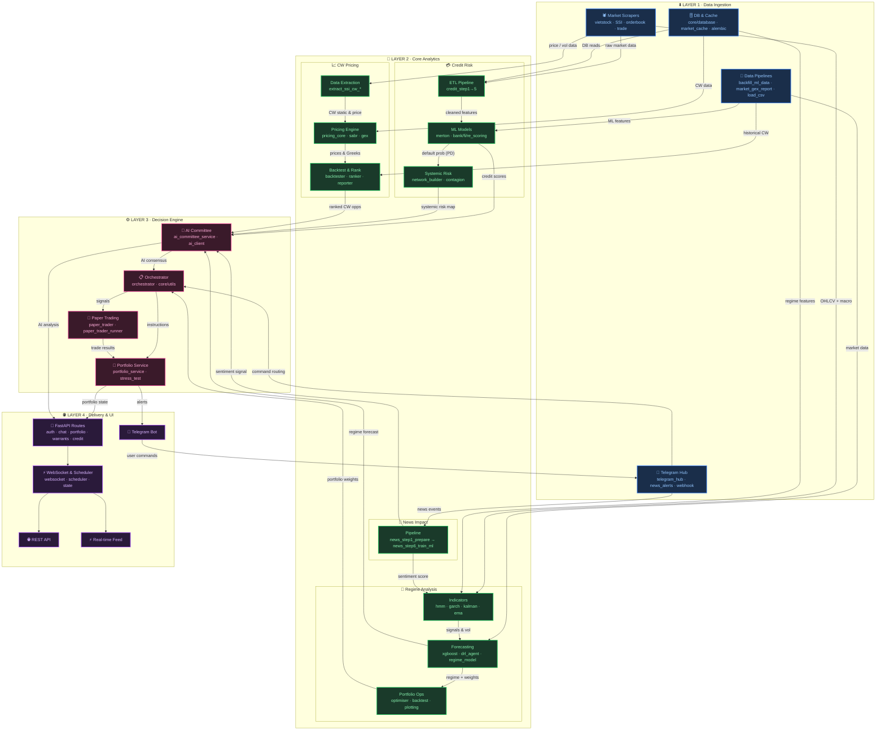

# 🏆 FINVISTA — Nền Tảng Định Giá & Quản Trị Rủi Ro Chứng Quyền

<p align="center">
  
  
  
  
  
</p>

<p align="center">
  
  
  
  
  
  
</p>

<p align="center">
  
  
  
  
  
</p>

<p align="center">
  <b>Quantitative Covered Warrant Engine & Enterprise API Gateway · Vietnamese Financial Markets</b><br>
  <sub>📍 UPGen Deutsches Haus Tower, Quận 1, TP. Hồ Chí Minh</sub>
</p>

---

## 📖 Mục Lục

- [⚡ Quick Start](#-quick-start)
- [🌟 Tổng Quan](#-tổng-quan)
- [🧩 Các Module Chính](#-các-module-chính)
- [🏗️ Kiến Trúc Hệ Thống](#️-kiến-trúc-hệ-thống--luồng-dữ-liệu)
- [✨ Tính Năng](#-tính-năng)
- [📦 Cài Đặt](#-cài-đặt)
- [⚙️ Cấu Hình](#️-cấu-hình)
- [🚀 Sử Dụng](#-sử-dụng)
- [📂 Cấu Trúc Dự Án](#-cấu-trúc-dự-án)
- [📊 Hiệu Suất](#-hiệu-suất)
- [🧪 Kiểm Thử](#-kiểm-thử)
- [🗺️ Lộ Trình](#️-lộ-trình)
- [📄 Giấy Phép](#-giấy-phép)

---

## ⚡ Quick Start

```bash
# 1. Clone & cài đặt
git clone https://github.com/Nahtuna/Finvista.git && cd Finvista
pip install -e .

# 2. Cấu hình môi trường
cp .env.example .env   # Điền TELEGRAM_BOT_TOKEN, JWT_SECRET_KEY...

# 3. Khởi chạy
python run.py api      # → REST API tại http://127.0.0.1:8008/docs
python run.py scan     # → Quét & cảnh báo CW qua Telegram
python run.py trade --portfolio  # → Xem danh mục Paper Trading
```

---

## 🌟 Tổng Quan

**Finvista** là giải pháp toán học tài chính tinh gọn và bảo mật cao giúp **định giá, phát hiện cơ hội Volatility Arbitrage và quản trị rủi ro** cho Chứng quyền có bảo đảm (Covered Warrants - CW) tại thị trường Việt Nam.

Nền tảng được tái cấu trúc hoàn chỉnh theo chuẩn **Clean Architecture** với:
- 🎯 **CLI trung tâm** duy nhất tại `run.py`
- 🗄️ **SQLite/PostgreSQL** qua ORM SQLAlchemy + Alembic migrations
- 🔐 **JWT authentication** đa người dùng, isolated
- ⚡ **FastAPI Gateway** tích hợp WebSocket real-time & Rate Limiting
- 🤖 **Gemini AI Committee** ra quyết định giao dịch tự động

---

## 🧩 Các Module Chính

| Module | Công nghệ | Mô tả |
|--------|-----------|-------|
| **💳 Credit Risk** | Merton Model · HistGBM · DebtRank | ETL 8 bước, ML dự báo kiệt quệ tài chính, mô phỏng lan truyền hệ thống |
| **📈 CW Pricing** | SABR · Black-Scholes · GEX Engine | Định giá lý thuyết, giải ngược IV, tính Greeks, backtest Delta-Adaptive |
| **🌊 Regime Analysis** | HMM · GARCH · XGBoost · DRL | Phát hiện chế độ thị trường, dự báo biến động, tối ưu danh mục DRL |
| **📰 News Impact** | NLP · ML Classifier | Pipeline 6 bước: cào → align → tính xác suất → huấn luyện ML |
| **🤝 Trading Engine** | Gemini AI · Paper Trader | AI Committee đồng thuận, Paper Trading mô phỏng HOSE, stress test |
| **🔧 Infra & Scripts** | FastAPI · Telegram · Scrapers | API gateway, bot Telegram, scrapers SSI/Vietstock, data pipelines |

---

## 🏗️ Kiến Trúc Hệ Thống & Luồng Dữ Liệu

> Sơ đồ tổ chức theo **4 tầng logic (Top-Down)**. Dữ liệu chạy từ tầng Thu thập → Phân tích → Quyết định → Phân phối.



| Tầng | Màu | Khối chức năng |
|------|-----|----------------|
| **L1 · Data Ingestion** | 🔵 Blue | Market Scrapers · Data Pipelines · Telegram Hub · DB/Cache |
| **L2 · Core Analytics** | 🟢 Green | Credit Risk · CW Pricing · Regime Analysis · News Impact |
| **L3 · Decision Engine** | 🔴 Pink | AI Committee · Orchestrator · Paper Trading · Portfolio |
| **L4 · Delivery & UI** | 🟣 Purple | FastAPI Routes · WebSocket · Telegram Bot · REST API |

---

## ✨ Tính Năng

### 🚀 Tự Động Hóa & Trí Tuệ Cấp Hedge Fund
- **vnstock 4.0.4 Unified UI Support:** Pipeline dữ liệu vĩ mô và doanh nghiệp tương thích hoàn toàn kiến trúc mới nhất.
- **Master Orchestrator:** Trình điều khiển trung tâm tự động hóa toàn bộ: cào tin tức, đồng bộ Vĩ mô (Lãi suất liên ngân hàng), chấm điểm rủi ro định kỳ mỗi 5 phút (`python run.py orchestrator`).
- **Deep Crawler & AI Telegram Alerts:** Cào sâu tin tức, lịch chốt quyền cổ tức từ Vietstock (AJAX). AI tóm tắt 3 câu, bắn cảnh báo điểm mua/bán thẳng Telegram.
- **News Impact Backtesting:** Tính xác suất tăng/giảm giá CW ngay sau khi sự kiện doanh nghiệp được công bố.

### 🔥 Thuật Toán Định Giá Cấp Chuyên Gia
`pricing_core.py` tích hợp bộ lọc cứng (**Hard Gates**) thực chiến cao cấp:
- **Chống "Úp sọt" Premium** `(Max Premium < 18%)` — Lọc CW bị nhà phát hành định giá ảo.
- **Chống "Vé số" Deep OTM** `(Min Delta > 0.15)` — Ngăn dòng tiền vào mã xa điểm hòa vốn.
- **Tránh bom Theta** `(Maturity > 15 ngày)` — Loại bỏ CW sắp đáo hạn.
- **Smart Spread Check** `(Spread < 15%)` — Đọc Bid/Ask thực khi thị trường vừa mở cửa.

### 🧠 AI Committee (Gemini LLM)
- Tổng hợp tín hiệu từ **Credit Risk + CW Pricing + Regime + News** thành quyết định đồng thuận.
- Tự động thực thi lệnh trên Paper Trader với cơ chế cắt lỗ/chốt lời động.

---

## 📦 Cài Đặt

### Yêu Cầu
- Python **3.9, 3.10 hoặc 3.11**
- pip package manager

### Thiết Lập

```bash
# Clone repository
git clone https://github.com/Nahtuna/Finvista.git
cd Finvista

# Tạo virtual environment (khuyên dùng)
python -m venv venv
source venv/bin/activate  # Windows: venv\Scripts\activate

# Cài đặt package ở chế độ editable
pip install -e .

# Hoặc chỉ cài dependencies
pip install -r requirements.txt
```

### Import Package

```python
from finvista.modules.cw_pricing.models.pricing_core import calculate_greeks_for_cw
from finvista.common import config
```

> **Ghi chú:** `python run.py` dùng `from src.modules...` (tương thích ngược). Import `finvista.*` là chuẩn sau khi `pip install -e .`.

---

## ⚙️ Cấu Hình

```bash
cp .env.example .env
```

### Biến Môi Trường Chính

| Biến | Mô tả |
|------|-------|
| `DATABASE_URL` | SQLite (mặc định) hoặc PostgreSQL khi deploy |
| `JWT_SECRET_KEY` | Khóa mã hóa JWT đa người dùng |
| `TELEGRAM_BOT_TOKEN` | Token bot Telegram |
| `TELEGRAM_CHAT_ID` | Chat ID nhận cảnh báo |
| `GEMINI_API_KEY` | API key Gemini AI cho AI Committee |

---

## 🚀 Sử Dụng

Tất cả chức năng hợp nhất vào CLI tại `python run.py`.

### API Gateway & WebSocket

```bash
python run.py api
# → REST API Swagger: http://127.0.0.1:8008/docs
# → WebSocket: ws://127.0.0.1:8008/api/ws
```

### Quét CW & Cảnh Báo Telegram

```bash
python run.py scan --strategy balanced    # Chiến thuật cân bằng
python run.py scan --strategy safe        # Chiến thuật an toàn
python run.py scan --strategy aggressive  # Đòn bẩy cao
python run.py scan --group-by cpcs --all  # Nhóm theo cổ phiếu cơ sở
```

### Phân Tích Lịch Sử IV vs HV

```bash
python run.py history --symbol CACB2510 --days 10
```

### Paper Trading

```bash
python run.py trade --portfolio          # Xem bảng điều khiển tài sản
python run.py trade --scan               # Quét & thực thi lệnh
python run.py trade --scan --loop 300    # Bot tự động mỗi 5 phút
python run.py trade --reset              # Reset về 100 Triệu VND
```

### Credit Risk Pipeline (8 Bước)

| Bước | Lệnh | Mô tả |
|:----:|:-----|:------|
| **1–5** | `python run.py credit` | ETL: Thu thập BCTC, làm sạch, tính chỉ số, gán nhãn Altman Z'' |
| **6** | `python run.py credit --train` | Huấn luyện & so sánh 11+ mô hình → `best_distress_model.pkl` |
| **7** | `python run.py credit --evaluate` | Batch inference → `market_health_report.csv` |
| **8** | `python run.py credit --contagion` | DebtRank lan truyền hệ thống → `systemic_health_report.csv` |

---

## 📂 Cấu Trúc Dự Án

```
Finvista/
├── pyproject.toml                    ⚙️  Package metadata (pip install -e .)
├── run.py                            🏆  CLI entrypoint duy nhất
├── requirements.txt
├── alembic/                          📂  Database migrations
├── alembic.ini
│
├── configs/                          ⚙️  Runtime configs (gitignored)
│   ├── macro_indicators.json
│   ├── opt_cw_params.json
│   ├── paper_portfolio.json
│   ├── sector_mapping.json
│   ├── telegram_config.json
│   └── underlying_hv_cache.json
│
├── artifacts/                        💾  Trained models (.pkl)
│   ├── credit_risk/                  best_distress_model · scaler · shap
│   ├── cw_pricing/                   ml_pricing_model · ml_hybrid_vol_model
│   └── regime_analysis/              xgboost_regime_*.pkl
│
├── data/                             📂  Dữ liệu cục bộ (gitignored)
│   ├── raw/
│   ├── processed/
│   └── finvista.db
│
├── docs/
│   ├── 1_Usage/                      📖  quick_start · CW handbook · Telegram guide
│   └── 2_Internal/
│       ├── Architecture/
│       ├── Planning/                 roadmap.md
│       ├── Research/
│       └── Archive/
│
├── scripts/                          🔧  Batch / research scripts
│   ├── data_pipelines/               backfill_ml_data · market_gex_report
│   ├── maintenance/
│   ├── model_training/
│   └── trading/                      stress_test · batch_reports · Telegram setup
│
├── src/                              🧠  Package nguồn → cài với tên `finvista`
│   ├── api/                          FastAPI gateway
│   │   ├── main.py
│   │   ├── scheduler.py
│   │   ├── websocket.py
│   │   ├── state.py
│   │   ├── dependencies.py
│   │   └── routes/                   auth · chat · portfolio · warrants · credit
│   │
│   ├── core/                         Shared utilities
│   │   ├── config.py
│   │   ├── database.py
│   │   └── utils.py
│   │
│   ├── infra/                        Infrastructure adapters
│   │   ├── ai_client.py              Gemini LLM wrapper
│   │   ├── chart_generator.py
│   │   ├── market_cache.py
│   │   ├── news_alerts.py
│   │   ├── orderbook_scraper.py
│   │   ├── telegram_alerts.py
│   │   ├── telegram_hub.py
│   │   ├── telegram_webhook.py
│   │   └── trade_scraper.py
│   │
│   ├── templates/                    HTML report templates
│   │
│   └── modules/                      4 Domain Bounded Contexts
│       ├── credit_risk/              💳  Rủi ro tín dụng & Merton
│       │   ├── etl/                  vietstock_scraper · merton_data_ingestor · filter
│       │   ├── models/               credit_step1-8 · merton_engine · bank/fi/re_scoring
│       │   ├── systemic/             network_builder (DebtRank contagion)
│       │   └── service.py
│       │
│       ├── cw_pricing/               📈  Định giá CW & backtest
│       │   ├── etl/                  extract_ssi_cw_* · load_csv_to_db
│       │   ├── models/               pricing_core · pricing_core_enhanced · sabr · gex
│       │   ├── backtest/             backtester · ranker · reporter · portfolio_optimizer
│       │   └── service.py
│       │
│       ├── regime_analysis/          🌊  HMM / DRL regime & forecasting
│       │   ├── etl/                  extract_ssi_stock_all · macro_scraper
│       │   ├── indicators/           hmm_regime · garch · kalman · multi_tf_ema
│       │   ├── forecasting/          xgboost_trainer · drl_portfolio_agent
│       │   ├── portfolio/            optimiser · backtest · regime_model
│       │   └── service.py
│       │
│       └── trading_engine/           🚀  Paper trading & AI orchestration
│           ├── ai_committee_service.py
│           ├── orchestrator.py
│           ├── paper_trader.py
│           ├── paper_trader_runner.py
│           └── portfolio_service.py
│
└── tests/                            🧪  pytest suite (15/15 passed)
```

---

## 📊 Hiệu Suất

### 1. Credit Risk ML — Dự Báo Kiệt Quệ Tài Chính (Out-of-Time Test Set)

| Thuật Toán | Accuracy | Precision | Recall | F1-Score | ROC-AUC |
|:-----------|:--------:|:---------:|:------:|:--------:|:-------:|
| **HistGradientBoosting ✅** | **81.60%** | **68.70%** | **81.94%** | **74.74%** | **0.8930** |
| Random Forest | 80.72% | 66.84% | 83.26% | 74.15% | 0.8973 |
| LightGBM | 79.11% | 64.01% | 84.80% | 72.95% | 0.8927 |
| GradientBoosting | 79.30% | 64.49% | 83.81% | 72.89% | 0.8817 |
| XGBoost | 79.15% | 64.20% | 84.14% | 72.83% | 0.8914 |
| CatBoost | 79.55% | 65.27% | 82.16% | 72.75% | 0.8888 |
| Logistic Regression | 75.93% | 59.84% | 83.70% | 69.79% | 0.8590 |
| LinearSVC | 75.90% | 59.92% | 82.82% | 69.53% | 0.8545 |
| KNN | 76.19% | 60.61% | 80.84% | 69.28% | 0.8587 |
| ExtraTrees | 74.84% | 58.32% | 84.91% | 69.15% | 0.8652 |
| GaussianNB | 63.83% | 46.12% | 52.97% | 49.31% | 0.6701 |

> ✅ **`HistGradientBoosting`** được chọn production: F1 **74.74%**, Recall **81.94%** (phát hiện sớm rủi ro). Độ ổn định theo năm: **89.99%** (2023) và **84.05%** (2024).

### 2. CW Strategy — Delta-Adaptive Exit vs Baseline

| Chỉ Số | Baseline | Delta-Adaptive Exit | Δ |
|:-------|:--------:|:-------------------:|:---:|
| **Win Rate** | 83.33% | **85.71%** | 📈 +2.38% |
| **Số Giao Dịch** | 9 lệnh | **21 lệnh** | 📈 ×2.3 |
| **Sharpe Ratio** | 1.85 | **2.14** | 📈 +0.29 |
| **Profit Factor** | 2.56 | **3.41** | 📈 +0.85 |
| **Max Drawdown** | -11.10% | -27.73% | ⚖️ Trong tầm kiểm soát |

### 3. Walk-Forward Validation — 3 Giai Đoạn

<details>
<summary><b>📊 STAGE: TRAIN (In-Sample)</b></summary>

```text
==========================================================================================
 STAGE: TRAIN
==========================================================================================
[1] OVERVIEW
  Sharpe: 0.23 | CAGR: -0.98% | Max Drawdown: -15.15% | Profit Factor: 1.30 | Calmar: -0.06

[2] PERFORMANCE
  Initial Capital : 100,000,000 VND   |  Cumulative Return : -0.98%
  Net Equity      : 99,015,108 VND    |  Win Rate          : 69.23%
  Total Trades    : 13                |  Sharpe Ratio      : 0.23
  Largest Win     : +19.39%           |  Sortino Ratio     : 0.25
  Largest Loss    : -55.45%           |  Max Drawdown      : -15.15%
  VaR (95%)       : -1.74%           |  CVaR (95%)        : -2.31%

[3] ANALYSIS — IS Testing Status: All 5 | Pass 2 | Fail 3 | Pending 0
```
</details>

<details>
<summary><b>📊 STAGE: TEST (Out-of-Sample) ✅</b></summary>

```text
==========================================================================================
 STAGE: TEST
==========================================================================================
[1] OVERVIEW
  Sharpe: 2.14 | CAGR: +853.19% | Max Drawdown: -27.73% | Profit Factor: 3.41 | Calmar: 30.77

[2] PERFORMANCE
  Initial Capital : 100,000,000 VND   |  Cumulative Return : +23.37%
  Net Equity      : 123,370,455 VND   |  Win Rate          : 85.71%
  Total Trades    : 21                |  Sharpe Ratio      : 2.14
  Largest Win     : +71.43%           |  Sortino Ratio     : 4.11
  Largest Loss    : -40.00%           |  Max Drawdown      : -27.73%
  Kelly Criterion : +60.58%           |  Omega Ratio       : 1.62

[3] ANALYSIS — OOS Testing Status: All 5 | Pass 5 | Fail 0 | Pending 0 ✅
```
</details>

<details>
<summary><b>📊 STAGE: SIMULATE (Full Period)</b></summary>

```text
==========================================================================================
 STAGE: SIMULATE
==========================================================================================
[1] OVERVIEW
  Sharpe: 1.01 | CAGR: +67.15% | Max Drawdown: -27.77% | Profit Factor: 2.28 | Calmar: 2.42

[2] PERFORMANCE
  Initial Capital : 100,000,000 VND   |  Cumulative Return : +23.16%
  Net Equity      : 123,157,209 VND   |  Win Rate          : 79.41%
  Total Trades    : 34                |  Sharpe Ratio      : 1.01
  Largest Win     : +71.43%           |  Sortino Ratio     : 1.36
  Largest Loss    : -55.45%           |  Max Drawdown      : -27.77%
  VaR (95%)       : -5.46%           |  CVaR (95%)        : -10.17%

[3] ANALYSIS — Status: All 5 | Pass 4 | Fail 1 | Pending 0
```
</details>

### 4. CW Benchmark — 23 Mã Thực Tế

| Chiến Lược | Cấu Hình | Lợi Nhuận TB | Sharpe | MDD | Khuyến Nghị |
|:-----------|:---------|:------------:|:------:|:---:|:------------|
| **Volatility Arbitrage** | Standard | **+33.15%** | **1.71** | -11.23% | ❌ Không dùng bộ lọc (giảm -9.34% hiệu năng) |
| Volatility Arbitrage | Filtered | +23.81% | 1.57 | -11.10% | |
| Pro Quant (TA Momentum) | Standard | -10.51% | -0.93 | -20.01% | ✅ Bắt buộc dùng bộ lọc |
| **Pro Quant (TA Momentum)** | **Filtered** | **-7.12%** | **-0.48** | **-16.48%** | ↑ +3.39% · Sharpe +0.45 · MDD -3.53% |

---

## 🧪 Kiểm Thử

```bash
python -m pytest -s
```

> **15/15 test cases passed** — Bao gồm REST API integration tests & unit tests logic toán học.

---

## 🗺️ Lộ Trình

Xem chi tiết tại [`docs/2_Internal/Planning/roadmap.md`](docs/2_Internal/Planning/roadmap.md):

- **Gap Analysis:** Đánh giá độ khớp giữa thiết kế PDF và codebase thực tế
- **Giai đoạn 5 (Active):** ReactJS + TailwindCSS · Đồ thị tương tác · 2D Scenario P/L Heatmap

---

## 📄 Giấy Phép

Dự án này được cấp phép theo **MIT License** — xem tệp [LICENSE](LICENSE) để biết chi tiết.
