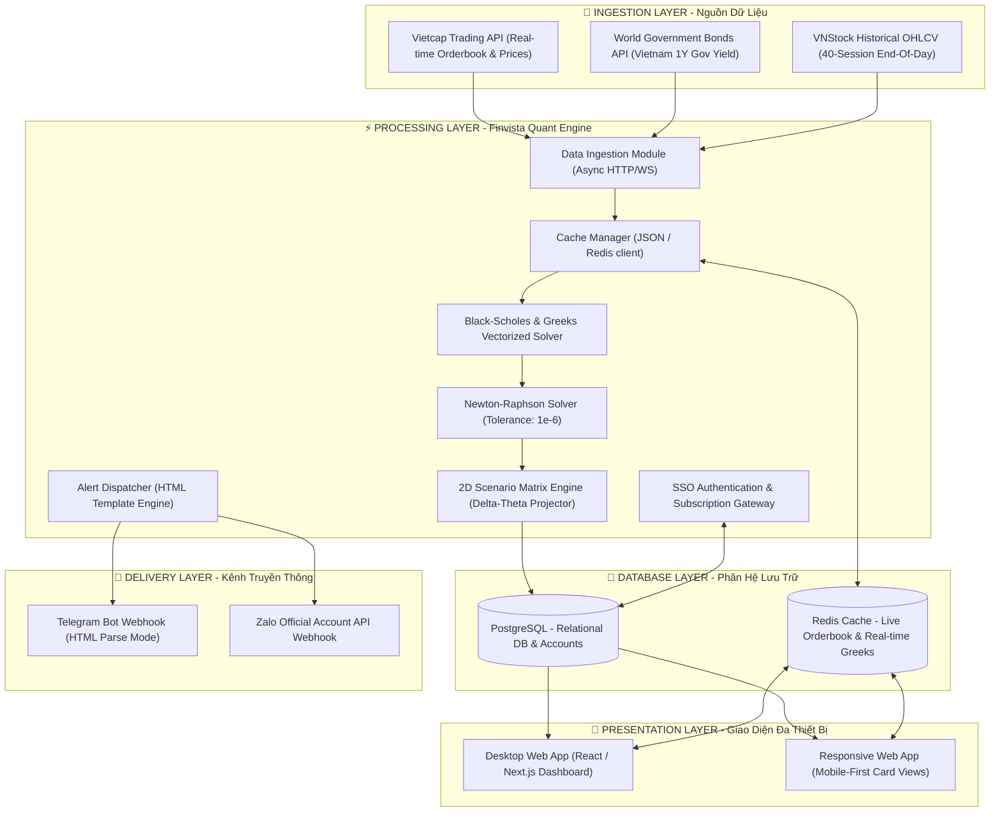
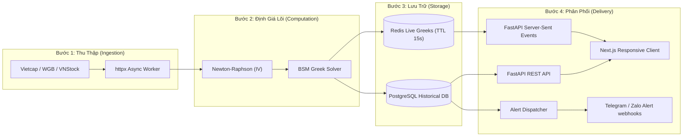
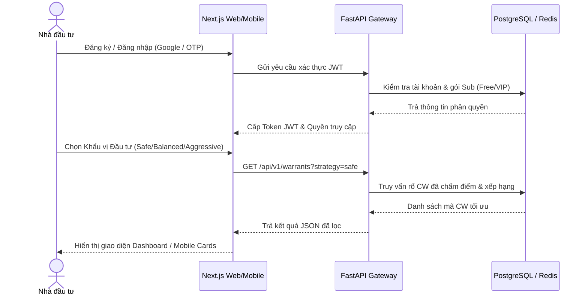
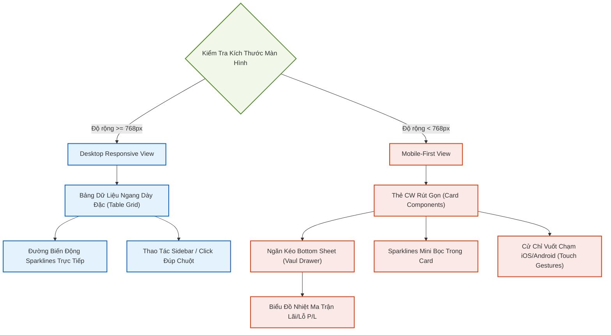

# 🏆 FINVISTA: KIẾN TRÚC HỆ THỐNG PHÂN TÍCH ĐỊNH LƯỢNG & ĐỀ ÁN PHÁT TRIỂN SAAS WEB/MOBILE
> **Enterprise Financial Software Architecture Blueprint & Production-Grade Development Plan**  
> *Tác giả: Hội đồng Kiến trúc Công nghệ Finvista*  
> *Trạng thái: Sẵn sàng triển khai (Production-Ready)*

---

## 🌐 1. TỔNG QUAN KIẾN TRÚC HỆ THỐNG (SYSTEM ARCHITECTURE)

Finvista SaaS được thiết kế theo kiến trúc **Hybrid Monolith** với định hướng sẵn sàng phân rã thành **Microservices** khi quy mô người dùng tăng trưởng. Hệ thống tối ưu hóa hiệu năng tính toán định lượng thời gian thực (real-time quant execution) và giảm thiểu độ trễ tối đa thông qua cơ chế bất đồng bộ và bộ đệm phân tầng.

### 1.1. Sơ đồ Kiến trúc Tổng quan (System Architecture Diagram)



---

## 📡 2. QUY TRÌNH LUỒNG DỮ LIỆU & CHIẾN LƯỢC RESILIENCE (DATAFLOW & RESILIENCE STRATEGY)

Luồng dữ liệu trong hệ thống tài chính định lượng đòi hỏi tính toàn vẹn (integrity), độ chính xác toán học tuyệt đối và khả năng khôi phục sau sự cố (failover) tự động.

### 2.1. Chi tiết Luồng Dữ Liệu 4 Bước (Pipeline Execution Flow)



| Bước | Phân Hệ / Phân Lớp | Dữ Liệu Đầu Vào / Đầu Ra | Hành Động Định Lượng Cốt Lõi | Cơ Chế Tối Ưu Hiệu Năng |
| :--- | :--- | :--- | :--- | :--- |
| **Bước 1: Thu Thập (Ingestion)** | Ingestion Layer (Celery Schedule) | - **Vietcap API:** Báo giá, Sổ lệnh CW & CPCS<br>- **WGB API:** Lãi suất TPCP VN 1Y<br>- **VNStock:** Giá lịch sử OHLCV | Kéo dữ liệu thời gian thực bất đồng bộ bằng `httpx` (15 giây/lần trong phiên giao dịch). | Tích hợp cơ chế tự động thử lại (Retry) và fallback giá trị mặc định khi mất kết nối. |
| **Bước 2: Định Giá Lõi (Computation)** | Quant Core Engine (Python/C) | - **Đầu vào:** Spot, Strike, Volatility, T, r<br>- **Đầu ra:** Greeks, Implied Volatility (IV) | - Newton-Raphson giải ngược IV ($\epsilon = 10^{-6}$)<br>- BSM Engine tính Greeks: $\Delta, \Gamma, \Theta, \nu, \rho$ | Vectorization với `numpy` giải toán song song cho toàn bộ 216 mã CW cùng lúc. |
| **Bước 3: Lưu Trữ (Storage)** | Cache & Persistent Database | - **Redis:** Dữ liệu Greeks & Live Price thời gian thực<br>- **PostgreSQL:** Lịch sử giá, Người dùng & Alerts | - Ghi live data vào bộ nhớ đệm tốc độ cao.<br>- Ghi thông tin có tính quan hệ và lịch sử vào DB. | Hai tầng Cache (Memory/Persistent) giúp triệt tiêu trễ và tránh nghẽn I/O. |
| **Bước 4: Phân Phối (Delivery)** | API Gateway & Alert Dispatcher | - **JSON REST API** qua HTTP/2<br>- **Cảnh báo:** Telegram & Zalo Webhooks | - API Gateway phân phát dữ liệu cho Web/Mobile App.<br>- Đẩy tin nhắn HTML thông báo rủi ro & cơ hội. | Server-Sent Events (SSE) để truyền dữ liệu thời gian thực không trễ lên trình duyệt. |

1.  **Ingestion:** Luồng Ingestion chạy bất đồng bộ qua `HTTP/2` để kéo rổ dữ liệu giá của 216 mã CW và 21 mã cổ phiếu cơ sở đại diện.
2.  **Quant Computation:** Sử dụng `numpy` vectorization để tính toán các chỉ số toán học tài chính cùng lúc cho toàn bộ 216 chứng quyền:
    *   **Implied Volatility (IV):** Dùng bộ giải Newton-Raphson với điều kiện dừng sai số tuyệt đối $\epsilon = 10^{-6}$ và số lần lặp tối đa $N_{max} = 100$.
    *   **Greeks:** Tính toán các đạo hàm bậc một và bậc hai gồm Delta ($\Delta$), Gamma ($\Gamma$), Theta ($\Theta$), Vega ($\nu$), Rho ($\rho$) được hiệu chỉnh tỷ lệ chuyển đổi ($k$).
3.  **Caching & Persistence:**
    *   **Redis Cache:** Lưu trữ trạng thái khớp lệnh và các biến Greeks thời gian thực với thời gian tồn tại (TTL) ngắn (15 giây).
    *   **PostgreSQL:** Ghi lại lịch sử giá phục vụ vẽ đồ thị nến, thông tin người dùng, lịch sử phân tích và cấu hình cảnh báo.

### 2.2. Chiến lược Tăng cường Khả năng Chịu Lỗi (Resilience Strategies)
*   **API Rate Limit Protection:** Hệ thống Ingestion tích hợp cơ chế tự động dừng chờ tăng dần (Exponential Backoff) và sử dụng Proxy xoay tua (Rotated Proxies) để không bị chặn bởi các API giao dịch lớn.
*   **Historical Volatility (HV) Caching:** Để tránh gọi API lịch sử giá liên tục cho 21 cổ phiếu cơ sở (vốn mất nhiều tài nguyên mạng), HV được tính toán định kỳ vào 16h00 hàng ngày và lưu trữ vào JSON/Redis cache. Nếu lỗi kết nối mạng, hệ thống tự động sử dụng giá trị HV gần nhất trong cache làm fallback an toàn để pipeline định giá không bị gián đoạn.
*   **Continuous Risk-Free Rate Fallback:** Lãi suất phi rủi ro Việt Nam kỳ hạn 1 năm được cào tự động. Trong trường hợp cổng dữ liệu TPCP bị lỗi (downtime), hệ thống sẽ kích hoạt giá trị mặc định được cấu hình sẵn là `3.5%` để đảm bảo tính toán Black-Scholes không bị dừng đột ngột.

---

## 📈 3. LUỒNG NGHIỆP VỤ & TƯ DUY SẢN PHẨM PHÂN TẦNG (MULTI-TIERED WORKFLOWS)

Sản phẩm Finvista SaaS được thiết kế để phân cấp trải nghiệm người dùng nhằm tối ưu hóa chuyển đổi thương mại (monetization funnel).

### 3.1. Luồng Nghiệp Vụ Người Dùng Cá Nhân (Retail Investor Workflow)



### 3.2. Phân Cấp Gói Thuê Bao (Subscription Tiering Model)
*   **Gói Free (Trải nghiệm cơ bản):**
    *   Xem bảng giá CW chậm 5 phút.
    *   Truy cập danh mục Top 5 mã CW khuyến nghị theo chế độ Cân Bằng (Balanced).
    *   Chỉ xem được Greeks cơ bản (Delta, Gamma).
*   **Gói VIP (150.000 VNĐ - 350.000 VNĐ / tháng):**
    *   Dữ liệu thời gian thực (Real-time) không trễ.
    *   Không giới hạn bộ lọc nâng cao (lọc theo TCPH, Spread, Đòn bẩy, Điểm Xếp Hạng FA).
    *   Truy cập trọn vẹn lõi toán học: **Ma trận Mô phỏng Lãi/Lỗ kịch bản (Scenario P/L Matrix)**, Delta-Theta projection.
    *   Kích hoạt phân hệ **Cảnh báo Đẩy (Push Alert Webhooks)** không giới hạn qua Telegram và Zalo Bot.

---

## 💾 4. CẤU TRÚC DỮ LIỆU CHUẨN HOÁ DOANH NGHIỆP (ENTERPRISE DATA SCHEMA)

Để đảm bảo khả năng mở rộng và truy vấn siêu tốc, cơ sở dữ liệu quan hệ PostgreSQL được thiết kế chuẩn hóa 3NF kết hợp tối ưu chỉ mục (indexes).

### 4.1. Thiết kế SQL DDL (PostgreSQL Schema)

```sql
-- Kích hoạt extension hỗ trợ UUID tự động
CREATE EXTENSION IF NOT EXISTS "uuid-ossp";

-- Bảng Cổ Phiếu Cơ Sở (Underlying Assets)
CREATE TABLE underlying_assets (
    symbol VARCHAR(10) PRIMARY KEY,
    name VARCHAR(150) NOT NULL,
    current_price DECIMAL(12, 2) NOT NULL,
    historical_volatility DECIMAL(6, 4) NOT NULL, -- HV 40 phiên
    last_updated TIMESTAMP DEFAULT CURRENT_TIMESTAMP NOT NULL
);

-- Bảng Chứng Quyền Có Bảo Đảm (Covered Warrants)
CREATE TABLE covered_warrants (
    symbol VARCHAR(15) PRIMARY KEY,
    underlying_symbol VARCHAR(10) REFERENCES underlying_assets(symbol) ON DELETE CASCADE,
    issuer VARCHAR(50) NOT NULL, -- TCPH (SSI, KIS, HSC...)
    strike_price DECIMAL(12, 2) NOT NULL, -- Giá thực hiện quyền
    conversion_ratio VARCHAR(10) NOT NULL, -- Tỷ lệ chuyển đổi (ví dụ: "2:1")
    conversion_ratio_decimal DECIMAL(10, 6) NOT NULL, -- Tỷ lệ chuyển đổi dạng thập phân (0.5)
    maturity_date DATE NOT NULL, -- Ngày đáo hạn
    current_price DECIMAL(12, 2) NOT NULL, -- Thị giá CW hiện tại
    implied_volatility DECIMAL(6, 4) NOT NULL, -- IV giải ngược
    delta DECIMAL(5, 4) NOT NULL, -- Chỉ số Greeks Delta
    gamma DECIMAL(8, 6) NOT NULL, -- Chỉ số Greeks Gamma
    theta DECIMAL(12, 2) NOT NULL, -- Chỉ số Greeks Theta (hao mòn thời gian/ngày)
    vega DECIMAL(12, 2) NOT NULL, -- Chỉ số Greeks Vega
    composite_score DECIMAL(4, 1) NOT NULL, -- Điểm định lượng tổng hợp Finvista (0-100)
    investment_signal VARCHAR(20) NOT NULL, -- Tín hiệu (STRONG BUY, BUY, HOLD, SKIP)
    last_updated TIMESTAMP DEFAULT CURRENT_TIMESTAMP NOT NULL
);

-- Chỉ mục tối ưu hóa truy vấn bảng điện và bộ lọc thời gian thực
CREATE INDEX idx_cw_underlying ON covered_warrants(underlying_symbol);
CREATE INDEX idx_cw_composite_score ON covered_warrants(composite_score DESC);
CREATE INDEX idx_cw_maturity_date ON covered_warrants(maturity_date ASC);
CREATE INDEX idx_cw_investment_signal ON covered_warrants(investment_signal);
```

### 4.2. Cấu trúc bộ nhớ đệm (Redis Key-Value Design)
*   **Orderbook Live Price Hash:**
    *   *Key:* `cw:live_price:<symbol>`
    *   *Value:* `{ "price": 1080, "change_pct": 52.1, "volume": 2425900, "bid_1": 1070, "ask_1": 1080 }`
    *   *TTL:* `15` (giây)
*   **Greeks Real-time Pricing Cache:**
    *   *Key:* `cw:greeks:<symbol>`
    *   *Value:* `{ "iv": 0.010, "delta": 0.50, "theta": -1.0, "gamma": 0.004 }`
    *   *TTL:* `15` (giây)
*   **Historical Volatility JSON Cache:**
    *   *Key:* `underlying:hv:cache`
    *   *Value:* `{ "ACB": 0.2337, "FPT": 0.3309, "HPG": 0.2075 }` (Không giới hạn thời gian - cập nhật thủ công vào 16:00 mỗi ngày).

---

## 📱 5. THIẾT KẾ TRẢI NGHIỆM MOBILE-FIRST (RESPONSIVE GRAPHICAL SYSTEM)

Hệ thống cung cấp trải nghiệm nhất quán trên cả môi trường Desktop Web và thiết bị di động (Mobile App) bằng cách sử dụng lưới linh hoạt (CSS Grid) và thiết kế **Mobile-First Components**.

### 5.1. Kiến trúc Chuyển Đổi Giao Diện Responsive (Responsive UI Adaptation)



| Thành Phần Giao Diện | Giao Diện Desktop (Desktop View - Bảng Ngang Dày Dữ Liệu) | Giao Diện Mobile (Mobile Card View - Thẻ Thông Tin Nhỏ Gọn) | Chiến Lược Tối Ưu UX |
| :--- | :--- | :--- | :--- |
| **Bố Cục (Layout)** | **Dạng bảng ngang dày đặc (Data-dense Grid):**<br>Hiển thị đầy đủ tất cả các cột dữ liệu đối chiếu.<br>*(Mã CW \| CPCS \| TCPH \| Thị giá \| +/- % \| IV vs HV \| Delta \| Theta \| Score \| Khuyến nghị)* | **Dạng thẻ riêng biệt (Collapse/Expand Card View):**<br>Mỗi mã CW là một thẻ thông tin độc lập có thể thu gọn.<br>*(🏷️ Mã CW \| CPCS \| Điểm số \| Giá \| Vol Arb \| Delta \| Theta)* | Sử dụng Tailwind CSS `hidden md:table-cell` trên desktop và `block md:hidden` trên mobile để tự động ẩn/hiện cấu trúc. |
| **Ma Trận Kịch Bản P/L** | Hiển thị ma trận 2 chiều (2D Heatmap Grid) cố định ngay trên trang chi tiết cùng với các đồ thị lớn. | Tích hợp trong **Bottom Sheet Drawer** (Ngăn kéo vuốt từ dưới lên). Khi click "Xem Ma Trận", drawer mới xuất hiện để tối ưu diện tích. | Sử dụng thư viện `vaul` của Radix UI cho hiệu ứng vuốt cực mịn trên iOS & Android. |
| **Biểu Đồ Xu Hướng** | Đồ thị Interactive Chart lớn vẽ bằng `ApexCharts` hoặc `ECharts` chiếm trọn 1/2 màn hình. | Đường đồ thị mini **(Sparklines)** vẽ gọn ngay bên trong thẻ danh sách để hiển thị nhanh xu hướng 5 ngày. | Sử dụng component Sparkarea của thư viện `Tremor` để vẽ biểu đồ siêu nhẹ không gây giật lag trên di động. |
| **Thao Tác Giao Dịch** | Click đúp chuột vào hàng hoặc dùng panel nút đặt lệnh cố định ở sidebar bên phải màn hình. | **Thao tác vuốt (Swipe Gestures):**<br>- Vuốt sang phải: Vào màn hình đặt lệnh mua nhanh.<br>- Vuốt sang trái: Bật/tắt cảnh báo hoặc lưu Watchlist. | Tích hợp thư viện `@radix-ui/react-context-menu` phiên bản cảm ứng để tối ưu phản hồi haptic. |

### 5.2. Các Thành Phần UX Di Động Đỉnh Cao (Mobile UX Elements)
1.  **Bottom Sheet Drawer (Vuốt từ dưới lên):** Thay thế hoàn toàn các Pop-up/Modal cồng kềnh của giao diện desktop. Khi người dùng nhấp vào nút "Xem Ma Trận Lãi/Lỗ", một ngăn kéo vuốt mềm mại sẽ hiện lên từ đáy màn hình giúp hiển thị biểu đồ nhiệt ma trận mà không làm mất tập trung của người dùng.
2.  **Interactive Sliders (Thanh trượt kịch bản):** Người dùng kéo ngón tay trực tiếp trên thanh trượt để thay đổi giá cổ phiếu cơ sở ($\pm 10\%$) và số ngày nắm giữ ($0 - 30$ ngày) nhằm nhìn thấy ngay biến động giả định của tài khoản chứng quyền bằng đồ họa trực quan.
3.  **Tremor Sparklines (Đường kẻ biến động mini):** Nhúng trực tiếp biểu đồ dao động 7 phiên của thị giá và IV ngay bên cạnh mã CW trên danh sách di động để người dùng có thể nhận định nhanh xu hướng mà không cần mở trang chi tiết.

---

## 🚀 6. LỘ TRÌNH TRIỂN KHAI PHÁT TRIỂN SAAS (8-WEEK SAAS IMPLEMENTATION ROADMAP)

Lộ trình triển khai áp dụng quy trình Phát triển Phần mềm Linh hoạt (Agile Scrum), chia làm 4 chặng Sprints chuẩn hóa, đảm bảo hệ thống lên môi trường thực tế (Go-Live) ổn định chỉ sau 2 tháng.

```
[SPRINT 1: API BACKEND] ──> [SPRINT 2: FRONTEND UI] ──> [SPRINT 3: SAAS & ALERTS] ──> [SPRINT 4: DEPLOY & TEST]
  (Tuần 1 - Tuần 2)          (Tuần 3 - Tuần 4)          (Tuần 5 - Tuần 6)           (Tuần 7 - Tuần 8)
```

### 🏃‍♂️ Sprint 1: Xây dựng Lõi Backend API & Cơ sở Dữ liệu (Tuần 1 - Tuần 2)
*   **Mục tiêu:** Hoàn thiện 100% cổng dữ liệu định lượng an toàn, tối ưu hóa Caching và sẵn sàng cung cấp dữ liệu qua API.
*   **Chi tiết Nhiệm vụ & Kỹ thuật:**
    1.  Khởi tạo kiến trúc FastAPI sử dụng `Poetry` quản lý package và `Uvicorn` làm server chính.
    2.  Triển khai ORM `SQLAlchemy` (hoặc `SQLModel`) kết hợp công cụ quản lý phiên bản database `Alembic` để tự động hóa migration cơ sở dữ liệu PostgreSQL.
    3.  Tích hợp `Redis` client và đóng gói module `CacheManager` để quản lý việc đọc/ghi đệm bảng giá và Greeks tự động với cơ chế fallback khi lỗi.
    4.  Xây dựng hệ thống scheduler bất đồng bộ sử dụng `Celery` kết hợp `RabbitMQ` hoặc `Redis` làm Message Broker, tối ưu hóa tần suất quét dữ liệu (15 giây/lần trong phiên giao dịch).
    5.  Hoàn thành hệ thống RESTful API endpoints:
        *   `GET /api/v1/warrants` (Xem danh sách kèm xếp hạng điểm số).
        *   `GET /api/v1/warrants/{symbol}` (Xem chi tiết chỉ số Greeks thời gian thực).
        *   `GET /api/v1/warrants/{symbol}/simulate` (Lấy dữ liệu ma trận P/L giả định).

### 🏃‍♂️ Sprint 2: Phát triển Giao diện Web Portal & Mobile UX (Tuần 3 - Tuần 4)
*   **Mục tiêu:** Hiện thực hóa giao diện SaaS hiện đại, bóng bẩy, hỗ trợ đầy đủ responsive và thao tác di động.
*   **Chi tiết Nhiệm vụ & Kỹ thuật:**
    1.  Khởi tạo dự án Next.js (phiên bản Next.js 14+) sử dụng App Router, TypeScript và Tailwind CSS.
    2.  Nhúng thư viện UI cốt lõi `shadcn/ui` (xây dựng trên Radix UI vô cùng mượt mà) và `Tremor` làm nền tảng hiển thị thẻ số liệu tài chính.
    3.  Lập trình Component bảng điện chứng quyền nâng cao (`sadmann7/shadcn-table`) hỗ trợ lọc theo CPCS, TCPH, tìm kiếm tức thì và phân trang.
    4.  Triển khai giao diện di động Responsive Grid, đóng gói danh sách chứng quyền thành Card View gọn đẹp và tích hợp thư viện `vaul` để làm Bottom Sheet Drawer xem ma trận P/L.
    5.  Sử dụng thư viện `Recharts` để vẽ biểu đồ ma trận lãi/lỗ 2D tương tác thời gian thực bằng dải màu HSL Gradient (với màu xanh dương đại diện cho lãi và cam đất đại diện cho lỗ).

### 🏃‍♂️ Sprint 3: Tích hợp Hệ thống Đăng nhập, Thanh toán & Webhooks (Tuần 5 - Tuần 6)
*   **Mục tiêu:** Hiện thực hóa mô hình thương mại hóa SaaS và tự động hóa hệ thống thông báo đẩy thông minh.
*   **Chi tiết Nhiệm vụ & Kỹ thuật:**
    1.  Triển khai phân hệ xác thực đăng nhập bảo mật sử dụng `NextAuth.js` hỗ trợ đăng nhập qua Google OAuth, Apple ID và OTP Số điện thoại.
    2.  Xây dựng module phân quyền tài khoản (Middleware Route Protection) bảo vệ các tài nguyên API VIP (như Ma trận mô phỏng và bộ lọc Greeks nâng cao).
    3.  Kết nối cổng thanh toán trực tuyến của Việt Nam (VNPAY / PayOS) để tự động hóa quy trình nạp tiền gia hạn tài khoản VIP bằng mã QR Code tiện lợi.
    4.  Nâng cấp phân hệ [telegram_alerts.py](../src/common/telegram_alerts.py) hiện tại lên thành module Notification Center tổng thể, hỗ trợ kết nối cả API Zalo Official Account để gửi tin nhắn chủ động khi tài khoản kích hoạt cảnh báo Greeks hoặc rủi ro đáo hạn.

### 🏃‍♂️ Sprint 4: Kiểm thử Tối ưu hoá, Cấu hình CI/CD & Ra Mắt Đợt Đầu (Tuần 7 - Tuần 8)
*   **Mục tiêu:** Bảo mật tuyệt đối hệ thống, tối ưu hóa hiệu năng máy chủ và chính thức đưa ứng dụng lên đám mây (Go-Live).
*   **Chi tiết Nhiệm vụ & Kỹ thuật:**
    1.  Viết bộ kiểm thử tự động toàn diện (Unit Tests & Integration Tests) sử dụng thư viện `pytest` để kiểm chứng độ chính xác toán học của lõi định giá BSM và giải ngược IV.
    2.  Viết các kịch bản kiểm thử hiệu năng tải (Load Testing) sử dụng thư viện `Locust` để đảm bảo hệ thống chịu được tải đồng thời ít nhất `5.000` người dùng trực tuyến.
    3.  Cấu hình luồng tự động hóa tích hợp và triển khai liên tục (CI/CD Pipeline) bằng GitHub Actions để tự động kiểm tra cú pháp (Linting) và deploy code lên máy chủ.
    4.  Docker hóa toàn bộ hệ thống bằng `Docker Compose` để đóng gói độc lập FastAPI Backend, Next.js Frontend, PostgreSQL Database và Redis Cache.
    5.  Triển khai hệ thống lên đám mây: Backend và Database được thiết lập trên cụm máy chủ VPS Linux (AWS / DigitalOcean) có bảo vệ bởi tường lửa Nginx, Frontend được lưu trữ trên hạ tầng Vercel Edge Server để tải trang nhanh nhất.
    6.  Chính thức ra mắt phiên bản thử nghiệm giới hạn (Beta Launch) cho 100 chuyên viên môi giới và khách hàng VIP đầu tiên để thu thập đánh giá trải nghiệm người dùng thực tế.

---

## 🛡️ 7. TUYÊN BỐ SỨ MỆNH PHỤC VỤ NHÀ ĐẦU TƯ
> [!IMPORTANT]
> **Finvista** ra đời với sứ mệnh mang đến sự minh bạch tối đa cho thị trường phái sinh Việt Nam. Trái ngược với các hệ thống tự doanh của các công ty chứng khoán (vốn có xung đột lợi ích với nhà đầu tư cá nhân trong việc định giá), **Finvista SaaS** đứng hoàn toàn về phía khách hàng để cung cấp một lăng kính định lượng độc lập, chính xác và trung thực nhất. Giúp mọi nhà đầu tư cá nhân làm chủ công cụ phòng vệ rủi ro và tối đa hóa cơ hội tích lũy tài sản dài hạn.
