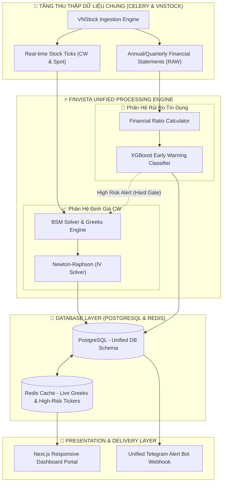

# 🏆 FINVISTA UNIFIED INTEGRATION PLAN: HỢP NHẤT HỆ SINH THÁI ĐỊNH LƯỢNG

Đề án tích hợp phân hệ **Dự báo Kiệt quệ Tài chính (Financial Distress)** vào lõi **Finvista Covered Warrants (CW) SaaS** để tạo ra một siêu ứng dụng (Super-App) phân tích chứng khoán phái sinh & quản trị rủi ro doanh nghiệp đầu tiên tại Việt Nam.

---

## 🌐 1. Sơ Đồ Kiến Trúc Hợp Nhất (Unified System Architecture)

Khi tích hợp, luồng dữ liệu thô từ `vnstock` sẽ chảy vào một lõi xử lý chung trước khi phân rã sang các tác vụ chuyên biệt (Định giá CW hoặc Cảnh báo rủi ro tín dụng).



---

## 🔑 2. Bốn Điểm Chạm Tích Hợp Cốt Lõi (Integration Touchpoints)

### 💾 2.1. Hợp Nhất Cơ Sở Dữ Liệu (Unified Database Schema)
Chúng ta kết nối bảng thông tin rủi ro tín dụng trực tiếp vào bảng cổ phiếu cơ sở `underlying_assets` để tối ưu hóa liên kết dữ liệu.

```sql
-- Bảng Sức khỏe tài chính & Dự báo Vỡ nợ (Corporate Credit Health)
CREATE TABLE corporate_credit_health (
    ticker VARCHAR(10) PRIMARY KEY REFERENCES underlying_assets(symbol) ON DELETE CASCADE,
    altman_z_score DECIMAL(6, 4) NOT NULL,
    z_score_zone VARCHAR(20) NOT NULL, -- SAFE, GREY, DISTRESS
    xgboost_distress_probability DECIMAL(5, 4) NOT NULL, -- Xác suất kiệt quệ (0.0 đến 1.0)
    distress_label INT NOT NULL, -- 0 hoặc 1
    leverage_ratio DECIMAL(6, 4) NOT NULL, -- Nợ/Tổng tài sản
    liquidity_ratio DECIMAL(6, 4) NOT NULL, -- Thanh toán hiện thời
    roa DECIMAL(6, 4) NOT NULL,
    roe DECIMAL(6, 4) NOT NULL,
    last_updated TIMESTAMP DEFAULT CURRENT_TIMESTAMP NOT NULL
);

-- Chỉ mục để quét siêu tốc các mã cổ phiếu cơ sở rủi ro cao
CREATE INDEX idx_credit_health_zone ON corporate_credit_health(z_score_zone);
CREATE INDEX idx_credit_xgboost_prob ON corporate_credit_health(xgboost_distress_probability DESC);
```

### 🛡️ 2.2. Tính Năng Lọc Cứng Rủi Ro - "Hard Gate Risk Filter"
* **Nghiệp vụ hiện tại**: Định giá CW chỉ phụ thuộc vào biến động giá cổ phiếu cơ sở ($S$), giá thực hiện ($K$), thời gian đáo hạn ($T$), lãi suất ($r$), biến động lịch sử ($HV$).
* **Nghiệp vụ sau tích hợp**: Hệ thống định giá CW sẽ chạy thêm một bộ lọc cứng (Hard Gate). Nếu cổ phiếu cơ sở (ví dụ: VIC, HPG) bị phân hệ rủi ro tín dụng đánh giá là **"Kiệt quệ tài chính (Distressed - Zone Đỏ)"**, hệ thống sẽ lập tức:
  1. Đóng băng đề xuất đầu tư đối với các CW liên quan.
  2. Hiển thị cảnh báo màu đỏ chói cảnh báo người dùng: *"Cổ phiếu cơ sở đang đứng trước nguy cơ vỡ nợ cao (Z''-Score < 1.1). Tuyệt đối tránh xa chứng quyền này!"*.

### 🔔 2.3. Tích Hợp Telegram Bot Cảnh Báo Đẩy Thông Minh
Nâng cấp tệp `telegram_alerts.py` hiện tại thành một chatbot đa năng:
* **Cảnh báo CW**: Gửi tin nhắn cơ hội chênh lệch giá (Vol Arbitrage).
* **Cảnh báo Vỡ nợ**: Gửi tin khẩn cấp khi một công ty lớn niêm yết công bố báo cáo tài chính mới với các thông số rơi vào "Vùng đỏ".
  * *Mẫu tin nhắn:*
    > **🚨 [CẢNH BÁO FINVISTA - CREDIT RISK]**  
    > Doanh nghiệp **ABC** vừa công bố báo cáo tài chính với vốn chủ sở hữu âm. Mô hình XGBoost dự báo nguy cơ kiệt quệ tài chính đạt **98.4%**. Điểm Altman Z''-Score sụt giảm còn **0.42 (Danger Zone)**.  
    > 👉 **Khuyến nghị cực kỳ quan trọng**: Rút toàn bộ vốn khỏi các chứng quyền cơ sở ABC ngay lập tức!

### 🎨 2.4. Tích Hợp Giao Diện Trực Quan (Unified UI Widget)
Trong trang chi tiết của một mã chứng quyền trên Next.js Web/Mobile Dashboard, chúng ta nhúng thêm một **Widget sức khỏe tài chính** bên cạnh biểu đồ Greeks:
* **Vòng quay Altman Z''-Score Dial**: Hiển thị kim chỉ vùng An Toàn (Xanh), Vùng Xám (Vàng), Vùng Nguy Hiểm (Đỏ).
* **Biểu đồ cột so sánh**: So sánh các chỉ số ROA, ROE, Thanh toán hiện thời của doanh nghiệp đó với trung bình ngành để nhà đầu tư có cái nhìn toàn cảnh trước khi click mua chứng quyền.

---

## 🎯 3. Giá Trị Thương Mại Cực Lớn Khi Tích Hợp
Việc tích hợp này biến sản phẩm của anh từ một công cụ định giá phái sinh thuần túy trở thành một **nền tảng tư vấn đầu tư an toàn và chuyên sâu**. Đây là vũ khí cạnh tranh độc quyền giúp gói VIP trên SaaS của anh trở nên cực kỳ đáng tiền đối với cả nhà đầu tư cá nhân lẫn các chuyên viên môi giới chứng khoán chuyên nghiệp tại Việt Nam!
