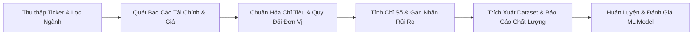
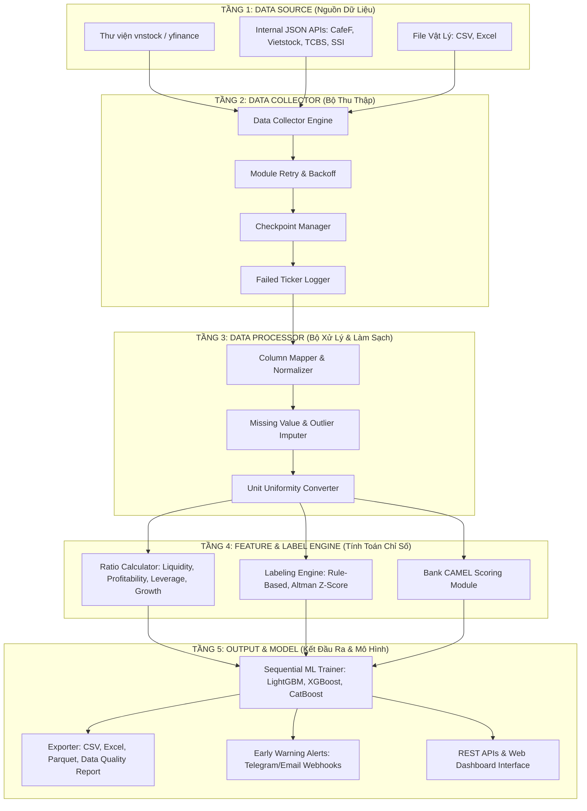
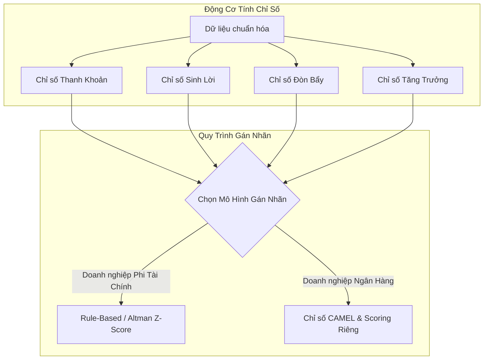

# 📊 HỆ THỐNG DỰ ĐOÁN KIỆT QUỆ TÀI CHÍNH (FINANCIAL DISTRESS PREDICTION SYSTEM)
## BẢN ĐỒ PHÁT TRIỂN KỸ THUẬT & KIẾN TRÚC HỆ THỐNG ĐẦY ĐỦ (ROADMAP)

> **Mục tiêu:** Xây dựng hệ thống tự động hóa thu thập dữ liệu tài chính từ các sàn HOSE/HNX/UPCOM Việt Nam, xử lý chuẩn hóa dữ liệu quy mô lớn, tính toán các chỉ số tài chính, áp dụng các mô hình gán nhãn rủi ro (Rule-Based, Altman Z-Score & CAMEL cho Ngân hàng) và huấn luyện mô hình Machine Learning dự báo sớm nguy cơ kiệt quệ tài chính (Financial Distress).

---

> [!NOTE]
> Tài liệu này được biên soạn dựa trên phân tích chuyên sâu về thị trường chứng khoán Việt Nam, kế thừa thư viện `vnstock` và thiết lập các tiêu chuẩn kỹ thuật nghiêm ngặt chống lỗi dữ liệu, chống rò rỉ thông tin thời gian (look-ahead bias) và phân tách rạch ròi giữa doanh nghiệp phi tài chính với khối Ngân hàng/Tài chính.

---

## 📋 MỤC LỤC
1. [Ý tưởng Cốt lõi & Luồng Dữ liệu Tổng quát](#1-ý-tưởng-cốt-lõi--luồng-dữ-liệu-tổng-quát)
2. [Thiết kế Kiến trúc Hệ thống (5 Tầng)](#2-thiết-kế-kiến-trúc-hệ-thống-5-tầng)
3. [Quy trình Ingestion Dữ liệu Kiên cường (Resilient Pipeline)](#3-quy-trình-ingestion-dữ-liệu-kiên-cường)
4. [Chuẩn hóa & Làm sạch Dữ liệu Tài chính Việt Nam](#4-chuẩn-hóa--làm-sạch-dữ-liệu-tài-chính-việt-nam)
5. [Động cơ Tính Chỉ số & Gán nhãn Rủi ro (Rule-Based & Z-Score & CAMEL)](#5-động-cơ-tính-chỉ-số--gán-nhãn-rủi-ro)
6. [Chiến lược Huấn luyện & Đánh giá Mô hình Machine Learning](#6-chiến-lược-huấn-luyện--đánh-giá-mô-hình-machine-learning)
7. [Lộ trình Triển khai Kỹ thuật (4 Giai đoạn - 8 Tuần)](#7-lộ-trình-triển-khai-kỹ-thuật-4-giai-đoạn---8-tuần)
8. [Các Lỗi Thường Gặp & Giải Pháp Phòng vệ](#8-các-lỗi-thường-gặp--giải-pháp-phòng-vệ)

---

## 1. Ý TƯỞNG CỐT LÕI & LUỒNG DỮ LIỆU TỔNG QUÁT

Kiệt quệ tài chính (Financial Distress) là trạng thái doanh nghiệp gặp khó khăn nghiêm trọng trong việc thực hiện các nghĩa vụ tài chính đối với chủ nợ và cổ đông, thường là tiền đề của việc tạm ngừng hoạt động, hủy niêm yết bắt buộc hoặc phá sản.

Hệ thống được thiết kế theo mô hình luồng dữ liệu một chiều khép kín:


### 🎯 Quy tắc Lọc ngành Đầu vào (Crucial Filter Rule)
Đối với mô hình dự báo Corporate Distress thông thường, **bắt buộc phải loại bỏ nhóm ngành tài chính** (Ngân hàng, Chứng khoán, Bảo hiểm, Quỹ đầu tư, Công ty tài chính) ra khỏi tập dữ liệu chung. 
- *Lý do:* Cấu trúc báo cáo của ngân hàng (không có các khoản mục thông thường như Hàng tồn kho, Phải thu, Nợ ngắn hạn/dài hạn theo kiểu doanh nghiệp sản xuất) sẽ làm sai lệch hoàn toàn các chỉ số tính toán.
- *Giải pháp:* Thiết lập 2 luồng xử lý riêng biệt: **Luồng Doanh nghiệp Phi tài chính** (Áp dụng Altman Z-Score & Rule-based) và **Luồng Tổ chức Tín dụng / Ngân hàng** (Áp dụng bộ chỉ số CAMEL & Mô hình chấm điểm rủi ro tín dụng riêng biệt).

---

## 2. THIẾT KẾ KIẾN TRÚC HỆ THỐNG (5 TẦNG)

Hệ thống được tổ chức thành 5 tầng chức năng rõ ràng nhằm đảm bảo tính module hóa, dễ bảo trì và dễ mở rộng sang giải pháp SaaS:



---

## 3. QUY TRÌNH INGESTION DỮ LIỆU KIÊN CƯỜNG (RESILIENT PIPELINE)

Khi thu thập dữ liệu từ hàng trăm công ty qua nhiều năm, các lỗi mạng, rate limit, hay thay đổi API từ phía nguồn cung cấp chắc chắn sẽ xảy ra. Pipeline thu thập được thiết kế để tự phục hồi dựa trên 3 nguyên tắc cốt lõi:
1. **Exponential Backoff & Random Delay:** Tạo khoảng nghỉ ngẫu nhiên (ví dụ từ 1.5 đến 3.5 giây) giữa các request và tự động thử lại (Retry) với độ trễ tăng dần nếu gặp lỗi.
2. **Stateful Checkpointing:** Lưu trạng thái định kỳ (sau mỗi 10-25 doanh nghiệp). Nếu hệ thống bị sập giữa chừng, lần chạy tiếp theo sẽ tiếp tục từ doanh nghiệp cuối cùng thành công thay vì cào lại từ đầu.
3. **Failed Tickers Log:** Ghi nhận toàn bộ danh sách mã lỗi vào một file JSON riêng biệt để chạy quét bù (fallback sweep) vào cuối phiên.

### 💻 Mã nguồn Skeleton: `data_collector.py`
```python
import time
import random
import json
import os
import logging
from typing import List, Dict, Any

logging.basicConfig(level=logging.INFO, format="%(asctime)s - %(levelname)s - %(message)s")

class ResilientDataCollector:
    def __init__(self, tickers: List[str], checkpoint_path: str = "data/checkpoint.json", failed_path: str = "data/failed_tickers.json"):
        self.tickers = tickers
        self.checkpoint_path = checkpoint_path
        self.failed_path = failed_path
        self.state = self.load_checkpoint()
        self.failed_tickers = self.load_failed_tickers()

    def load_checkpoint(self) -> Dict[str, Any]:
        if os.path.exists(self.checkpoint_path):
            with open(self.checkpoint_path, 'r', encoding='utf-8') as f:
                return json.load(f)
        return {"last_index": 0, "processed_tickers": []}

    def save_checkpoint(self, index: int, ticker: str):
        self.state["last_index"] = index
        if ticker not in self.state["processed_tickers"]:
            self.state["processed_tickers"].append(ticker)
        with open(self.checkpoint_path, 'w', encoding='utf-8') as f:
            json.dump(self.state, f, ensure_ascii=False, indent=4)

    def load_failed_tickers(self) -> List[str]:
        if os.path.exists(self.failed_path):
            with open(self.failed_path, 'r', encoding='utf-8') as f:
                return json.load(f)
        return []

    def log_failed_ticker(self, ticker: str, reason: str):
        if ticker not in self.failed_tickers:
            self.failed_tickers.append(ticker)
            with open(self.failed_path, 'w', encoding='utf-8') as f:
                json.dump(self.failed_tickers, f, ensure_ascii=False, indent=4)
            logging.warning(f"❌ Logged failed ticker {ticker}. Reason: {reason}")

    def fetch_with_retry(self, ticker: str, report_type: str, year: int, retries: int = 3) -> Dict[str, Any]:
        """Gọi API với cơ chế tự động thử lại khi gặp sự cố."""
        delay = 2.0
        for attempt in range(retries):
            try:
                # Giả lập gọi API (Trong thực tế sẽ dùng requests hoặc vnstock)
                # print(f"Calling API for {ticker} - {report_type} - {year}")
                if random.random() < 0.05:  # Giả lập 5% lỗi ngẫu nhiên
                    raise Exception("Rate limit or gateway timeout")
                
                # Trả về dữ liệu mẫu thành công
                return {"status": "success", "ticker": ticker, "data": {}}
            except Exception as e:
                logging.warning(f"⚠️ Thử lần {attempt + 1} thất bại cho {ticker} ({report_type}). Lỗi: {str(e)}")
                if attempt < retries - 1:
                    time.sleep(delay + random.uniform(0.5, 2.0))
                    delay *= 2  # Exponential backoff
                else:
                    raise e

    def run_pipeline(self):
        start_idx = self.state["last_index"]
        logging.info(f"🚀 Bắt đầu pipeline thu thập dữ liệu từ chỉ mục: {start_idx}/{len(self.tickers)}")
        
        for idx in range(start_idx, len(self.tickers)):
            ticker = self.tickers[idx]
            logging.info(f"🔄 Đang thu thập dữ liệu cho mã: {ticker} ({idx + 1}/{len(self.tickers)})")
            
            try:
                # Quét các báo cáo chính
                balance_sheet = self.fetch_with_retry(ticker, "balance_sheet", 2024)
                income_statement = self.fetch_with_retry(ticker, "income_statement", 2024)
                cash_flow = self.fetch_with_retry(ticker, "cash_flow", 2024)
                
                # Lưu dữ liệu thô (giả lập lưu file JSON hoặc DB)
                # ...
                
                # Cập nhật checkpoint
                self.save_checkpoint(idx + 1, ticker)
                
                # Giãn cách request tránh bị chặn IP
                time.sleep(random.uniform(1.0, 2.5))
                
            except Exception as e:
                logging.error(f"🔴 Thất bại hoàn toàn khi cào mã {ticker}: {str(e)}")
                self.log_failed_ticker(ticker, str(e))
                # Vẫn tiếp tục với mã tiếp theo, không dừng pipeline
                self.save_checkpoint(idx + 1, ticker)

# Cách sử dụng
# collector = ResilientDataCollector(["HPG", "FPT", "VNM", "VIC"])
# collector.run_pipeline()
```

---

## 4. CHUẨN HÓA & LÀM SẠCH DỮ LIỆU TÀI CHÍNH VIỆT NAM

Dữ liệu báo cáo tài chính thô từ các website Việt Nam có độ nhiễu cực cao do sự không nhất quán về tên chỉ tiêu và đơn vị tính qua các thời kỳ hoặc giữa các nguồn.

### A. Chuẩn hóa tên chỉ tiêu bằng Dictionary Mapping
Hệ thống sử dụng một bộ từ điển ánh xạ (Mapping Dictionary) toàn diện để chuẩn hóa tất cả các biến thể ngôn ngữ về một khóa trường (field key) thống nhất:

| Trường Thống Nhất     | Các biến thể trong Báo cáo tài chính Tiếng Việt                  | Biến thể Tiếng Anh                                 |
| :-------------------- | :--------------------------------------------------------------- | :------------------------------------------------- |
| `total_assets`        | "Tổng cộng tài sản", "TỔNG CỘNG TÀI SẢN", "Tổng tài sản"         | "Total Assets", "TOTAL ASSETS"                     |
| `current_assets`      | "Tài sản ngắn hạn", "TỔNG TÀI SẢN NGẮN HẠN", "TS ngắn hạn"       | "Current Assets", "Total Current Assets"           |
| `current_liabilities` | "Nợ ngắn hạn", "NỢ NGẮN HẠN", "Tổng nợ ngắn hạn"                 | "Current Liabilities", "Total Current Liabilities" |
| `total_liabilities`   | "Nợ phải trả", "NỢ PHẢI TRẢ", "Tổng cộng nợ phải trả"            | "Total Liabilities", "TOTAL LIABILITIES"           |
| `equity`              | "Vốn chủ sở hữu", "VỐN CHỦ SỞ HỮU", "Tổng nguồn vốn chủ sở hữu"  | "Owner's Equity", "Total Equity"                   |
| `net_revenue`         | "Doanh thu thuần", "Doanh thu thuần về bán hàng...", "DT thuần"  | "Net Revenue", "Net Sales"                         |
| `net_profit`          | "Lợi nhuận sau thuế", "Lợi nhuận sau thuế thu nhập doanh nghiệp" | "Net Profit After Tax", "NPAT"                     |
| `operating_cash_flow` | "Lưu chuyển tiền tệ thuần từ các hoạt động kinh doanh"           | "Net cash flows from operating activities"         |

### B. Quy đổi đồng bộ Đơn vị đo lường (Unit Scale)
Một số nguồn dữ liệu trả về số liệu dạng giá trị thô nguyên tệ (VND), trong khi nguồn khác lại rút gọn về nghìn VND (1,000 VND), triệu VND (1,000,000 VND), hoặc tỷ VND.
- *Quy tắc:* Toàn bộ số liệu tài chính khi đưa vào DB phải được quy đổi về **đơn vị chuẩn là VND** (hoặc đồng bộ triệu VND cho tất cả). Nếu phát hiện một doanh nghiệp có Tổng tài sản nhỏ hơn $10,000,000$ (tức là chỉ vài triệu đồng thực tế), hệ thống sẽ tự động đối chiếu và áp dụng hệ số nhân quy đổi phù hợp.

### C. Xử lý Trị khuyết (Missing Values) & Trị ngoại lệ (Outliers)
- **Thiếu dữ liệu:** Không nội suy (imputation) bừa bãi bằng trị trung bình đối với các số liệu tài chính vì tính chất đặc thù của mỗi doanh nghiệp. Nếu doanh nghiệp thiếu trên 2 năm báo cáo liên tiếp, tiến hành loại bỏ (Drop).
- **Trị ngoại lệ (Outliers):** Sử dụng phương pháp **Winsorization** tại phân vị 1% và 99% để triệt tiêu ảnh hưởng của các giá trị cực đoan tăng đột biến (ví dụ: một năm lãi đột biến gấp 1000 lần do bán tài sản một lần).
- **Phép chia cho 0 (Division by Zero):** Khi tính các tỷ số như $\text{EBIT} / \text{Chi phí lãi vay}$, nếu chi phí lãi vay bằng 0, phép chia sẽ bị lỗi. Thay thế giá trị vô hạn bằng một hằng số trần lớn (ví dụ: $9999$) hoặc giá trị đặc biệt `NaN`.

---

## 5. ĐỘNG CƠ TÍNH CHỈ SỐ & GÁN NHÃN RỦI RO

Phân hệ này đảm nhận việc chuyển đổi các số liệu thô thành các chỉ số tài chính có ý nghĩa kinh tế và tiến hành gán nhãn mục tiêu (Target Label) cho mô hình học máy.



### A. Công thức tính các Nhóm chỉ số Tài chính Cốt lõi
Hệ thống tự động tính toán các nhóm chỉ số cơ bản sau:
1. **Thanh khoản (Liquidity):**
   $$\text{Current Ratio} = \frac{\text{Current Assets}}{\text{Current Liabilities}}$$
   $$\text{Working Capital Ratio} = \frac{\text{Current Assets} - \text{Current Liabilities}}{\text{Total Assets}}$$
2. **Khả năng sinh lời & Chất lượng lợi nhuận (Profitability & Earnings Quality):**
   $$\text{ROA} = \frac{\text{Net Profit}}{\text{Total Assets}}$$
   $$\text{ROE} = \frac{\text{Net Profit}}{\text{Equity}}$$
   $$\text{Operating Margin} = \frac{\text{EBIT}}{\text{Net Revenue}}$$
   $$\text{OCF to PAT} = \frac{\text{Operating Cash Flow}}{\text{Profit After Tax}}$$
3. **Đòn bẩy & Phòng vệ lãi vay (Leverage & Debt Coverage):**
   $$\text{Debt Ratio} = \frac{\text{Total Liabilities}}{\text{Total Assets}}$$
   $$\text{Equity Multiplier} = \frac{\text{Total Assets}}{\text{Equity}}$$
   $$\text{Debt to Equity} = \frac{\text{Total Liabilities}}{\text{Total Equity}}$$
   $$\text{CFO Interest Coverage} = \frac{\text{Operating Cash Flow} + \text{Interest Expense}}{\text{Interest Expense}}$$
4. **Quy mô và Tăng trưởng (Size & Growth):**
   $$\text{Company Size} = \ln(\text{Total Assets})$$
   $$\text{Revenue Growth} = \frac{\text{Revenue}_t - \text{Revenue}_{t-1}}{\text{Revenue}_{t-1}}$$

### B. Logic Gán nhãn Rủi ro (Rule-Based Labeling)
Trong thực tế, số lượng doanh nghiệp chính thức tuyên báo phá sản tại Việt Nam rất ít do thủ tục pháp lý kéo dài, thay vào đó họ sẽ rơi vào trạng thái ngừng hoạt động, kiểm soát đặc biệt hoặc hủy niêm yết. Hệ thống sử dụng bộ quy tắc kết hợp (Rule-based) để gán nhãn:
- **Nhãn 1 (Distress - Rủi ro cao):** Doanh nghiệp thỏa mãn ít nhất **một** trong các điều kiện sau:
  1. Lợi nhuận sau thuế bị âm liên tiếp trong 2 năm gần nhất.
  2. Vốn chủ sở hữu bị âm ($\text{Equity} < 0$).
  3. Lợi nhuận sau thuế chưa phân phối lũy kế bị âm vượt quá Vốn điều lệ thực góp.
  4. Hệ số thanh toán ngắn hạn cực kỳ suy kiệt: $\text{Current Ratio} < 0.5$.
  5. Dòng tiền thuần từ hoạt động kinh doanh bị âm liên tiếp trong 3 năm.
- **Nhãn 0 (Non-Distress - Khỏe mạnh):** Hoạt động kinh doanh bình thường, không vi phạm các điều kiện trên.

### C. Công thức Altman Z-Score hiệu chỉnh cho thị trường Việt Nam
Hệ thống áp dụng công thức **Altman Z''-Score dành cho các thị trường mới nổi (Emerging Markets)** để làm biến độc lập (Feature) hoặc làm nhãn so sánh kiểm chứng:

$$Z'' = 6.56(X_1) + 3.26(X_2) + 6.72(X_3) + 1.05(X_4)$$

Trong đó:
- $X_1 = \frac{\text{Tài sản ngắn hạn} - \text{Nợ ngắn hạn}}{\text{Tổng tài sản}}$ (Tỷ lệ Vốn lưu động)
- $X_2 = \frac{\text{Lợi nhuận giữ lại tích lũy}}{\text{Tổng tài sản}}$ (Tỷ lệ Sinh lời tích lũy)
- $X_3 = \frac{\text{EBIT}}{\text{Tổng tài sản}}$ (Khả năng sinh lời hoạt động)
- $X_4 = \frac{\text{Giá trị thị trường của vốn chủ sở hữu (Vốn hóa)}}{\text{Tổng nợ phải trả}}$ (Tỷ lệ Đòn bẩy thị trường)

#### Ngưỡng phân loại Z''-Score hiệu chỉnh cho Việt Nam:
*   **Vùng Nguy hiểm (Safe Zone - Đỏ):** $Z'' < 1.1 \rightarrow$ Nguy cơ kiệt quệ tài chính cực kỳ cao.
*   **Vùng Cảnh báo (Grey Zone - Xám):** $1.1 \le Z'' \le 2.6 \rightarrow$ Trạng thái không ổn định, cần giám sát đặc biệt.
*   **Vùng An toàn (Safe Zone - Xanh):** $Z'' > 2.6 \rightarrow$ Cấu trúc tài chính vững vàng.

### D. Hệ thống đánh giá Khối Ngân hàng (CAMEL Framework)
Vì đặc thù ngân hàng, hệ thống xây dựng một module chấm điểm rủi ro riêng biệt dựa trên khung **CAMEL**:
1. **Capital Adequacy (An toàn vốn):** Tỷ lệ an toàn vốn tối thiểu (CAR), Vốn tự có / Tổng tài sản có rủi ro.
2. **Asset Quality (Chất lượng tài sản):** Tỷ lệ nợ xấu (NPL - Non-Performing Loans), Tỷ lệ bao phủ nợ xấu (LLR).
3. **Management (Năng lực quản lý):** Tỷ lệ chi phí trên thu nhập (CIR).
4. **Earnings (Khả năng sinh lời):** NIM (Net Interest Margin), ROA, ROE của Ngân hàng.
5. **Liquidity (Thanh khoản):** Tỷ lệ dư nợ tín dụng trên vốn huy động (LDR), Tỷ lệ nguồn vốn ngắn hạn cho vay trung dài hạn.

---

## 6. CHIẾN LƯỢC HUẤN LUYỆN & ĐÁNH GIÁ MÔ HÌNH MACHINE LEARNING

Một trong những sai lầm phổ biến nhất khi huấn luyện mô hình tài chính là phân chia ngẫu nhiên (Random K-Fold cross-validation). Việc này dẫn đến hiện tượng rò rỉ thông tin tương lai (Data Leakage / Look-ahead bias) - mô hình dùng dữ liệu năm 2025 để dự báo cho năm 2020.

```
PHÂN CHIA DỮ LIỆU CHUẨN THEO DÒNG THỜI GIAN (TIME-BASED SPLIT):

─────────────────────────────────────────────────────────────
[  2018  |  2019  |  2020  |  2021  |  2022  ] ──▶ TRAIN SET (80%)
─────────────────────────────────────────────────────────────
                                       │
                                       ▼
                     [  2023  |  2024  |  2025  ] ──▶ TEST SET (20%)
─────────────────────────────────────────────────────────────
```

### A. Phương pháp Phân chia Dữ liệu động theo Thời gian (Time-Based Train/Test Split)
Hệ thống sử dụng mốc thời gian lịch sử cụ thể để phân vùng dữ liệu:
*   **Tập huấn luyện (Train Set):** Toàn bộ dữ liệu của tất cả doanh nghiệp trong giai đoạn từ **2018 đến 2022**.
*   **Tập kiểm thử (Test Set):** Toàn bộ dữ liệu của giai đoạn tương lai từ **2023 đến 2025**.
Cách chia này mô phỏng chính xác nghiệp vụ thực tế: dùng dữ liệu quá khứ của thị trường để dự đoán những doanh nghiệp sắp rơi vào kiệt quệ tài chính trong tương lai.

### B. Chỉ số Đánh giá Ưu tiên (Recall is King)
Trong bài toán chấm điểm rủi ro tài chính, cái giá của việc bỏ sót một doanh nghiệp sắp vỡ nợ (False Negative) lớn hơn rất nhiều so với việc cảnh báo nhầm một doanh nghiệp khỏe mạnh (False Positive). Do đó, chỉ số đánh giá được tối ưu hóa theo thứ tự ưu tiên:
1. **Recall của lớp 1 (Distress):** Đo lường tỷ lệ bắt trúng các doanh nghiệp thực sự gặp rủi ro. Mục tiêu tối thiểu: **> 85%**.
2. **F1-Score / G-Mean:** Đảm bảo cân bằng, tránh trường hợp mô hình dự đoán bừa tất cả doanh nghiệp đều là rủi ro để đạt Recall 100%.
3. **ROC-AUC:** Đánh giá năng lực phân loại tổng quát của mô hình ở mọi ngưỡng threshold.

### C. Xử lý Mất cân bằng dữ liệu (Class Imbalance)
Tỷ lệ doanh nghiệp kiệt quệ trên thị trường thường rất thấp (chỉ chiếm 3-7% tổng số mã niêm yết). Để tránh mô hình bị lệch (bias) về lớp an toàn (lớp 0), hệ thống áp dụng:
- Thiết lập tham số trọng số lớp (`scale_pos_weight` trong XGBoost, `class_weight='balanced'` trong Random Forest / LightGBM).
- Sử dụng kỹ thuật **SMOTE** (Synthetic Minority Over-sampling Technique) chỉ trên tập Train để tạo dữ liệu nhân tạo cho nhóm thiểu số.

### 💻 Mã nguồn Skeleton: `model_trainer.py`
```python
import pandas as pd
import numpy as np
from xgboost import XGBClassifier
from sklearn.metrics import classification_report, roc_auc_score, confusion_matrix
from sklearn.preprocessing import StandardScaler

class FinancialDistressTrainer:
    def __init__(self, data_path: str):
        self.df = pd.read_csv(data_path)
        self.scaler = StandardScaler()
        self.model = None

    def prepare_data(self, target_col: str = "distress_label", split_year: int = 2022):
        # Đảm bảo cột năm ở định dạng số
        self.df['year'] = self.df['year'].astype(int)
        
        # Tách tập train/test theo thời gian
        train_mask = self.df['year'] <= split_year
        test_mask = self.df['year'] > split_year
        
        # Loại bỏ các cột thông tin phi tài chính khỏi features
        exclude_cols = ['ticker', 'company_name', 'year', 'exchange', 'industry', target_col]
        feature_cols = [col for col in self.df.columns if col not in exclude_cols]
        
        self.X_train = self.df[train_mask][feature_cols]
        self.y_train = self.df[train_mask][target_col]
        self.X_test = self.df[test_mask][feature_cols]
        self.y_test = self.df[test_mask][target_col]
        
        # Chuẩn hóa đặc trưng
        self.X_train_scaled = self.scaler.fit_transform(self.X_train)
        self.X_test_scaled = self.scaler.transform(self.X_test)
        
        print(f"📊 Train shape: {self.X_train.shape} | Test shape: {self.X_test.shape}")
        print(f"⚠️ Tỷ lệ lớp rủi ro trong Train: {np.mean(self.y_train):.2%} | Test: {np.mean(self.y_test):.2%}")

    def train_xgboost(self):
        # Tính toán trọng số lớp để xử lý dữ liệu mất cân bằng
        negative_count = np.sum(self.y_train == 0)
        positive_count = np.sum(self.y_train == 1)
        scale_pos_weight = negative_count / positive_count
        
        print(f"⚖️ Đang áp dụng trọng số lớp (Scale Position Weight): {scale_pos_weight:.2f}")
        
        self.model = XGBClassifier(
            n_estimators=150,
            max_depth=5,
            learning_rate=0.05,
            scale_pos_weight=scale_pos_weight,
            random_state=42,
            eval_metric="logloss"
        )
        
        self.model.fit(self.X_train_scaled, self.y_train)
        print("✅ Đã hoàn thành huấn luyện mô hình XGBoost!")

    def evaluate(self):
        if self.model is None:
            raise ValueError("Mô hình chưa được huấn luyện!")
            
        y_pred = self.model.predict(self.X_test_scaled)
        y_pred_proba = self.model.predict_proba(self.X_test_scaled)[:, 1]
        
        # Xuất báo cáo đánh giá chi tiết
        print("\n--- BÁO CÁO HIỆU NĂNG MÔ HÌNH (TẬP TEST TƯƠNG LAI) ---")
        print(classification_report(self.y_test, y_pred, target_names=["Khỏe Mạnh (0)", "Rủi Ro Cao (1)"]))
        
        auc = roc_auc_score(self.y_test, y_pred_proba)
        print(f"📈 ROC-AUC Score: {auc:.4f}")
        
        cm = confusion_matrix(self.y_test, y_pred)
        print("\nConfusion Matrix:")
        print(f"   Dự đoán 0 | Dự đoán 1")
        print(f"Thực tế 0:  {cm[0,0]:<5} | {cm[0,1]}")
        print(f"Thực tế 1:  {cm[1,0]:<5} | {cm[1,1]}  <-- (Số bỏ sót: {cm[1,0]})")

# trainer = FinancialDistressTrainer("data/final_processed_dataset.csv")
# trainer.prepare_data()
# trainer.train_xgboost()
# trainer.evaluate()
```

---

## 7. LỘ TRÌNH TRIỂN KHAI KỸ THUẬT (4 GIAI ĐOẠN - 8 TUẦN)

Để đưa dự án từ ý tưởng đến một ứng dụng chấm điểm doanh nghiệp SaaS hoàn chỉnh, lộ trình 8 tuần được chia nhỏ như sau:

### Giai đoạn 1: Xây dựng Core MVP (Tuần 1 - Tuần 2)
*   **Mục tiêu:** Hoàn thiện luồng thu thập cơ bản và xây dựng bộ dữ liệu nhỏ (100 doanh nghiệp phi tài chính lớn nhất trên HOSE).
*   **Nhiệm vụ:**
    - Thiết lập module `data_collector.py` với các hàm kết nối `vnstock` thu thập Báo cáo tài chính (BS, IS, CF) và giá cổ phiếu lịch sử 5 năm.
    - Viết module chuẩn hóa tên chỉ tiêu cột sơ bộ.
    - Áp dụng gán nhãn Rule-based sơ khởi để kiểm tra tỷ lệ phân bổ rủi ro trên thực tế.
    - Xuất file kết quả dạng CSV để kiểm nghiệm tính chính xác thủ công.

### Giai đoạn 2: Ingestion Kiên cường & Mở rộng Dữ liệu (Tuần 3 - Tuần 4)
*   **Mục tiêu:** Mở rộng quy mô cào dữ liệu cho toàn bộ hơn 1.600 mã chứng khoán Việt Nam, tối ưu tính kiên cường của hệ thống.
*   **Nhiệm vụ:**
    - Tích hợp cơ chế Retry, Exponential Backoff, Checkpoint Manager và Failed Log vào bộ cào dữ liệu.
    - Hoàn thiện bảng Mapping từ điển chuẩn hóa tất cả các biến thể chỉ tiêu tài chính khó nhất.
    - Tích hợp thuật toán Winsorization để dọn dẹp outlier dữ liệu tài chính Việt Nam.
    - Tính toán toàn bộ các biến phái sinh (25+ chỉ số thanh khoản, sinh lời, đòn bẩy, quy mô).
    - Tạo báo cáo chất lượng dữ liệu tự động (Data Quality Report).

### Giai đoạn 3: Tối ưu Mô hình & Xây dựng Module Ngân hàng (Tuần 5 - Tuần 6)
*   **Mục tiêu:** Huấn luyện các thuật toán học máy nâng cao, xử lý mất cân bằng lớp và xây dựng động cơ đánh giá riêng cho khối ngân hàng.
*   **Nhiệm vụ:**
    - Phân chia dữ liệu theo dòng thời gian chuẩn xác (Train <= 2022, Test >= 2023).
    - Áp dụng SMOTE kết hợp tối ưu trọng số pos_weight để đẩy Recall của lớp rủi ro lên trên 85%.
    - Thử nghiệm và so sánh hiệu năng các mô hình: Logistic Regression, Random Forest, XGBoost, LightGBM.
    - Phát triển riêng phân hệ gán nhãn & chấm điểm rủi ro ngân hàng theo khung **CAMEL**.
    - Lưu mô hình tốt nhất dưới dạng tệp nén `.pkl` hoặc ONNX phục vụ cho suy luận (inference).

### Giai đoạn 4: Đóng gói SaaS & Giao diện Cảnh báo Sớm (Tuần 7 - Tuần 8)
*   **Mục tiêu:** Triển khai API dịch vụ, xây dựng giao diện Dashboard trực quan và hệ thống đẩy tin cảnh báo tự động.
*   **Nhiệm vụ:**
    - Xây dựng hệ thống REST API bằng **FastAPI** (nạp mã cổ phiếu -> trả về điểm Z-score, nhãn rủi ro, xác suất kiệt quệ tài chính và bảng xếp hạng Greeks/CAMEL).
    - Thiết kế giao diện Frontend tuyệt đẹp bằng **Next.js + Tremor UI** hiển thị biểu đồ so sánh rủi ro doanh nghiệp theo ngành và danh sách cảnh báo đỏ.
    - Tích hợp module Webhook gửi cảnh báo tức thì về Telegram khi phát hiện doanh nghiệp lớn có chỉ số sụt giảm nghiêm trọng hoặc bị rơi vào vùng nguy hiểm (Altman Z''-Score < 1.1).

---

## 8. CÁC LỖI THƯỜNG GẶP & GIẢI PHÁP PHÒNG VỆ

### 🚨 Lỗi 1: Lệch pha đơn vị tiền tệ giữa các nguồn dữ liệu
*   *Mô tả:* Một số nguồn ghi doanh thu là `2000` (đơn vị tỷ VND), nguồn khác ghi `2,000,000,000,000` (đơn vị VND). Trộn lẫn sẽ phá nát các phép tính toán học.
*   *Giải pháp:* Luôn kiểm tra ngưỡng kiểm soát. Nếu $\text{Tổng tài sản} < 10,000,000$ (tức là nguồn đang dùng đơn vị rút gọn), tự động thực hiện phép nhân chuẩn hóa về đơn vị tiền tệ cơ bản (VND).

### 🚨 Lỗi 2: Rò rỉ thông tin từ tương lai (Look-ahead Leakage)
*   *Mô tả:* Sử dụng kỹ thuật chia dữ liệu ngẫu nhiên (Random Split) khiến mô hình học trước thông tin kinh doanh năm 2025 để đoán năm 2021. Trên thực tế, ta không thể biết trước tương lai khi thực hiện dự đoán.
*   *Giải pháp:* Tuyệt đối tuân thủ phân tách tập dữ liệu theo **Dòng thời gian (Sequential Time-Based Split)** như hướng dẫn tại Mục 6.

### 🚨 Lỗi 3: Lỗi chia cho 0 khi doanh nghiệp không có dư nợ
*   *Mô tả:* Nhiều doanh nghiệp không vay nợ ngân hàng dẫn đến Chi phí lãi vay bằng 0. Khi tính chỉ số $\text{EBIT} / \text{Chi phí lãi vay}$, phép toán trả về giá trị vô hạn (`inf`) làm mô hình ML bị lỗi.
*   *Giải pháp:* Sử dụng hàm xử lý ngoại lệ trong Python:
    ```python
    df['ebit_to_interest'] = np.where(df['interest_expense'] == 0, 9999.0, df['ebit'] / df['interest_expense'])
    ```

### 🚨 Lỗi 4: Báo cáo tài chính bị chỉnh sửa (Window Dressing)
*   *Mô tả:* Số liệu báo cáo tài chính được doanh nghiệp "xào nấu" làm đẹp trước khi công bố dẫn đến mô hình AI bị đánh lừa.
*   *Giải pháp:* Tích hợp thêm các chỉ số chất lượng lợi nhuận (Earnings Quality indicators) như **Tỷ lệ Dòng tiền từ HĐKD / Lợi nhuận sau thuế**. Nếu lợi nhuận rất cao nhưng dòng tiền hoạt động liên tục âm, đây là cảnh báo đỏ cho việc ghi nhận doanh thu ảo.

---
*Tài liệu được thiết kế và lưu trữ tại thư mục dự án Finvista làm cơ sở phát triển kỹ thuật.*
