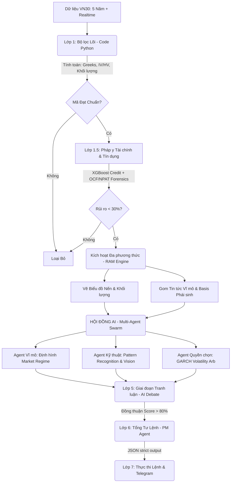

# 🎯 FINVISTA: BẢN ĐỒ PHÁT TRIỂN & ĐÁNH GIÁ KỸ THUẬT (ROADMAP)
> **Dự án:** Finvista – Nền tảng định giá chứng quyền có bảo đảm và quản trị rủi ro tại Việt Nam.  
> **Trụ sở startup:** UPGen Deutsches Haus Tower, Quận 1, TP. Hồ Chí Minh.  

---

> [!NOTE]
> Tài liệu này được biên soạn dựa trên việc đối chiếu hồ sơ nghiên cứu khả thi **Finvista (PDF)** với mã nguồn thực tế hiện tại của dự án nhằm thực hiện đánh giá khoảng trống (Gap Analysis) và định hướng các bước phát triển tiếp theo.

---

## 📋 MỤC LỤC
1. [Giới thiệu Dự án Finvista](#1-giới-thiệu-dự-án-finvista)
2. [Đánh giá Khoảng trống (Gap Analysis: Có gì & Thiếu gì)](#2-đánh-giá-khoảng-trống)
3. [Lộ trình Phát triển Kỹ thuật (6 Giai đoạn)](#3-lộ-trình-phát-triển-kỹ-thuật)
4. [Lý thuyết Định giá & Pipeline Hiện tại](#4-lý-thuyết-định-giá--pipeline-hiện-tại)
5. [Ánh xạ Mã nguồn (Code ↔ Logic)](#5-ánh-xạ-mã-nguồn)
6. [Quản trị Rủi ro CW Việt Nam](#6-quản-trị-rủi-ro-cw-việt-nam)
7. [Nghiên cứu Định lượng & Tích hợp AI Agents](#7-nghiên-cứu-định-lượng--tích-hợp-ai-agents)

---

## 1. GIỚI THIỆU DỰ ÁN FINVISTA

Dự án **Finvista** định vị là một nền tảng phân tích độc lập, khách quan, đứng về phía nhà đầu tư cá nhân trên thị trường chứng khoán Việt Nam. Nhắm vào sản phẩm **Chứng quyền có bảo đảm (Covered Warrants - CW)** - một công cụ phái sinh hấp dẫn với đòn bẩy cao nhưng vô cùng phức tạp và chứa đựng nhiều rủi ro ăn mòn vốn nhanh.

### 💡 Các mục tiêu cốt lõi:
- **Minh bạch hóa thị trường:** Cung cấp công cụ định giá độc lập để xóa bỏ xung đột lợi ích giữa nhà phát hành (các Công ty Chứng khoán) và nhà đầu tư cá nhân.
- **Quản trị rủi ro tiên tiến:** Giúp nhà đầu tư định lượng rủi ro thời gian (Theta Decay) và rủi ro biến động thị trường (Implied Volatility).
- **Thương mại hóa SaaS:** Hướng tới mục tiêu 5.000 người dùng trả phí trong năm đầu tiên thông qua các mô hình bộ lọc mã cao cấp và mô phỏng kịch bản.

---

## 2. ĐÁNH GIÁ KHOẢNG TRỐNG (GAP ANALYSIS)

Dưới đây là bảng đối chiếu chi tiết giữa **Kế hoạch kỹ thuật đề xuất trong PDF** và **Mã nguồn thực tế đang hoạt động**:

| Phân Hệ & Tính Năng Đề Xuất (PDF) | Trạng Thái Trong Code Thực Tế | Đánh Giá Khoảng Trống (Gap) | Hành Động Kế Tiếp |
|---|---|---|---|
| **Lõi Định Giá Black-Scholes (BSM)** | ✅ **Đã hoàn thành 100%** | Code hiện tại hỗ trợ đầy đủ mô hình BSM kiểu Châu Âu, phù hợp hoàn toàn với thiết kế CW Việt Nam. | Không cần điều chỉnh lõi toán học. |
| **Tính toán 4 Greeks ($\Delta, \Gamma, \Theta, \nu$)** | ✅ **Đã hoàn thành 100%** | Đã viết sẵn các hàm tính Delta, Gamma, Theta (suy hao ngày), Vega chi tiết cho CW (đã chia tỉ lệ chuyển đổi). | Sẵn sàng kết nối giao diện hiển thị. |
| **Giải ngược Implied Volatility (IV)** | ✅ **Đã hoàn thành 100%** | Thuật toán Newton-Raphson được nhúng trực tiếp trong `src/quant/pricing_core.py` giúp giải ngược IV chính xác từ giá thị trường. | Tối ưu hóa hiệu năng khi tính toán đồng thời hàng trăm mã. |
| **Lãi suất phi rủi ro ($r$) thực tế** | ✅ **Đã hoàn thành 100%** | Tự động quét lợi suất TPCP Việt Nam kỳ hạn 1 năm thời gian thực từ World Government Bonds API với fallback an toàn. | Đã tích hợp trơn tru và đồng bộ vào lõi định giá BSM & Greeks. |
| **Độ sâu sổ lệnh (Top 3 Bid/Ask)** | ✅ **Đã hoàn thành 100%** | Đã tích hợp đầy đủ chênh lệch Bid-Ask Spread vào công cụ tính toán và bảng hiển thị CLI. | Không cần điều chỉnh thêm. |
| **Ma trận Mô phỏng Lãi/Lỗ kịch bản** | ✅ **Đã hoàn thành 100%** | Đã tích hợp công cụ mô phỏng 2 chiều (2D Scenario Simulator) sử dụng tham số `--simulate <Mã CW>` hoặc endpoint API `/api/warrants/{symbol}/simulate`. | Sẵn sàng cho giao diện Heatmap. |
| **Chuông báo rủi ro tự động (Webhook)** | ✅ **Đã hoàn thành 100%** | Đã tích hợp module `src/common/telegram_alerts.py` gửi tin nhắn HTML tự động và hợp nhất báo cáo cho các cơ hội STRONG BUY hoặc CW sắp đáo hạn (<14 ngày). | Hoạt động hoàn hảo qua cấu hình môi trường `.env`. |
| **Cơ sở dữ liệu bền vững (SaaS Database)** | ✅ **Đã hoàn thành 100%** | Tích hợp SQLite với SQLAlchemy ORM, quản lý bằng Alembic Migrations tự động. | Hoàn hảo cho việc lưu trữ đa người dùng. |
| **Xác thực JWT đa người dùng** | ✅ **Đã hoàn thành 100%** | Đã triển khai bảo mật JWT mã hóa PBKDF2 HMAC SHA-256 cô lập tài khoản và Paper Trading cá nhân. | Đảm bảo tính bảo mật cấp Enterprise. |
| **WebSockets & Rate Limiting** | ✅ **Đã hoàn thành 100%** | Tích hợp Rate Limiting bằng SlowAPI để bảo vệ API cào nặng, thiết lập WebSocket Endpoint `ws://127.0.0.1:8008/api/ws` để truyền NAV và trạng thái. | Giảm tải tài nguyên server, loại bỏ polling. |
| **Giao diện thời gian thực Web App** | 🔄 **ĐANG TRIỂN KHAI** | Backend đã sẵn sàng 100% ở Giai đoạn 4 với 15/15 bài test tự động thành công. Bắt đầu phát triển giao diện người dùng. | Triển khai trong Giai đoạn 5. |

---

## 3. LỘ TRÌNH PHÁT TRIỂN KỸ THUẬT (ROADMAP)

Dựa trên Gap Analysis, lộ trình phát triển kỹ thuật của Finvista gồm 6 giai đoạn cụ thể:

```
  ┌───────────────────────┐      ┌───────────────────────┐
  │ GIAI ĐOẠN 1: CORE OK! │ ──▶  │ GIAI ĐOẠN 2: DATA OK! │
  │ BSM, Greeks, IV NR    │      │ Yield Curve, Bid/Ask  │
  └───────────────────────┘      └───────────────────────┘
                                             │
                                             ▼
  ┌───────────────────────┐      ┌───────────────────────┐
  │ GIAI ĐOẠN 4: SAAS API │ ◀──  │ GIAI ĐOẠN 3: ACTIONS  │
  │ DB, Async, Auth, WS   │      │ P/L Matrix, Webhooks  │
  │ (HOÀN THÀNH 100%!)    │      └───────────────────────┘
  └───────────────────────┘
              │
              ▼
  ┌───────────────────────┐      ┌───────────────────────┐
  │ GIAI ĐOẠN 5: FRONTEND │ ──▶  │ GIAI ĐOẠN 6: AI AGENT │
  │ (👉 ĐANG THỰC HIỆN!)  │      │ Multi-Agent Swarm     │
  │ React App, Charts     │      │ Intent Router, HITL   │
  └───────────────────────┘      └───────────────────────┘
```

### 🔹 Giai đoạn 1: Chuẩn Hóa Lõi Định Lượng (ĐÃ HOÀN THÀNH)
*   Xây dựng mô-đun toán học định giá BSM và tính các Greeks ([src/quant/pricing_core.py](src/quant/pricing_core.py)).
*   Nhúng bộ giải Newton-Raphson ước lượng Implied Volatility từ giá thị trường.
*   Thiết lập hệ thống chấm điểm đa chiến thuật (`Safe`, `Balanced`, `Aggressive`) và lọc mã trên dòng lệnh.

### 🔹 Giai đoạn 2: Nâng Cấp Dữ Liệu Thời Gian Thực (ĐÃ HOÀN THÀNH)
*   **Tích hợp Lãi suất TPCP động:** Tự động quét lợi suất TPCP Việt Nam kỳ hạn 1 năm thời gian thực từ World Government Bonds API với fallback an toàn.
*   **Bổ sung Sổ lệnh tốt nhất:** Tích hợp Bid/Ask tốt nhất phục vụ tính toán chênh lệch thanh khoản (Spread).
*   **Thiết lập Ingestion siêu kiên cường:** Tích hợp cơ chế tự động Retry và tự kích hoạt Offline Cache Fallback nếu Vietcap bị nghẽn mạng.

### 🔹 Giai đoạn 3: Giả Lập Kịch Bản, Volatility Arbitrage & Telegram Alerts (ĐÃ HOÀN THÀNH 100%)
*   **Xây dựng Mô phỏng Ma trận Lãi/Lỗ (P/L Scenario Matrix):** 
    Hoàn thiện tính năng mô phỏng kịch bản lãi lỗ 2D qua tham số dòng lệnh hoặc qua REST API. Ma trận tự động hiển thị tác động tương hỗ giữa biến động giá cổ phiếu cơ sở (từ -10% đến +10%) và thời gian suy hao Theta (từ 0 đến 30 ngày).
*   **So sánh IV vs HV (Volatility Arbitrage):**
    Tính toán biến động lịch sử 40 phiên của các cổ phiếu cơ sở trực tiếp từ vnstock, hỗ trợ tự động lưu cache JSON kiên cường (`data/underlying_hv_cache.json`) chống Rate Limit. Phân loại tín hiệu `CHEAP` và `EXPENSIVE` cộng điểm trực tiếp vào mô hình xếp hạng cơ hội đầu tư.
*   **Tích hợp Telegram Bot Webhook:**
    Phát triển hoàn chỉnh module `src/common/telegram_alerts.py` gửi tin nhắn cảnh báo định lượng HTML trực tiếp về Chat ID thông qua Telegram Webhook API. Tích hợp nạp động từ môi trường `.env`.

### 🔹 Giai đoạn 4: Hoàn Thiện Lõi Backend & Kiến Trúc API Gateway (ĐÃ HOÀN THÀNH 100%)
Toàn bộ cơ sở hạ tầng Backend SaaS chuyên nghiệp đa người dùng đã được hiện thực hóa trọn vẹn:
1.  **API Hóa Trình Giả Lập Giao Dịch & Greeks:**
    Đầy đủ các REST API endpoints trong [src/api/main.py](src/api/main.py) phục vụ hiển thị: `GET /api/portfolio`, `POST /api/portfolio/orders` (khớp lệnh chuẩn sàn HOSE lô 100, chốt lời cắt lỗ động), và định giá `GET /api/warrants/{symbol}/simulate`.
2.  **Cơ Chế Bất Đồng Bộ & Luồng Nền Tự Động:**
    Tích hợp `FastAPI BackgroundTasks` bằng endpoint `POST /api/warrants/scan/async` (HTTP 202) để tránh lỗi Gateway Timeout khi quét thị trường. Đồng thời, thiết lập luồng nền chạy ngầm tự động cập nhật dữ liệu mỗi 15 phút trong giờ giao dịch của sàn HOSE.
3.  **Hệ Persistence SQLite & Xác Thực Đa Người Dùng JWT:**
    Được triển khai chuyên nghiệp thông qua SQLAlchemy và quản trị phiên bản bằng Alembic. Bảo mật tài khoản đa người dùng bằng OAuth2 JWT Bearer Token, băm mật khẩu chuẩn PBKDF2 HMAC SHA-256 giúp cô lập hoàn toàn tài sản Paper Trading giữa các tài khoản người dùng khác nhau.
4.  **Tích Hợp Rate Limiting & WebSockets:**
    Giới hạn tần suất gọi API quét thị trường nặng bằng `SlowAPI` để bảo vệ server. Xây dựng WebSocket Server `ws://127.0.0.1:8008/api/ws` truyền dữ liệu thời gian thực cho Client.

### 🔹 Giai đoạn 5: Phát Triển Giao Diện Web App & Trực Quan Hóa (👉 GIAI ĐOẠN ĐANG TRIỂN KHAI)
Chúng ta đang bước vào giai đoạn này nhằm trực quan hóa toàn bộ sức mạnh định lượng của Backend lên một giao diện đỉnh cao:
*   **Công nghệ cốt lõi:** ReactJS (Vite) + TailwindCSS + Lucide Icons + Recharts/ApexCharts (để vẽ đồ thị tài chính).
*   **Các phân hệ giao diện chính:**
    -   **Dashboard Tổng Quan:** Top mã CW tiềm năng xếp hạng theo G-Score, bộ lọc chiến thuật (Safe, Balanced, Aggressive).
    -   **Interactive Greeks Calculator:** Trình tính toán Greeks động với các thanh kéo (Slider) trực quan.
    -   **2D Scenario Heatmap:** Bảng đồ nhiệt trực quan hóa ma trận P/L của chứng quyền theo thời gian và biến động giá cơ sở.
    -   **Paper Trading Workspace:** Giao diện đặt lệnh mua/bán, bảng theo dõi danh mục tài sản và đồ thị tăng trưởng NAV.
    -   **Credit Risk Center:** Bảng xếp hạng tín dụng FA của 1,447 doanh nghiệp cơ sở, cảnh báo vùng Danger Zone.

### 🔹 Giai đoạn 6: Chuyển Đổi Thành Nền Tảng AI Quant Agent
*   **Tích hợp Kiến trúc Đa Agent (Multi-Agent Swarm):** Áp dụng mô hình *Statement Auditor* và *Model Builder* để tự động hóa việc rà soát báo cáo tài chính thô.
*   **Vibe-to-Quant Ask-Agent:** Chatbot tiếng Việt nhận diện ý định và tự sinh code Python gọi API Gateway của Finvista tính toán Greeks/Z-score, loại bỏ hoàn toàn hiện tượng AI bịa số.
*   **Human-in-the-Loop (HITL):** AI chỉ đề xuất dự thảo cảnh báo tín dụng/Z-score và yêu cầu chuyên viên đầu tư nhấn phê duyệt (Approve) trên giao diện trước khi phát webhook.

---

## 4. LÝ THUYẾT ĐỊNH GIÁ & PIPELINE HIỆN TẠI

Hệ thống hoạt động dựa trên mô hình định giá quyền chọn kiểu Châu Âu của **Black-Scholes (1973)**:

$$C = \frac{S \cdot N(d_1) - K \cdot e^{-rT} \cdot N(d_2)}{\text{Conversion Ratio}}$$

Trong đó:
- $S$: Giá cổ phiếu cơ sở thời gian thực.
- $K$: Giá thực hiện của chứng quyền (Strike price).
- $T$: Thời gian còn lại tới ngày đáo hạn (tính bằng năm: $\text{Số ngày} / 365.0$).
- $r$: Lãi suất phi rủi ro (tham chiếu TPCP).
- $\sigma$: Biến động hàm ý (Implied Volatility - IV).
- $N(x)$: Hàm phân phối tích lũy chuẩn chuẩn hóa.
- $\text{Conversion Ratio}$: Tỷ lệ chuyển đổi.

---

## 5. ÁNH XẠ MÃ NGUỒN (CODE ↔ LOGIC)

Sơ đồ ánh xạ giữa lý thuyết định lượng tài chính và các tệp mã nguồn tương ứng trong cấu trúc Clean Architecture mới:

```
┌────────────────────────────────────────────────────────────────────────┐
│                              LÕI TOÁN HỌC                              │
├───────────────────────────────┬────────────────────────────────────────┤
│ Black-Scholes Formula         │ pricing_core.py (calculate_d1_d2)      │
│ Delta, Gamma, Vega, Theta, Rho│ pricing_core.py (Greeks functions)     │
│ Implied Volatility (NR)       │ pricing_core.py (estimate_iv)          │
└───────────────────────────────┴────────────────────────────────────────┘

┌────────────────────────────────────────────────────────────────────────┐
│                             PIPELINE & CHẠY                            │
├───────────────────────────────┬────────────────────────────────────────┤
│ Bộ chấm điểm 3 Chiến thuật    │ pricing_core.py (score_cw)             │
│ Thu thập dữ liệu APIs         │ run_analysis.py (fetch_market_cw_data) │
│ Tập lệnh chạy Phân tích CLI   │ run.py CLI (scan command)              │
└───────────────────────────────┴────────────────────────────────────────┘
```

---

## 6. QUẢN TRỊ RỦI RO CW VIỆT NAM
Hệ thống Finvista xây dựng bộ quy tắc cảnh báo dựa trên các ngưỡng nhạy cảm toán học của chứng quyền tại Việt Nam:

1. **Ngưỡng Đáo Hạn Ngắn (Mối họa Theta):** Khi thời gian đáo hạn $L < 15$ ngày, hệ thống sẽ tự động hạ điểm sức khỏe `P_Health` của CW xuống dưới 40 và kích hoạt khuyến nghị `SKIP` hoặc `CAUTION` do tốc độ xói mòn giá trị thời gian (Theta Decay) tăng theo cấp số nhân.
2. **IV Crushing (Cực kỳ đắt đỏ):** Nếu biến động hàm ý $IV > 1.5 \times HV$ (Biến động lịch sử của cổ phiếu cơ sở), CW đang bị định giá quá đắt. Hệ thống sẽ gán nhãn ĐẮT và đưa vào diện theo dõi hạn chế mua mới.
3. **Moneyness Sweet Spot:** Ưu tiên cao nhất cho chứng quyền trạng thái **ATM** hoặc **ITM nhẹ** (Moneyness trong khoảng $0.95 - 1.10$) do có Delta tối ưu ($0.40 - 0.70$), mang lại đòn bẩy thực tế tốt nhất mà không chịu rủi ro mất trắng quá cao như nhóm deep OTM.

---

## 7. KIẾN TRÚC FINVISTA INTELLIGENCE V2.0 (ROADMAP AI QUANT 2026)

Dựa trên các siêu nghiên cứu (Ultra-Deep Research) mới nhất về AI Quant giai đoạn 2025-2026, kiến trúc của Finvista được nâng cấp lên phiên bản 2.0. Trọng tâm chuyển dịch từ "Tra cứu AI" sang **Hệ thống Đa Tác Vụ (Multi-Agent Swarm)** kết hợp với các mô hình **Time Series Foundation Models**.

### 7.1. Sơ đồ Kiến trúc Bộ lọc 7 Lớp (Hội đồng AI Quant Committee)

Dòng vốn và lệnh giao dịch của hệ thống giờ đây phải vượt qua 7 lớp rào chắn khắt khe, pha trộn giữa Toán học Định lượng, Học máy và Suy luận Đa phương thức:



### 7.2. Nâng Cấp Công Nghệ Cốt Lõi (SOTA 2026)

1.  **PTKT: Kỷ nguyên "Patch-based Transformer"**
    Thay vì các chỉ báo RSI/MACD tĩnh, Finvista định hướng sử dụng kiến trúc **PatchTST** hoặc **iTransformer**. AI không nhìn từng giá đơn lẻ mà chia biểu đồ thành các "mảnh ghép" (patches) để nhận diện "vòng cung xu hướng" (Trend Arc). Phối hợp với Gemini Vision (Mắt thần thị giác) để đọc hành vi giá (Price Action) và mô hình Wyckoff trực tiếp từ biểu đồ.
2.  **Định Giá Chứng Quyền: Mô hình GARCH-Adaptive**
    Chứng quyền Việt Nam bị ảnh hưởng mạnh bởi "cụm biến động" (volatility clusters). Hệ thống nâng cấp lõi Black-Scholes bằng cách nhúng **GARCH Volatility Forecaster** để dự báo "Biến động ngày mai" dựa trên các cú sốc giá hôm nay. Cải tiến việc tính toán VRP (Volatility Risk Premium) để chặn rủi ro IV Crushing.
3.  **Market Regime Detection: "Latent State Discovery"**
    Phân loại thị trường thành 4 trạng thái: *Quiet-Trending*, *Mean-Reverting*, *Crisis*, và *Sideway*. Hệ thống tự động (Adaptive Pricing) mở rộng spread Bid-Ask hoặc cắt giảm Allocation khi phát hiện Regime chuyển sang Crisis.
4.  **Pháp y Tài chính (Earnings Quality Forensics)**
    Lớp 1.5 không chỉ chạy XGBoost dự báo phá sản. Nó đối chiếu chéo Lợi nhuận sau thuế (NPAT) và Dòng tiền hoạt động (OCF). Thuật toán tính Cash Conversion Ratio (CCR) sẽ kích hoạt cờ đỏ "Phantom Profits" nếu CCR < 0.8 liên tục.
5.  **Giao thức AI Debate (Hội đồng Phản biện 2026)**
    Áp dụng chuẩn **FinDebate**:
    *   **The Skeptic Agent (Kẻ hoài nghi):** Luôn tìm lý do để "Bán" và chỉ ra rủi ro đuôi (Tail risks).
    *   **The Trust Agent (Người xác thực):** Kiểm chứng tính đúng đắn của dữ liệu đầu vào.
    *   Chỉ khi **Consensus Score > 80%**, PM Agent mới được phép ra quyết định "STRONG BUY".
6.  **Tích hợp Cổ tức liên tục (Dividend Yield - $q$) vào Black-Scholes**
    Mở rộng công thức định giá BSM (tính $d_1, d_2$) để bao gồm tỷ suất cổ tức dự kiến $q$. Tận dụng kho dữ liệu cào sự kiện doanh nghiệp từ Vietstock để dự phóng dòng tiền cổ tức của chứng khoán cơ sở. Điều này giúp mô hình tự động điều chỉnh sụt giảm giá trị lý thuyết của CW một cách chính xác khi đi qua ngày giao dịch không hưởng quyền.
7.  **Cơ sở dữ liệu Chuỗi thời gian cho Sổ lệnh (L2 Orderbook Backtesting)**
    Nâng cấp mô hình kiểm chứng Walk-Forward bằng việc kiến trúc cơ sở dữ liệu Time-Series (ví dụ: QuestDB hoặc TimescaleDB) để lưu trữ Snapshot Sổ lệnh L2 (Bid/Ask Imbalance) theo tần suất phút. Dữ liệu này sẽ cho phép backtest các chiến lược săn thanh khoản vi mô (Micro-Liquidity) và mô phỏng độ trượt giá (Realistic Slippage) với độ chính xác tuyệt đối, vốn là yếu tố sống còn của CW.

---

## 8. THỰC THI THỜI GIAN THỰC & ORDER BOOK GUARD (GIAI ĐOẠN TIẾP THEO)

Đây là chốt chặn cuối cùng để biến Finvista thành một hệ thống giao dịch tự trị 100%, bảo vệ nhà đầu tư khỏi rủi ro trượt giá (Slippage) trong các pha biến động mạnh (Vol Spikes).

### 8.1. Module Cào Sổ lệnh Đa nguồn (Multi-source L2 Scraper)
*   **Mục tiêu:** Thu thập dữ liệu Level 2 (10 mức giá Bid/Ask tốt nhất) từ SSI, VPS và DNSE.
*   **Cơ chế:** Sử dụng kết hợp GraphQL và REST Snapshots để đảm bảo tính thời thực (< 1 giây).
*   **Fallback:** Tự động chuyển đổi nguồn nếu một broker bị nghẽn mạng hoặc chặn IP.

### 8.2. Động cơ Tính toán Chi phí Tác động (Impact Cost Engine)
*   **Liquidity Check:** AI tính toán xem với khối lượng mục tiêu (Target Volume), thị trường có đủ lệnh đối ứng để khớp ngay lập tức không.
*   **Real-world Fill Price:** Thay vì dùng giá khớp gần nhất, hệ thống tính toán giá khớp trung bình dự kiến dựa trên độ sâu sổ lệnh.
*   **Slippage Alert:** Cảnh báo cực mạnh nếu trượt giá dự kiến > 1.5% và hạ bậc quyết định từ STRONG BUY xuống SKIP nếu rủi ro thanh khoản quá cao.

### 8.3. Tích hợp Lớp Layer 7 (Execution Guard)
*   Nhúng module Order Book trực tiếp vào `AICommitteeService`.
*   Tạo tham số `--volume` trong CLI để người dùng chỉ định quy mô vốn, từ đó AI tính toán tính khả thi thực tế của lệnh.
*   **Tự học từ dữ liệu L2:** AI Memory sẽ lưu lại trạng thái sổ lệnh tại thời điểm phân tích để tối ưu hóa chiến lược vào lệnh trong tương lai.
