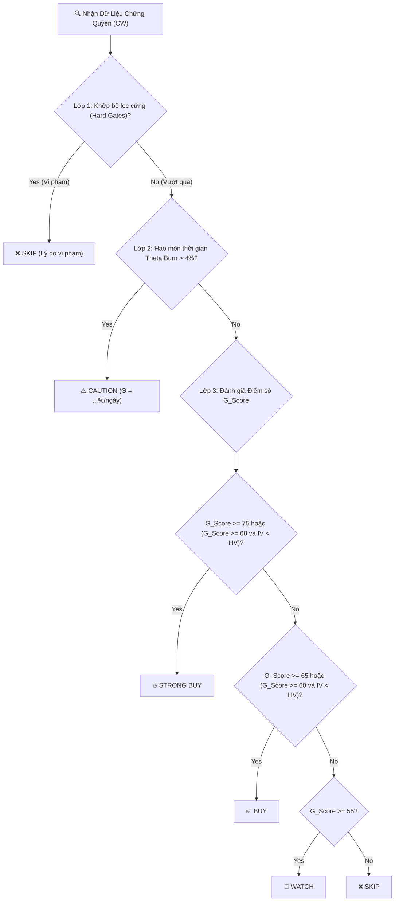

# 📘 CẨM NANG TOÀN DIỆN CÁC CHỈ SỐ VÀ CÔNG THỨC CHỨNG QUYỀN (FINVISTA CW HANDBOOK)

---

### 🌟 GIỚI THIỆU CHUNG (OVERVIEW)

**Finvista** là nền tảng phân tích định lượng (Quantitative Analysis Platform) và hỗ trợ ra quyết định đầu tư chuyên sâu dành cho thị trường **Chứng quyền có bảo đảm (Covered Warrant - CW)** tại Việt Nam.

Tệp **Cẩm nang Chỉ số (CW Metrics Handbook)** này đóng vai trò là **Nguồn chân lý duy nhất (Single Source of Truth)** của toàn bộ dự án. Tài liệu được thiết kế nhằm đồng bộ hóa tư duy giữa kỹ thuật và nghiệp vụ tài chính:
* **Dành cho Lập trình viên (Developers):** Hệ thống hóa chi tiết 100% công thức toán học, thuật toán xấp xỉ (Newton-Raphson), các ngưỡng tham số mô hình Machine Learning (XGBoost), và logic các chốt chặn (Hard Gates) đang chạy trực tiếp trong mã nguồn (`src/quant/`, `src/etl/`).
* **Dành cho Nhà đầu tư (Traders):** Giải thích cặn kẽ ý nghĩa kinh tế của các chỉ số biến động ($IV, HV$), các hệ số Greeks ($\Delta, \Gamma, \Theta, \nu, \rho$), và cơ chế chấm điểm xếp hạng để người dùng hiểu rõ bản chất hoạt động của bộ lọc khuyến nghị.

---

## 🏛️ 1. LÕI ĐỊNH GIÁ BLACK-SCHOLES-MERTON (BSM)

Chứng quyền có bảo đảm (CW) tại Việt Nam được định giá bằng mô hình Black-Scholes kiểu Châu Âu (quy đổi theo tỷ lệ chuyển đổi):

$$\text{Giá trị lý thuyết } (C_{CW}) = \frac{S \cdot N(d_1) - K \cdot e^{-rT} \cdot N(d_2)}{\text{Conversion Ratio}}$$

Trong đó các tham số đầu vào:
* **$S$ (Spot Price):** Giá thị trường hiện tại của cổ phiếu cơ sở.
* **$K$ (Strike Price):** Giá thực hiện của chứng quyền.
* **$T$ (Time to Expiry):** Thời gian còn lại tới ngày đáo hạn (tính theo năm):
  $$T = \frac{\text{Số ngày còn lại}}{365.0}$$
* **$r$ (Risk-free Rate):** Lãi suất phi rủi ro (tham chiếu động theo lợi suất trái phiếu chính phủ Việt Nam kỳ hạn 1 năm).
* **$\sigma$ (Implied Volatility - IV):** Biến động hàm ý.
* **$N(x)$:** Hàm phân phối tích lũy chuẩn hóa tích lũy.

Công thức của $d_1$ và $d_2$:
$$d_1 = \frac{\ln(S / K) + (r + 0.5 \sigma^2) T}{\sigma \sqrt{T}}$$
$$d_2 = d_1 - \sigma \sqrt{T}$$

> [!NOTE]
> **Xác suất có lãi thực tế (Probability of ITM):** Được tính trực tiếp bằng $N(d_2)$ (đối với Call Option) hoặc $N(-d_2)$ (đối với Put Option). Đo lường xác suất toán học cổ phiếu cơ sở đóng cửa trên giá thực hiện khi đáo hạn.

---

## 📊 2. CÁC BIẾN SỐ NHẠY CẢM ĐỊNH LƯỢNG (THE GREEKS)

Được hiệu chỉnh chia cho Tỷ lệ chuyển đổi ($CR$ - Conversion Ratio) để tính chính xác biến động thực tế của 1 đơn vị chứng quyền giao dịch trên sàn HOSE:

### A. Delta ($\Delta$) - "Độ nhạy giá cổ phiếu"
* **Định nghĩa:** Mức thay đổi giá chứng quyền khi cổ phiếu cơ sở thay đổi 1 đơn vị giá.
* **Công thức toán học:**
  $$\Delta_{CW} = \frac{N(d_1)}{\text{Conversion Ratio}}$$

### B. Gamma ($\Gamma$) - "Gia tốc của Delta"
* **Định nghĩa:** Tốc độ thay đổi của Delta khi giá cổ phiếu cơ sở di chuyển 1 đơn vị.
* **Công thức toán học:**
  $$\Gamma_{CW} = \frac{N'(d_1)}{S \cdot \sigma \sqrt{T} \cdot \text{Conversion Ratio}}$$
  *(Trong đó $N'(x) = \frac{1}{\sqrt{2\pi}}e^{-x^2 / 2}$ là hàm mật độ phân phối chuẩn).*

### C. Theta ($\Theta$) - "Kẻ thù thời gian" (Time Decay)
* **Định nghĩa:** Giá trị hao mòn của chứng quyền sau mỗi ngày trôi qua (luôn mang giá trị âm).
* **Công thức toán học (Theta theo ngày):**
  $$\Theta_{CW} = \frac{1}{365.0} \cdot \left[ -\frac{S \cdot N'(d_1) \cdot \sigma}{2 \sqrt{T}} - r \cdot K \cdot e^{-rT} \cdot N(d_2) \right]$$

### D. Vega ($\nu$) - "Độ nhạy với biến động"
* **Định nghĩa:** Mức thay đổi giá chứng quyền khi biến động hàm ý (IV) tăng/giảm 1% tuyệt đối.
* **Công thức toán học:**
  $$\text{Vega}_{CW} = \frac{S \cdot N'(d_1) \sqrt{T} \cdot 0.01}{\text{Conversion Ratio}}$$

### E. Rho ($\rho$) - "Độ nhạy lãi suất"
* **Định nghĩa:** Mức thay đổi giá chứng quyền khi lãi suất phi rủi ro biến động 1% tuyệt đối.
* **Công thức toán học:**
  $$\text{Rho}_{CW} = K \cdot T \cdot e^{-rT} \cdot N(d_2) \cdot 0.01$$

---

## 📈 3. CHỈ SỐ ĐO LƯỜNG THỊ TRƯỜNG & BIẾN ĐỘNG (MARKET METRICS)

### A. Phân loại Trạng thái tiền tệ 5 cấp độ (Moneyness Category)
* **Định nghĩa:** Đo lường trạng thái lời/lỗ danh nghĩa của chứng quyền dựa trên tỷ lệ giữa giá thị trường hiện tại của cổ phiếu cơ sở và giá thực hiện.
* **Công thức toán học:**
  $$\text{Moneyness} = \frac{S}{K}$$
  * **DEEP OTM (Lỗ rất sâu):** $\text{Moneyness} < 0.85$ (Cổ phiếu thấp hơn giá thực hiện $>15\%$. Nguy cơ mất trắng cực lớn $\rightarrow$ Hệ thống tự động **SKIP**).
  * **OTM (Lỗ nhẹ):** $0.85 \le \text{Moneyness} < 0.98$ (Có tính đòn bẩy thô cao nhưng rủi ro lớn).
  * **ATM (Hòa vốn):** $0.98 \le \text{Moneyness} \le 1.02$ (Vùng nhảy nhạy bén nhất, Gamma cực đại, nổ Vol mạnh).
  * **ITM (Có lãi nhẹ):** $1.02 < \text{Moneyness} \le 1.15$ (An toàn, biên bảo hộ tốt).
  * **DEEP ITM (Lãi sâu):** $\text{Moneyness} > 1.15$ (Delta gần bằng 1, chứng quyền biến động 1:1 như cổ phiếu, đòn bẩy thấp).

### B. Giá trị nội tại (Intrinsic Value)
* **Định nghĩa:** Giá trị thực tế hay số tiền mặt nhà đầu tư nhận được nếu thực hiện quyền ngay lập tức.
* **Công thức toán học:**
  $$\text{Intrinsic Value} = \max\left(0, \frac{S - K}{\text{Conversion Ratio}}\right)$$

### C. Giá thực hiện hòa vốn danh nghĩa ($M\_GiaHL$)
* **Định nghĩa:** Mức giá của cổ phiếu cơ sở cần đạt được tại ngày đáo hạn để nhà đầu tư mua chứng quyền đạt điểm hòa vốn.
* **Công thức toán học:**
  $$M\_GiaHL = K + C_{Market} \cdot \text{Conversion Ratio}$$

### D. Premium % (Tỷ lệ thặng dư) & Monthly Risk Cost (Hao phí rủi ro tháng)
* **Premium Pct:**
  * **Định nghĩa:** Tỷ lệ tăng trưởng tối thiểu cần có của cổ phiếu cơ sở để nhà đầu tư đạt hòa vốn khi đáo hạn.
  * **Công thức toán học:**
    $$\text{Premium Pct} = \frac{M\_GiaHL - S}{S} \times 100\%$$
* **Monthly Risk Cost:**
  * **Định nghĩa:** Chi phí thặng dư hao phí rủi ro bình quân hàng tháng trong suốt vòng đời của chứng quyền.
  * **Công thức toán học:**
    $$\text{Risk Monthly Pct} = \frac{\text{Premium Pct}}{\frac{L\_Ngay}{30.0}}$$

### E. Gearing & Effective Gearing (Đòn bẩy)
* **Đòn bẩy đơn giản (Gearing):**
  * **Định nghĩa:** Tỷ số đòn bẩy thô giữa giá cổ phiếu cơ sở và giá chứng quyền.
  * **Công thức toán học:**
    $$\text{Gearing} = \frac{S}{C_{Market} \cdot \text{Conversion Ratio}}$$
* **Đòn bẩy thực tế (Effective Gearing):**
  * **Định nghĩa:** Mức độ khuếch đại sinh lời (hoặc thua lỗ) thực tế của chứng quyền so với cổ phiếu cơ sở, đã điều chỉnh theo độ nhạy Delta.
  * **Công thức toán học:**
    $$\text{Effective Gearing} = \Delta_{CW} \times \text{Conversion Ratio} \times \frac{S}{C_{Market}} = \frac{N(d_1) \cdot S}{C_{Market}}$$

### F. Độ lệch giá Mua - Bán (Bid-Ask Spread Pct)
* **Định nghĩa:** Khoảng cách tỷ lệ phần trăm giữa giá bán thấp nhất và giá mua cao nhất, phản ánh tính thanh khoản tức thời và chi phí giao dịch ẩn.
* **Công thức toán học:**
  $$\text{Spread Pct} = \frac{\text{Ask} - \text{Bid}}{\text{Bid}} \times 100\%$$
  *(Spread quá rộng $>15\%$ phản ánh rủi ro thanh khoản kém).*

### G. Biến động lịch sử (Historical Volatility - HV) & Biến động hàm ý (Implied Volatility - IV)
Biến động là thước đo rủi ro và kỳ vọng biến động giá cổ phiếu. Trong chứng quyền, hệ thống sử dụng hai loại biến động:

1. **Biến động lịch sử ($HV$ - Historical Volatility):**
   * **Định nghĩa:** Đo lường mức độ dao động giá thực tế của cổ phiếu cơ sở trong quá khứ qua một khung thời gian nhìn lại $N$ ngày ($HV_{10}, HV_{20}, HV_{40}$).
   * **Quy trình tính toán 4 bước chi tiết:**
     * **Bước 1:** Tính tỷ suất sinh lời logarit hàng ngày (natural log return) của giá đóng cửa cổ phiếu cơ sở:
       $$r_t = \ln\left(\frac{C_t}{C_{t-1}}\right)$$
       *(Tại sao dùng tỷ suất sinh lời logarit thay vì phần trăm tăng/giảm đơn giản? Vì tỷ suất sinh lời logarit có tính chất cộng dồn (additive) qua các thời kỳ và đối xứng quanh điểm 0. Ví dụ: một khoản tăng 10% sau đó giảm 10% ở tỷ suất sinh lời đơn giản sẽ không đưa tài sản về điểm hòa vốn ban đầu, nhưng với tỷ suất sinh lời logarit, toán học sẽ khớp hoàn hảo).*
     * **Bước 2:** Tính giá trị trung bình (mean) của các tỷ suất sinh lời logarit trên cửa sổ $N$ phiên:
       $$\bar{r} = \frac{1}{N}\sum_{t=1}^N r_t$$
     * **Bước 3:** Tính độ lệch chuẩn mẫu (sample standard deviation) của chuỗi tỷ suất sinh lời hàng ngày (chia cho $N-1$ để hiệu chỉnh độ lệch):
       $$\sigma_{\text{daily}} = \sqrt{\frac{1}{N-1}\sum_{t=1}^N (r_t - \bar{r})^2}$$
     * **Bước 4:** Thường niên hóa (annualize) bằng cách nhân với căn bậc hai của 252 (giả định có 252 ngày giao dịch trong một năm):
       $$\text{HV} = \sigma_{\text{daily}} \times \sqrt{252}$$

2. **Biến động hàm ý ($IV$ - Implied Volatility):**
   * **Định nghĩa:** Mức biến động của cổ phiếu cơ sở mà thị trường đang kỳ vọng, được phản chiếu ngược từ giá thị trường hiện tại của chứng quyền.
   * **Cách tính toán (Giải thuật Newton-Raphson):** Vì không có công thức đại số để tính trực tiếp $IV$ từ phương trình BSM, hệ thống sử dụng phương pháp lặp xấp xỉ Newton-Raphson:
     $$\sigma_{n+1} = \sigma_n + \frac{C_{Market} \cdot \text{Conversion Ratio} - C_{BSM}(\sigma_n)}{\text{Vega}_{BSM}(\sigma_n)}$$
     * *Vòng lặp tiếp tục cho đến khi giá trị lý thuyết sát với thị giá chứng quyền (độ lệch $< 10^{-5}$).*
     * *Trong trường hợp giá chứng quyền thấp hơn giá trị nội tại (nhà cái định giá sai lệch), hệ thống sẽ tự động lấy $HV_{40}$ làm biến động đại diện làm mốc thay thế.*

### H. Tín hiệu Chênh lệch Biến động (Volatility Arbitrage Signals)
* **Định nghĩa:** Đo lường chênh lệch giữa kỳ vọng biến động giá của thị trường (implied volatility - IV) và dao động thực tế trong quá khứ (historical volatility - HV) để phát hiện cơ hội giao dịch chênh lệch (Vol Arbitrage).
* **Công thức toán học / Quy tắc phân loại:**
  $$\text{Signal} = \begin{cases}
  \text{CHEAP (Rẻ)} & \text{nếu } IV < HV - 0.05 \text{ (thấp hơn 5\% tuyệt đối)} \\
  \text{EXPENSIVE (Đắt)} & \text{nếu } IV > HV + 0.10 \text{ (cao hơn 10\% tuyệt đối)} \\
  \text{FAIR (Hợp lý)} & \text{các trường hợp còn lại}
  \end{cases}$$

### I. Dự báo Lợi nhuận kỳ vọng T+3 (3-Day Projected Returns)
* **Định nghĩa:** Tỷ lệ sinh lời/thua lỗ lý thuyết dự kiến của chứng quyền sau 3 ngày nắm giữ dưới các kịch bản chuyển động khác nhau của cổ phiếu cơ sở, đã khấu trừ hao mòn thời gian Theta.
* **Công thức toán học:**
  $$\text{Projected Return Pct} = \frac{C_{T+3} - C_{Market}}{C_{Market}} \times 100\%$$
  Trong đó $C_{T+3}$ được tính bằng công thức BSM với thời gian còn lại giảm đi 3 ngày ($T_{new} = \frac{L\_Ngay - 3}{365.0}$) theo 3 trường hợp:
  1. **Flat Path (Đi ngang):** Giá cổ phiếu không đổi ($S_{new} = S$).
  2. **Bullish Path (Tăng giá):** Giá cổ phiếu tăng 2% ($S_{new} = S \cdot 1.02$).
  3. **Bearish Path (Giảm giá):** Giá cổ phiếu giảm 2% ($S_{new} = S \cdot 0.98$).

### J. Theta Burn Rate (Hao mòn theo tỷ lệ thị giá)
* **Định nghĩa:** Tốc độ xói mòn giá trị thời gian hàng ngày của chứng quyền so với chính thị giá hiện tại của nó.
* **Công thức toán học:**
  $$\text{Theta Burn Rate} = \frac{|\Theta_{CW}|}{C_{Market}}$$
  *(Nếu tỷ lệ này lớn hơn 4% - 5%/ngày, hệ thống sẽ cảnh báo nguy cơ tài khoản bị xói mòn nhanh chóng).*

---

## 🚨 4. PHÂN TÍCH RỦI RO DOANH NGHIỆP CƠ SỞ (CORPORATE CREDIT HEALTH)

Phân hệ này đảm bảo rằng chứng quyền không dựa trên một cổ phiếu cơ sở của doanh nghiệp đang đứng trước nguy cơ vỡ nợ hoặc kiệt quệ tài chính. Bên cạnh mô hình Machine Learning, hệ thống sử dụng 3 bộ chấm điểm rủi ro tài chính kinh điển:

### A. Điểm số Altman Z''-Score (Emerging Markets)
* **Định nghĩa:** Điểm số đánh giá mức độ an toàn tài chính và dự báo nguy cơ phá sản của doanh nghiệp cơ sở áp dụng riêng cho thị trường mới nổi.
* **Công thức toán học:**
  $$Z'' = 6.56(X_1) + 3.26(X_2) + 6.72(X_3) + 1.05(X_4)$$
  Trong đó các tỷ số tài chính được định nghĩa như sau:
  * **$X_1$ (Working Capital Ratio):** Tỷ lệ vốn lưu động trên tổng tài sản.
    $$X_1 = \frac{\text{Tài sản ngắn hạn} - \text{Nợ ngắn hạn}}{\text{Tổng tài sản}}$$
  * **$X_2$ (Retained Earnings Ratio):** Tỷ lệ lợi nhuận tích lũy trên tổng tài sản.
    $$X_2 = \frac{\text{Lợi nhuận sau thuế chưa phân phối}}{\text{Tổng tài sản}}$$
  * **$X_3$ (EBIT Ratio):** Khả năng sinh lời hoạt động trước thuế và lãi vay trên tổng tài sản.
    $$X_3 = \frac{\text{EBIT}}{\text{Tổng tài sản}}$$
  * **$X_4$ (Leverage Ratio):** Giá trị sổ sách vốn chủ sở hữu trên tổng nợ phải trả.
    $$X_4 = \frac{\text{Vốn chủ sở hữu}}{\text{Tổng nợ phải trả}}$$

  Phân vùng rủi ro theo điểm số Altman Z''-Score:
  * **Vùng An toàn (Safe Zone):** $Z'' > 2.6 \rightarrow$ `O_Stock_FA = 18.5` (Điểm tối đa).
  * **Vùng Xám (Grey Zone):** $1.1 \le Z'' \le 2.6 \rightarrow$ `O_Stock_FA = 10.0` (Cảnh báo).
  * **Vùng Nguy hiểm (Danger Zone):** $Z'' < 1.1 \rightarrow$ `O_Stock_FA = 2.0` (Nguy cơ vỡ nợ cực cao).

### B. Chỉ số Springate S-Score (1978)
* **Định nghĩa:** Chỉ số dự báo nguy cơ kiệt quệ tài chính của doanh nghiệp phi tài chính dựa trên cấu trúc vốn ngắn hạn và hiệu suất tài sản.
* **Công thức toán học:**
  $$S = 1.03(Y_1) + 3.07(Y_2) + 0.66(Y_3) + 0.40(Y_4)$$
  Trong đó:
  * **$Y_1$:** Tỷ lệ Vốn lưu động trên Tổng tài sản.
    $$Y_1 = \frac{\text{Vốn lưu động}}{\text{Tổng tài sản}}$$
  * **$Y_2$:** Tỷ lệ EBIT trên Tổng tài sản.
    $$Y_2 = \frac{\text{EBIT}}{\text{Tổng tài sản}}$$
  * **$Y_3$:** Tỷ lệ EBT trên Nợ ngắn hạn.
    $$Y_3 = \frac{\text{Lợi nhuận trước thuế (EBT)}}{\text{Nợ ngắn hạn}}$$
  * **$Y_4$:** Hiệu suất sử dụng tài sản (Vòng quay tài sản).
    $$Y_4 = \frac{\text{Doanh thu thuần}}{\text{Tổng tài sản}}$$

  * **Ngưỡng cảnh báo (Threshold):**
    $$\text{Nếu } S < 0.862 \rightarrow \text{Doanh nghiệp có nguy cơ kiệt quệ tài chính (Springate Distressed).}$$

### C. Chỉ số Zmijewski X-Score (1984)
* **Định nghĩa:** Chỉ số dự báo xác suất vỡ nợ của doanh nghiệp dựa trên khả năng sinh lời (ROA), tỷ lệ đòn bẩy tài chính và khả năng thanh toán hiện thời.
* **Công thức toán học:**
  $$X = -4.3 - 4.5(\text{ROA}) + 5.7(\text{Debt Ratio}) - 0.004(\text{Current Ratio})$$
  Trong đó:
  * **ROA:** Lợi nhuận sau thuế trên Tổng tài sản.
    $$\text{ROA} = \frac{\text{Lợi nhuận sau thuế}}{\text{Tổng tài sản}}$$
  * **Debt Ratio (Tỷ lệ Nợ):** Tổng nợ phải trả trên Tổng tài sản.
    $$\text{Debt Ratio} = \frac{\text{Tổng nợ phải trả}}{\text{Tổng tài sản}}$$
  * **Current Ratio (Khả năng thanh toán hiện thời):**
    $$\text{Current Ratio} = \frac{\text{Tài sản ngắn hạn}}{\text{Nợ ngắn hạn}}$$

  * **Ngưỡng cảnh báo (Threshold):**
    $$\text{Nếu } X > 0 \rightarrow \text{Doanh nghiệp có rủi ro vỡ nợ cao (Zmijewski Distressed).}$$

### D. Mô hình học máy XGBoost Classifier Dự báo Kiệt quệ
* **Định nghĩa:** Xác suất xảy ra khủng hoảng tài chính được AI/Machine Learning dự đoán dựa trên sự kết hợp phi tuyến tính của 32 chỉ số tài chính.
* **Công thức toán học / Quy trình tính toán:**
  Sử dụng mô hình XGBoost với 32 chỉ số tài chính đầu vào (bao gồm cả các chỉ số của Altman, Springate, Zmijewski, các chỉ số dòng tiền bổ trợ như `OCF to PAT`, `CFO Interest Coverage`, `Debt to Equity`...) để dự đoán **Xác suất kiệt quệ tài chính của doanh nghiệp (`underlying_distress_prob`)** trong năm kế tiếp.
* **Logic chốt chặn (Hard Gate Override):**
  $$\text{Nếu } \text{underlying\_distress\_prob} \ge 0.50 \text{ (hoặc } Z'' < 1.1\text{)} \rightarrow \text{Đánh dấu } \text{underlying\_is\_distressed} = 1$$
  Khi đó, điểm số cơ bản `O_Stock_FA` lập tức bị hạ xuống **`2.0` (Danger Red Zone)** bất kể các chỉ số khác tốt ra sao. Mọi khuyến nghị của chứng quyền tương ứng đều chuyển sang **`SKIP`**.

---

## ⚡ 5. ĐO LƯỜNG CẢM XÚC PHÁI SINH (DERIVATIVES SENTIMENT)

Phân hệ đo lường chênh lệch (Basis) giữa chỉ số cơ sở VN30 và Hợp đồng tương lai VN30F1M để định hình xu hướng thị trường:

### A. Các Chỉ số Cảm xúc
1. **Basis Spread (Độ lệch Basis):**
   * **Định nghĩa:** Khoảng cách chênh lệch giá trực tiếp giữa thị trường tương lai phái sinh (VN30F1M) và chỉ số cơ sở cổ phiếu (VN30).
   * **Công thức toán học:**
     $$\text{Basis} = \text{Close}_{VN30F1M} - \text{Close}_{VN30}$$
2. **Basis SMA5 (Trung bình động 5 phiên):**
   * **Định nghĩa:** Đường trung bình động 5 phiên của độ lệch Basis để lọc nhiễu dao động ngắn hạn.
   * **Công thức toán học:**
     $$\text{Basis\_SMA5} = \frac{1}{5}\sum_{i=0}^{4} \text{Basis}_{t-i}$$
3. **Basis Momentum (Động lượng Basis):**
   * **Định nghĩa:** Tốc độ thay đổi và hướng đi hiện tại của Basis so với trung bình ngắn hạn.
   * **Công thức toán học:**
     $$\text{Basis\_Momentum} = \text{Basis} - \text{Basis\_SMA5}$$
4. **Volume Spike Pct (Đột biến thanh khoản VN30F1M):**
   * **Định nghĩa:** Phần trăm tăng/giảm khối lượng giao dịch phái sinh đột biến so với trung bình 5 phiên gần nhất.
   * **Công thức toán học:**
     $$\text{Volume\_Spike\_Pct} = \frac{\text{Volume}_{t} - \text{Avg\_Volume\_5D}}{\text{Avg\_Volume\_5D}} \times 100\%$$
     *(Trong đó $\text{Avg\_Volume\_5D}$ là khối lượng giao dịch trung bình của 5 phiên trước đó).*

### B. Logic phân loại Cảm xúc thị trường (Market Sentiment)
* **Định nghĩa:** Trạng thái tâm lý và xu hướng dòng tiền phái sinh tổng hợp trên thị trường (Bullish/Bearish/Neutral).
* **Quy tắc phân loại:**
  * **BULLISH (Tích cực):** Khi độ lệch Basis dương mạnh và động lượng đang đi lên:
    $$\text{Basis} > 2.0 \quad \text{và} \quad \text{Basis\_Momentum} > 0$$
  * **BEARISH (Tiêu cực):** Khi dòng tiền phái sinh bán khống phòng thủ tạo độ lệch âm lớn:
    $$\text{Basis} < -5.0 \quad \text{hoặc} \quad \text{Basis\_SMA5} < -3.0$$
  * **NEUTRAL (Trung lập):** Các trường hợp còn lại.

---

## 🏆 6. HỆ THỐNG CHẤM ĐIỂM TỔNG HỢP (SCORING ENGINE)

### A. Phương pháp Chuẩn hóa dữ liệu đầu vào (Min-Max Scaling)
Để đưa các chỉ số có đơn vị khác nhau (khối lượng giao dịch, số ngày, tỷ lệ đòn bẩy...) về cùng một thang điểm so sánh từ $0$ đến $100$:
* **Chuẩn hóa thuận (Giá trị càng lớn càng tốt):**
  $$\text{norm}(x) = \frac{x - x_{min}}{x_{max} - x_{min}} \times 100$$
* **Chuẩn hóa nghịch (Giá trị càng lớn càng tệ - ví dụ: IV):**
  $$\text{norm\_reverse}(x) = 100 - \left(\frac{x - x_{min}}{x_{max} - x_{min}} \times 100\right)$$

### B. Các biến số được chuẩn hóa trong Finvista
1. **`norm_vol` (Thanh khoản di động):** Sử dụng phép biến đổi logarithm để làm mượt phân phối lệch:
   $$\text{norm\_vol} = \text{norm}(\ln(1 + \text{D\_Volume}))$$
2. **`norm_days` (Số ngày đáo hạn):** Clip (giới hạn chặn trên) tại 150 ngày để tránh thiên vị các mã quá dài:
   $$\text{norm\_days} = \text{norm}(\min(\text{L\_Ngay}, 150))$$
3. **`norm_prob` (Điểm xác suất có lãi):**
   $$\text{norm\_prob} = \text{norm}(\text{prob\_itm})$$
4. **`norm_gear` (Điểm đòn bẩy thực tế):** Giới hạn chặn trên tại 15x để tránh rủi ro đòn bẩy ảo cực hạn:
   $$\text{norm\_gear} = \text{norm}(\min(\text{F\_DonBay}, 15))$$
5. **`norm_iv` (Điểm biến động hàm ý):** Áp dụng chuẩn hóa nghịch (IV càng thấp điểm càng cao):
   $$\text{norm\_iv} = \text{norm\_reverse}(\text{S\_IV\_Pct})$$
6. **`delta_score` (Điểm tối ưu hóa Delta):** Ưu tiên vùng Delta "ngọt" quanh mức $0.5$ (trạng thái ATM tốt nhất cho cả đòn bẩy và rủi ro):
   $$\text{delta\_score} = 100 - |T\_Delta - 0.5| \times 200 \quad (\text{giới hạn trong khoảng } [0, 100])$$
7. **`norm_upside` (Điểm biên định giá):** Giới hạn biến động kỳ vọng thặng dư từ $-100\%$ đến $+200\%$:
   $$\text{norm\_upside} = \text{norm}(\max(\min(\text{I\_Upside}, 2.0), -1.0))$$

### C. Công thức G_Score theo từng Chiến thuật (Thang điểm 100)
* **Safe (An toàn):** Tập trung vào khả năng có lãi và thời gian nắm giữ dài để bảo toàn vốn:
  $$\text{G\_Score}_{Safe} = \text{norm\_prob} \cdot 0.30 + \text{norm\_days} \cdot 0.25 + \text{norm\_vol} \cdot 0.20 + \text{norm\_iv} \cdot 0.15 + \text{delta\_score} \cdot 0.10$$
* **Aggressive (Tấn công):** Săn lùng đòn bẩy lớn và thặng dư định giá để tối đa hóa hiệu suất:
  $$\text{G\_Score}_{Aggressive} = \text{norm\_gear} \cdot 0.35 + \text{norm\_upside} \cdot 0.30 + \text{norm\_delta} \cdot 0.20 + \text{norm\_vol} \cdot 0.15$$
* **Balanced (Cân bằng):** Hài hòa giữa độ nhạy, thanh khoản và xác suất thắng:
  $$\text{G\_Score}_{Balanced} = \text{delta\_score} \cdot 0.30 + \text{norm\_vol} \cdot 0.20 + \text{norm\_prob} \cdot 0.20 + \text{norm\_upside} \cdot 0.20 + \text{norm\_days} \cdot 0.10$$

### D. Công thức Điểm Sức Khỏe Doanh Nghiệp (P_Health)
Tỷ trọng kết hợp giữa Phân tích cơ bản tài chính (FA) và cảm xúc xã hội từ AI:
$$\text{P\_Health} = \text{O\_Stock\_FA} \cdot 0.70 + (\text{Sentiment\_Score} \cdot 50 + 50) \cdot 0.30 \quad (\text{giới hạn } [0, 100])$$
*(Trong đó `Sentiment_Score` được AI chuẩn hóa về đoạn $[-1.0, 1.0]$).*

---

## 🛡️ 7. BỘ LỌC CỨNG (HARD GATES) & RA QUYẾT ĐỊNH

### A. Quy tắc Lọc Cứng (Hard Gates Rule)
Nếu vi phạm bất kỳ điều kiện nào dưới đây, mã CW lập tức nhận trạng thái **`SKIP (Lý do)`** mà không cần xét đến điểm số `G_Score`:

$$\text{Nếu } \begin{cases} 
\text{underlying\_is\_distressed} == 1 \text{ hoặc } \text{underlying\_altman\_z} < 1.1 & \rightarrow \text{"DISTRESSED ASSET"} \\
L < \text{min\_days\_gate} & \rightarrow \text{"ĐÁO HẠN NHANH"} \\
E\_GTGD < 150.0 \text{ triệu VND } (\text{sau 10h}) & \rightarrow \text{"THANH KHOẢN THẤP"} \\
\text{bid} == 0 \text{ hoặc } \text{ask} == 0 \text{ (trước 10h)} & \rightarrow \text{"TRỐNG MUA/BÁN"} \\
\frac{\text{ask} - \text{bid}}{\text{bid}} > 0.15 \text{ (trước 10h)} & \rightarrow \text{"SPREAD RỘNG"} \\
\text{Premium\_Pct} > \text{max\_premium\_gate} & \rightarrow \text{"PREMIUM CAO"} \\
\text{S\_IV\_Pct} > 100.0\% & \rightarrow \text{"IV CỰC CAO"} \\
T\_Delta < 0.15 & \rightarrow \text{"DEEP OTM"} \\
T\_Delta > 0.80 & \rightarrow \text{"DEEP ITM"} \\
\text{Theta\_Burn\_Rate} > 5\% & \rightarrow \text{"THETA BOMB"}
\end{cases}$$

> [!WARNING]
> **Bộ lọc thích ứng theo thị trường (Market Sentiment Controls):**
> Khi phân hệ cảm xúc báo thị trường tiêu cực (`BEARISH`), hệ thống tự động thắt chặt điều kiện:
> * Thắt chặt Premium tối đa: $\text{max\_premium\_gate} = 12.0\%$ (bình thường là $18.0\%$).
> * Thắt chặt thời gian đáo hạn: $\text{min\_days\_gate} = 30$ ngày (bình thường là $15$ ngày).

### B. Cây Quyết Định Thực Chiến (Decision Tree Logic)
Luồng phân tích qua 4 lớp để đưa ra khuyến nghị cuối cùng:

---

## ⚙️ 8. ĐÁNH GIÁ & ĐỊNH HƯỚNG TỐI ƯU HỆ THỐNG (SYSTEM TUNING & LIMITATIONS)

Dưới đây là các định hướng tinh chỉnh và tối ưu hóa hệ thống định lượng Finvista trong môi trường giao dịch thực tế tại thị trường Việt Nam:

### A. Tinh chỉnh Hao mòn Theta qua Ngày nghỉ lễ
* **Thực trạng:** Trong mô hình Black-Scholes cơ bản, thời gian đáo hạn $T$ được chia liên tục cho $365$ ngày dương lịch. Tuy nhiên, thị trường không giao dịch vào cuối tuần và các kỳ nghỉ lễ dài (Tết Nguyên Đán, 30/4 - 1/5), trong khi Theta vẫn tiếp tục bào mòn giá trị thời gian của chứng quyền.
* **Định hướng tối ưu:** Tích hợp hệ số chiết khấu ngày nghỉ lễ $T_{\text{trading}} = \frac{\text{Số ngày giao dịch còn lại}}{252}$ để định hình đường cong Theta decay mượt mà hơn, hoặc áp dụng hệ số phạt (decay penalty factor) trước kỳ nghỉ lễ để phản ánh đúng áp lực bán của thị trường.

### B. Khắc phục độ trễ của Dữ liệu cơ bản (BCTC)
* **Thực trạng:** Các chỉ số rủi ro tín dụng cổ phiếu cơ sở (Altman Z'', Springate, Zmijewski) dựa trên báo cáo tài chính định kỳ theo quý, thường có độ trễ công bố từ 30 đến 45 ngày.
* **Định hướng tối ưu:** 
  1. Tích hợp thêm các tín hiệu kỹ thuật/thanh khoản của cổ phiếu cơ sở (như việc giá rơi dưới MA200 kèm Vol đột biến, hay sự sụt giảm thanh khoản nghiêm trọng) làm chỉ báo cảnh báo sớm (Early Warning Signal) trước khi BCTC chính thức được công bố.
  2. Bổ sung các biến số biến động kỹ thuật của cổ phiếu cơ sở vào mô hình XGBoost Classifier để tăng độ nhạy.

### C. Sử dụng Lãi suất phi rủi ro động (Dynamic Risk-free Rate)
* **Thực trạng:** Hệ thống đang sử dụng lợi suất Trái phiếu Chính phủ Việt Nam kỳ hạn 1 năm. Đây là mốc chuẩn hàn lâm nhưng chưa phản ánh sát chi phí cơ hội thực tế của dòng vốn cá nhân.
* **Định hướng tối ưu:** Cho phép cấu hình hoặc tự động hóa việc lấy dữ liệu Lãi suất liên ngân hàng kỳ hạn 1 tháng đến 3 tháng (ON/1M/3M Interbank Rates) hoặc bình quân lãi suất tiền gửi của nhóm ngân hàng quốc doanh (Big 4) để làm mốc chiết khấu thực tế hơn cho nhà đầu tư cá nhân.

### D. Năng động hóa Bộ lọc Thanh khoản (Dynamic Liquidity Gate)
* **Thực trạng:** Ngưỡng thanh khoản tĩnh $E\_GTGD \ge 150.0$ triệu VND có thể quá cao đối với các mã CW ngách nhưng lại quá thấp đối với các mã CW "quốc dân" dựa trên cổ phiếu HPG, FPT hay ACB.
* **Định hướng tối ưu:** Chuyển ngưỡng thanh khoản tĩnh thành tỷ lệ phần trăm thanh khoản động:
  $$E\_GTGD \ge \max\left(150.0\text{ triệu}, \quad \text{Volume}_{20D\_Avg} \times \text{Price} \times 0.01\%\right)$$
  Giúp hệ thống tự thích ứng yêu cầu thanh khoản tương ứng với quy mô dòng tiền của cổ phiếu cơ sở.

---

## 📊 9. BẢNG TRA CỨU & TỔNG HỢP NHANH CHỈ SỐ (METRICS CHEAT SHEET)

Dưới đây là bảng tổng hợp tất cả các chỉ số định lượng, rủi ro và cảm xúc trong hệ thống Finvista để phục vụ việc tra cứu nhanh và ghi nhớ:

| Phân Nhóm         | Ký Hiệu / Biến Code   | Tên Chỉ Số                | Công Thức / Logic Tính Toán                                                     | Ngưỡng Khuyến Nghị / Cách Hành Xử                                                       |
| :---------------- | :-------------------- | :------------------------ | :------------------------------------------------------------------------------ | :-------------------------------------------------------------------------------------- |
| **Định Giá BSM**  | `C_GiaCW`             | Thị giá chứng quyền       | Giá thị trường khớp lệnh hiện tại                                               | Mốc so sánh với giá trị hợp lý                                                          |
|                   | `theo_price`          | Giá lý thuyết BSM         | Định giá BSM sử dụng biến động chuẩn $35\%$                                     | Dùng làm mốc định giá trị thực                                                          |
|                   | `I_Upside`            | Biên định giá thặng dư    | $\frac{\text{theo\_price} - C_{Market}}{C_{Market}}$                            | Càng cao càng rẻ                                                                        |
| **Greeks**        | `T_Delta` ($\Delta$)  | Hệ số phòng thủ Delta     | $\Delta_{CW} = N(d_1) / CR$                                                     | Đóng vai trò tỷ lệ phòng thủ. Tránh $< 0.15$ (Deep OTM) và $> 0.80$ (Deep ITM)          |
|                   | `T_Gamma` ($\Gamma$)  | Độ nhạy của Delta         | $\Gamma_{CW} = N'(d_1) / (S \cdot \sigma \sqrt{T} \cdot CR^2)$                  | Cực đại khi chứng quyền ở trạng thái ATM                                                |
|                   | `T_Theta` ($\Theta$)  | Hao mòn thời gian         | $\Theta_{CW} = \text{Theta}_{BSM} / CR$                                         | Chi phí hao mòn qua đêm (VND). Tránh Theta Decay $> 5\%/\text{ngày}$                    |
|                   | `T_Vega` ($\nu$)      | Độ nhạy biến động         | $\text{Vega}_{CW} = \text{Vega}_{BSM} / CR$                                     | Mức thay đổi giá CW khi $IV$ tăng $1\%$                                                 |
| **Thị Trường**    | `K_ITM_OTM`           | Trạng thái tiền tệ        | Tỷ số giữa cổ phiếu cơ sở và giá thực hiện $S/K$                                | Chia 5 cấp độ. Tự động loại bỏ (`SKIP`) nếu $\text{Moneyness} < 0.85$ (Deep OTM)        |
|                   | `Premium_Pct`         | Thặng dư hòa vốn          | $\frac{K + C_{Market} \cdot CR - S}{S} \times 100\%$                            | Tỷ lệ tăng tối thiểu để hòa vốn. Ngưỡng: $\le 18\%$ (Bullish) hoặc $\le 12\%$ (Bearish) |
|                   | `risk_monthly_pct`    | Hao phí rủi ro tháng      | $\frac{\text{Premium\_Pct}}{L\_Ngay / 30}$                                      | Chi phí gánh chịu bình quân hàng tháng                                                  |
|                   | `F_DonBay`            | Đòn bẩy thực tế           | $\Delta \cdot \frac{S}{C_{Market}}$                                             | Số lần khuếch đại sinh lời so với cổ phiếu cơ sở                                        |
|                   | `Spread_Pct`          | Chênh lệch Bid-Ask        | $\frac{\text{Ask} - \text{Bid}}{\text{Bid}} \times 100\%$                       | Đo lường thanh khoản tức thời. Yêu cầu $\le 15\%$ trước 10h sáng                        |
|                   | `S_IV_Pct`            | Biến động hàm ý ($IV$)    | Giải thuật xấp xỉ liên tiếp Newton-Raphson                                      | Thể hiện kỳ vọng giá. Ngưỡng lọc cứng: $\le 100\%$                                      |
|                   | `S_HV_Pct`            | Biến động lịch sử ($HV$)  | $\sigma_{\text{daily}} \times \sqrt{252}$ (Log returns $10N, 20N, 40N$)         | Biến động thực tế trong quá khứ của cổ phiếu                                            |
|                   | `IV_vs_HV_Signal`     | Tín hiệu Vol Arbitrage    | So sánh trực tiếp giữa $IV$ và $HV$                                             | `CHEAP` ($IV < HV - 5\%$), `EXPENSIVE` ($IV > HV + 10\%$), hoặc `FAIR`                  |
|                   | `proj_3d_flat_pct`    | Dự báo lợi nhuận T+3      | BSM với thời gian giảm đi 3 ngày ($T - 3$)                                      | Dự đoán hiệu suất nắm giữ dưới kịch bản giá đi ngang, tăng 2%, giảm 2%                  |
| **Sức Khỏe (FA)** | `O_Stock_FA`          | Điểm cơ bản cổ phiếu      | Altman Z''-Score (Emerging Markets)                                             | Safe ($>2.6$: 18.5đ), Grey ($1.1 \le Z \le 2.6$: 10đ), Danger ($<1.1$: 2đ - SKIP)       |
|                   | `Springate S-Score`   | Chỉ số kiệt quệ Springate | $1.03(Y_1) + 3.07(Y_2) + 0.66(Y_3) + 0.4(Y_4)$                                  | Nguy cơ kiệt quệ tài chính nếu $S < 0.862$                                              |
|                   | `Zmijewski X-Score`   | Chỉ số rủi ro Zmijewski   | $-4.3 - 4.5(\text{ROA}) + 5.7(\text{Debt Ratio}) - 0.004(\text{Current Ratio})$ | Rủi ro vỡ nợ cao nếu $X > 0$                                                            |
|                   | `underlying_distress` | Dự báo Kiệt quệ ML        | Mô hình phân loại XGBoost (32 chỉ số đầu vào)                                   | Hạ điểm `O_Stock_FA` về mức tối thiểu 2.0đ nếu xác suất $\ge 0.50$ (SKIP)               |
| **Cảm Xúc**       | `current_basis`       | Độ lệch phái sinh         | $\text{Close}_{VN30F1M} - \text{Close}_{VN30}$                                  | Biểu thị chênh lệch giá tương lai và hiện tại                                           |
|                   | `market_sentiment`    | Trạng thái cảm xúc        | Kết hợp Basis, Basis SMA5 và Momentum                                           | Chia thành 3 trạng thái: `BULLISH`, `BEARISH` và `NEUTRAL`                              |
