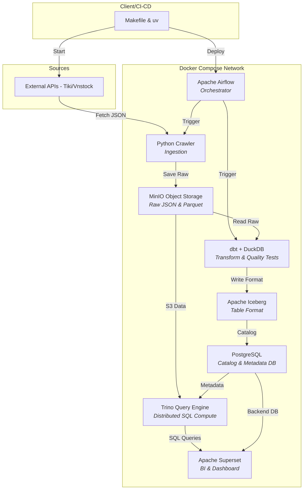

# 🏗️ Kiến Trúc Modern Data Stack & Hệ Thống Kiểm Soát Chất Lượng Dữ Liệu (Data Quality)

Tài liệu này chi tiết hóa cách thức xây dựng một **Modern Data Stack (MDS)** và tích hợp hệ thống kiểm soát chất lượng dữ liệu (**Data Quality Checks**) theo sơ đồ kiến trúc nhằm chứng minh năng lực **scale** và **xử lý dữ liệu lớn (Big Data)** cho nền tảng định lượng tài chính như **Finvista**.

---

## 📊 1. Phân Tích Chi Tiết Sơ Đồ Modern Data Stack (MDS)

Hệ thống được thiết kế theo nguyên lý **phân tách hoàn toàn giữa tính toán (Compute) và lưu trữ (Storage)**, giúp tối ưu chi phí và tăng khả năng mở rộng không giới hạn (horizontal scaling).



### Chi Tiết Từng Thành Phần Trong Stack:

1. **Makefile & uv (Deployment & Package Manager):**
   * **`uv`** là trình quản lý thư viện Python viết bằng Rust (nhanh gấp 10-100 lần `pip` và `poetry`). Giúp việc đóng gói Docker image nhẹ hơn và cài đặt dependencies cho worker gần như tức thời.
   * **`Makefile`** chuẩn hóa các lệnh tự động hóa (e.g., `make deploy`, `make test`, `make run-pipeline`).

2. **Apache Airflow (Orchestrator):**
   * Lập lịch, điều phối và giám sát luồng chạy (DAGs). 
   * Đảm bảo tính phụ thuộc của pipeline: *Cào dữ liệu (Step 2) -> Lưu trữ thô -> Clean & Quality Audit (Step 2.5) -> Tính Features (Step 3) -> Train Model / Định giá*. Nếu một bước bị lỗi, Airflow tự động gửi alert (Slack/Telegram) và cho phép chạy lại (Retry) từ điểm lỗi.

3. **MinIO (S3-Compatible Object Storage - Data Lake):**
   * Đóng vai trò là **Data Lake Storage**. Thay vì lưu trữ tệp thô trên đĩa cứng cục bộ (local disk), toàn bộ dữ liệu cào về (JSON) và dữ liệu chuẩn hóa dạng cột (**Parquet**) được lưu trữ trên MinIO dưới dạng các S3 Buckets.
   * Giúp dễ dàng chuyển sang AWS S3, Google Cloud Storage mà không cần sửa code.

4. **dbt (data build tool) + DuckDB (Transformation & In-memory Compute):**
   * **DuckDB** hoạt động như một serverless analytic database cực kỳ nhanh (vectored execution engine), xử lý định dạng Parquet trực tiếp trên S3 cực kỳ hiệu quả mà không cần khởi tạo cluster nặng nề như Spark.
   * **dbt** quản lý vòng đời SQL (Staging -> Marts), xây dựng sơ đồ phụ thuộc (lineage) và định nghĩa các bài kiểm tra chất lượng dữ liệu (**dbt tests**).

5. **Apache Iceberg (Open Table Format - Lakehouse):**
   * Cung cấp khả năng giao dịch **ACID** trực tiếp trên Object Storage.
   * Hỗ trợ **Time Travel** (truy vấn dữ liệu tại một thời điểm lịch sử cụ thể), **Schema Evolution** (thêm/sửa/xóa cột mà không làm hỏng dữ liệu cũ) và **Hidden Partitioning** giúp tăng tốc độ truy vấn lớn.

6. **PostgreSQL (Catalog & Metadata):**
   * Lưu trữ metadata của Apache Iceberg (danh sách tệp tin, schema, snapshot).
   * Làm database lưu thông tin người dùng và dashboard của Apache Superset.

7. **Trino (Distributed SQL Query Engine):**
   * Trực tiếp truy vấn dữ liệu từ MinIO (Parquet/Iceberg) bằng cú pháp SQL chuẩn với tốc độ cực nhanh. Trino tách biệt hoàn toàn phần Compute, cho phép mở rộng bằng cách thêm các Worker Node khi dữ liệu tăng từ Gigabyte lên Terabyte.

8. **Apache Superset (Visualization):**
   * Công cụ Business Intelligence mã nguồn mở để vẽ biểu đồ và trực quan hóa dữ liệu thời gian thực truy vấn trực tiếp từ Trino.

---

## 🛡️ 2. Tích Hợp Quality Check (Data Quality Gates) Vào Pipeline

Trong một Modern Data Stack chuyên nghiệp, **Data Quality** không phải là bước phụ mà là các **Quality Gates** bắt buộc để chặn dữ liệu rác đi vào mô hình Machine Learning hoặc hệ thống giao dịch thực tế.

Chúng tôi đã thiết lập 3 tầng kiểm soát chất lượng dữ liệu trong Finvista:

```
[Raw Financials JSON]
         │
         ▼
 🚨 LEVEL 1: Schema & Type Validation (Coercion Gate)
         │  ↳ Chuyển đổi kiểu dữ liệu thô sang int/float, loại bỏ các ký tự rác.
         ▼
 🚨 LEVEL 2: Completeness Audit (Completeness Gate)
         │  ↳ Kiểm tra tỷ lệ khuyết thiếu (null/zero) của các trường bắt buộc (Assets, Equity, Revenue).
         ▼
 🚨 LEVEL 3: Business Logic & Outliers Checks (Accounting Sanity Gate)
         │  ↳ Kiểm định phương trình kế toán: Assets = Liabilities + Equity (sai lệch < 5%).
         │  ↳ Kiểm tra logic: Current Assets <= Total Assets, Debt Ratio (Liabilities / Assets) < 3.0.
         ▼
[Cleaned CSV & JSON Quality Report]
```

### Mã Nguồn Thực Tế Đã Triển Khai (`src/etl/filter_raw_data.py`):
Mã nguồn này tự động phát hiện, ghi nhận cảnh báo và xử lý dữ liệu lỗi trước khi đẩy vào pipeline huấn luyện mô hình:

```python
    # 5a. Completeness Audit (Kiểm tra dữ liệu trống hoặc bằng 0 ở cột quan trọng)
    completeness_report = {}
    critical_columns = ["total_assets", "total_equity", "net_revenue", "profit_after_tax"]
    for col in critical_columns:
        zero_or_nan = (df[col] == 0) | df[col].isna()
        missing_count = int(zero_or_nan.sum())
        missing_rate = float(missing_count / total_records)
        
        status = "PASSED" if missing_rate < 0.05 else "WARNING"
        completeness_report[col] = {"missing_count": missing_count, "missing_rate": missing_rate, "status": status}

    # 5b. Business Logic Validation (Kiểm tra tính hợp lý của kế toán)
    logic_violations = []
    
    # Logic 1: Tổng tài sản không được âm
    neg_assets = df[df["total_assets"] < 0]
    if not neg_assets.empty:
        logic_violations.append({"check": "negative_total_assets", "count": int(len(neg_assets))})
        df.loc[df["total_assets"] < 0, "total_assets"] = 0 # Tự động sửa chữa dữ liệu

    # Logic 2: Phương trình kế toán cân đối (Assets = Liabilities + Equity)
    bs_diff = (df["total_assets"] - (df["total_liabilities"] + df["total_equity"])).abs()
    bs_ratio_diff = np.where(df["total_assets"] == 0, 0.0, bs_diff / df["total_assets"])
    imbalance_records = df[bs_ratio_diff > 0.05]
    if not imbalance_records.empty:
        logic_violations.append({"check": "balance_sheet_imbalance", "count": int(len(imbalance_records))})

    # Logic 3: Tài sản ngắn hạn không vượt quá tổng tài sản
    assets_imbalance = df[df["current_assets"] > df["total_assets"]]
    if not assets_imbalance.empty:
        logic_violations.append({"check": "current_assets_gt_total_assets", "count": int(len(assets_imbalance))})
        df.loc[df["current_assets"] > df["total_assets"], "current_assets"] = df["total_assets"]
```

---

## 🚀 3. Cách Scale Hệ Thống Finvista Hiện Tại Lên Big Data

Khi số lượng mã chứng khoán cần quét và tần suất cào dữ liệu tăng (e.g., cào dữ liệu sổ lệnh mua bán thời gian thực từng giây cho toàn bộ thị trường), kiến trúc SQLite cục bộ của Finvista sẽ gặp hiện tượng nghẽn khóa ghi (Write Lock). 

Dưới đây là kế hoạch chuyển dịch sang Modern Data Stack:

### Lộ trình dịch chuyển (Migration Path):

| Thành phần hiện tại | Thành phần Big Data (MDS) | Vai trò & Cách hoạt động khi Scale |
| :--- | :--- | :--- |
| **Local JSON (`data/raw`)** | **MinIO / AWS S3** | Lưu trữ phi cấu trúc hàng triệu tệp JSON thô cào về từ SSI/Vietcap API mà không tốn tài nguyên ổ đĩa local. |
| **Pandas Local (`run.py`)** | **dbt + DuckDB (hoặc PySpark)** | DuckDB sẽ thay thế Pandas để thực hiện các phép join và tính Greeks (Delta, Gamma, Vega) song song trực tiếp trên tệp Parquet. Nếu dữ liệu vượt quá 500GB, chuyển sang chạy **PySpark** trên cụm Cloud để xử lý phân tán. |
| **SQLite (`finvista.db`)** | **Apache Iceberg + PostgreSQL** | Dữ liệu giao dịch chứng quyền lịch sử được lưu dưới dạng bảng Iceberg. Cú pháp SQL được catalog hóa qua Postgres giúp thực hiện Time Travel truy vấn lịch sử thị trường để backtest chiến thuật trong vài giây. |
| **Local Loops (`--loop 300`)** | **Apache Airflow DAGs** | Thay thế vòng lặp vô hạn `while True` trong `run.py` bằng Airflow DAG chạy định kỳ mỗi 5 phút hoặc tích hợp **Kafka** để stream dữ liệu thời gian thực. |
| **FastAPI Console Logs** | **Apache Superset** | Xây dựng Dashboard trực quan hóa cơ hội lệch giá biến động (Volatility Arbitrage) và sức khỏe tài chính doanh nghiệp thay vì in bảng mã ASCII thô ra terminal. |

---

## 💡 Kết Luận Cho Buổi Thuyết Trình/Báo Cáo
Khi trình bày hệ thống này với các đối tác hoặc khách hàng:
1. Nhấn mạnh việc **Finvista đã có sẵn cơ chế Data Quality Guard** để đảm bảo dữ liệu đầu vào mô hình ML luôn sạch (sẵn sàng sinh báo cáo JSON tự động).
2. Sơ đồ kiến trúc **Modern Data Stack** chứng minh dự án có khả năng chuyển đổi trực tiếp sang xử lý Big Data trên nền tảng Cloud (AWS/GCP) bằng cách cấu hình file Docker Compose mà không cần viết lại mã nguồn cốt lõi (pricing core & ML logic).
