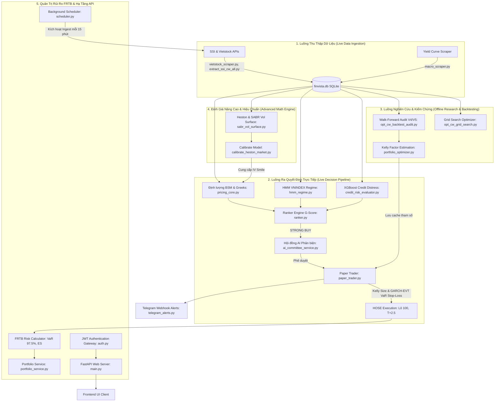

# 🧭 FINVISTA: TOÀN BỘ KIẾN TRÚC HỆ THỐNG & QUY TRÌNH QUYẾT ĐỊNH (SYSTEM PIPELINES)

Tài liệu này chi tiết hóa toàn bộ các luồng vận hành của hệ thống **Finvista Quant Pro**, bao gồm luồng ra quyết định giao dịch trực tiếp thời gian thực, hệ thống nghiên cứu/kiểm chứng ngoại tuyến, định giá nâng cao và hạ tầng hỗ trợ.

---

## 🏛️ SƠ ĐỒ KIẾN TRÚC TỔNG THỂ HỆ THỐNG (SYSTEM ARCHITECTURE)

---

## 🔍 CHI TIẾT CÁC PHÂN HỆ VÀ QUY TRÌNH VẬN HÀNH

---

### PHÂN HỆ 1: LUỒNG GIAO DỊCH TRỰC TIẾP (LIVE DECISION PIPELINE)

Quy trình tự động đưa ra quyết định giao dịch theo thời gian thực gồm **8 bước** nghiêm ngặt:

1.  **Thu thập dữ liệu thời gian thực (Ingestion):**
    *   Tự động chạy mỗi 15 phút để lấy dữ liệu khớp lệnh, chênh lệch Bid/Ask và thông số vĩ mô.
    *   *Mã nguồn:* [vietstock_scraper.py](file:///c:/Users/samvo/Downloads/Finvista/src/etl/extractors/vietstock_scraper.py), [extract_ssi_cw_all.py](file:///c:/Users/samvo/Downloads/Finvista/src/etl/extractors/extract_ssi_cw_all.py), [macro_scraper.py](file:///c:/Users/samvo/Downloads/Finvista/src/etl/extractors/macro_scraper.py).
2.  **Định lượng BSM & Giải ngược IV:**
    *   Tính giá lý thuyết BSM, Greeks ($\Delta, \Gamma, \Theta, \nu$) và giải ngược Implied Volatility (IV) qua Newton-Raphson. So sánh IV với GARCH Volatility/HV để tìm lệch giá (Volatility Arbitrage).
    *   *Mã nguồn:* [pricing_core.py](file:///c:/Users/samvo/Downloads/Finvista/src/quant/pricing/pricing_core.py).
3.  **Chốt chặn An toàn Tín dụng (Credit Risk Gate):**
    *   Chạy mô hình XGBoost dự báo rủi ro kiệt quệ tài chính của doanh nghiệp cơ sở.
    *   **Quy tắc Chặn cứng (Hard-Stop):** Nếu cổ phiếu cơ sở bị dán nhãn Đỏ (xác suất kiệt quệ > 50%), hệ thống cấm mua và tự động kích hoạt lệnh bán khẩn cấp (`Force Sell`) các CW liên quan.
    *   *Mã nguồn:* [credit_risk_evaluator.py](file:///c:/Users/samvo/Downloads/Finvista/src/models/credit/credit_risk_evaluator.py), [paper_trader.py](file:///c:/Users/samvo/Downloads/Finvista/src/trading/paper_trader.py#L292-L314).
4.  **HMM Market Regime Detection:**
    *   Sử dụng Hidden Markov Model 4 trạng thái để phân loại VNINDEX thành các pha (Quiet Bullish, Volatile Bullish, Quiet Bearish, Crisis). 
    *   *Mã nguồn:* [hmm_regime.py](file:///c:/Users/samvo/Downloads/Finvista/src/quant/indicators/hmm_regime.py), [alpha_engine.py](file:///c:/Users/samvo/Downloads/Finvista/src/services/alpha_engine.py#L22-L42).
5.  **Chấm điểm G-Score & Phân loại Tín hiệu:**
    *   Xếp hạng mã chứng quyền theo G-Score dựa trên Upside, Gearing, IV/HV Skew và Credit Risk.
    *   *Mã nguồn:* [ranker.py](file:///c:/Users/samvo/Downloads/Finvista/src/quant/engines/ranker.py).
6.  **Hội đồng AI Phê duyệt (AI Committee Swarm):**
    *   Sử dụng Multi-Agent Swarm phản biện để xác thực lại các tín hiệu `STRONG BUY` dựa trên tin tức vĩ mô và phân tích thị giác biểu đồ nến (Gemini Vision).
    *   *Mã nguồn:* [ai_committee_service.py](file:///c:/Users/samvo/Downloads/Finvista/src/services/ai_committee_service.py).
7.  **Định cỡ Vị thế & Khớp lệnh (HOSE Compliance & Stop-Loss):**
    *   **Định cỡ:** Áp dụng Kelly Criterion để phân bổ vốn tối ưu.
    *   **GARCH-EVT VaR Stop-Loss:** Tính Value-at-Risk ngày tiếp theo, tự động thắt chặt stop-loss thêm 30% khi biến động thị trường tăng vọt hoặc HMM cảnh báo Crisis.
    *   *Mã nguồn:* [paper_trader.py](file:///c:/Users/samvo/Downloads/Finvista/src/trading/paper_trader.py).
8.  **Đẩy cảnh báo (Alerts & Webhooks):**
    *   Đẩy kết quả khớp lệnh lên API Gateway WebSockets và bắn cảnh báo HTML về Telegram Chatbot.
    *   *Mã nguồn:* [telegram_alerts.py](file:///c:/Users/samvo/Downloads/Finvista/src/common/telegram_alerts.py).

---

### PHÂN HỆ 2: LUỒNG NGHIÊN CỨU & KIỂM CHỨNG (OFFLINE RESEARCH & BACKTESTING)

Phục vụ cho việc tối ưu hóa và đánh giá hiệu năng chiến lược trên dữ liệu lịch sử trước khi đưa vào vận hành thực tế.

*   **Walk-Forward Validation (WFA):**
    *   *Hoạt động:* Thực hiện rà soát chiến lược bằng cách chia dữ liệu lịch sử thành các cửa sổ huấn luyện và kiểm thử nối tiếp nhau (Train/Test 70/30). Hỗ trợ kiểm thử Walk-Forward nâng cao có phòng hộ (Hedging) trong V5.
    *   *Mã nguồn:* [opt_cw_backtest_audit.py](file:///c:/Users/samvo/Downloads/Finvista/src/quant/engines/opt_cw_backtest_audit.py), [opt_cw_backtest_audit_v5.py](file:///c:/Users/samvo/Downloads/Finvista/src/quant/engines/opt_cw_backtest_audit_v5.py).
*   **Tối ưu hóa Tham số (Grid Search):**
    *   *Hoạt động:* Quét qua hàng ngàn tổ hợp tham số (Stop-Loss, Take-Profit, G-Score threshold) để tìm ra bộ quy tắc mang lại tỷ suất Sharpe và Profit Factor cao nhất.
    *   *Mã nguồn:* [opt_cw_grid_search.py](file:///c:/Users/samvo/Downloads/Finvista/src/quant/engines/opt_cw_grid_search.py).
*   **Kelly Factor Optimizer:**
    *   *Hoạt động:* Phân tích lịch sử thắng thua để ước lượng hệ số Kelly tối ưu cho từng cổ phiếu cơ sở, giúp bảo toàn vốn và tối đa hóa tăng trưởng NAV dài hạn.
    *   *Mã nguồn:* [portfolio_optimizer.py](file:///c:/Users/samvo/Downloads/Finvista/src/quant/engines/portfolio_optimizer.py).

---

### PHÂN HỆ 3: ĐỊNH GIÁ NÂNG CAO & HIỆU CHUẨN BIẾN ĐỘNG (ADVANCED MATH ENGINE)

Mở rộng lõi toán học để xử lý các kịch bản lệch biến động phức tạp trên thị trường thực tế.

*   **SABR Volatility Surface & Heston Model:**
    *   *Hoạt động:* Xây dựng đường cong biến động (Volatility Smile) và ma trận biến động hàm ý. Mô phỏng biến động ngẫu nhiên (stochastic volatility) thay vì biến động không đổi của BSM truyền thống.
    *   *Mã nguồn:* [sabr_vol_surface.py](file:///c:/Users/samvo/Downloads/Finvista/src/quant/pricing/sabr_vol_surface.py), [pricing_core_enhanced.py](file:///c:/Users/samvo/Downloads/Finvista/src/quant/pricing/pricing_core_enhanced.py).
*   **Hiệu chuẩn Mô hình (Calibration):**
    *   *Hoạt động:* Khớp các tham số của Heston Model và Merton default model với dữ liệu thị trường Việt Nam thực tế bằng phương pháp bình phương tối thiểu (least-squares).
    *   *Mã nguồn:* [calibrate_heston_market.py](file:///c:/Users/samvo/Downloads/Finvista/scripts/calibrate_heston_market.py), [calibrate_merton.py](file:///c:/Users/samvo/Downloads/Finvista/scripts/calibrate_merton.py).

---

### PHÂN HỆ 4: QUẢN TRỊ RỦI RO DANH MỤC CHUẨN TỔ CHỨC (FRTB RISK ENGINE)

Quản lý rủi ro tích lũy của toàn bộ danh mục tài sản theo tiêu chuẩn ngân hàng đầu tư toàn cầu.

*   **FRTB Standard Exposure:**
    *   *Hoạt động:* Tính toán giá trị rủi ro danh mục **Value-at-Risk (VaR ở mức tin cậy 97.5%)** và **Expected Shortfall (ES)** trong các điều kiện thị trường bị căng thẳng (Stress testing).
    *   *Mã nguồn:* [portfolio_service.py](file:///c:/Users/samvo/Downloads/Finvista/src/services/portfolio_service.py).

---

### PHÂN HỆ 5: HẠ TẦNG LẬP LỊCH & BẢO MẬT (INFRASTRUCTURE & SERVICES)

Hệ thống xương sống vận hành tự động hóa và bảo vệ API.

*   **Background Scheduler:**
    *   *Hoạt động:* Lập lịch tự động cào dữ liệu mới trong giờ giao dịch của sàn HOSE, tránh nghẽn mạng và Gateway Timeout bằng FastAPI BackgroundTasks.
    *   *Mã nguồn:* [scheduler.py](file:///c:/Users/samvo/Downloads/Finvista/src/api/scheduler.py).
*   **JWT Security Gate:**
    *   *Hoạt động:* Xác thực tài khoản đa người dùng bằng OAuth2 JWT Bearer Token, băm mật khẩu chuẩn PBKDF2 HMAC SHA-256 giúp cô lập hoàn toàn tài sản Paper Trading giữa các tài khoản người dùng khác nhau.
    *   *Mã nguồn:* [auth.py](file:///c:/Users/samvo/Downloads/Finvista/src/api/routes/auth.py).
