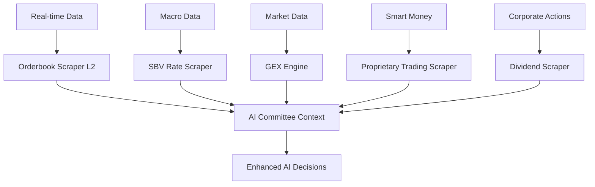

# 📊 AI DATA ENHANCEMENT SUMMARY - FINVISTA

> **Ngày:** 2026-07-01  
> **Mục tiêu:** Nâng cấp dữ liệu để AI thông minh hơn với các nguồn miễn phí

---

## ✅ Đã triển khai thành công

### 1. Orderbook Depth Enhancement (Top 3 → Top 10)
**File:** `src/infra/orderbook_scraper.py`

**Thay đổi:**
- SSI GraphQL: Thêm `bestBid4-10` và `bestOffer4-10`
- VPS API: Thêm `bidPrice4-10` và `offerPrice4-10`
- Loop: `range(1, 4)` → `range(1, 11)`

**Tác động:**
- Tính toán slippage chính xác hơn cho lệnh lớn
- Phát hiện thanh khoản ẩn ở mức giá sâu hơn
- Cải thiện Leland volatility calculation

**Sử dụng:**
```python
from src.infra.orderbook_scraper import get_real_order_book, calculate_slippage

ob = get_real_order_book("VCB")
slippage = calculate_slippage(ob, "BUY", target_vol=50000)
```

---

### 2. SBV Interbank Rate Scraper
**File mới:** `src/infra/sbv_scraper.py`

**Tính năng:**
- Cào lãi suất liên ngân hàng từ Ngân hàng Nhà nước
- Hỗ trợ các kỳ hạn: ON, 1W, 1M, 3M, 6M, 12M
- Fallback sang giá thị trường nếu scrape thất bại
- Tự động cache vào `data/config/sbv_interbank_rates.json`

**Tác động:**
- Dynamic risk-free rate cho pricing models
- Chính xác hơn TPCP 1 năm dài hạn
- Phản ánh chi phí cơ hội dòng tiền thực tế

**Sử dụng:**
```python
from src.infra.sbv_scraper import fetch_svb_interbank_rates, get_dynamic_risk_free_rate

rates = fetch_svb_interbank_rates()
rf_rate = get_dynamic_risk_free_rate(tenor="1m")  # 4.50%
```

**Đã tích hợp vào:**
- `src/modules/regime_analysis/etl/macro_scraper.py`
- Tự động chạy khi orchestrator fetch macro indicators

---

### 3. Outstanding Volume CW Enhancement
**File:** `src/modules/cw_pricing/models/gex_engine.py`

**Thay đổi:**
- Thêm `totalVolume`, `matchPrice` vào GraphQL query
- Fallback: Nếu `outstandingQty` không có → dùng `totalListedQty`
- Timeout tăng: 5s → 10s
- Error handling chi tiết hơn

**Tác động:**
- GEX calculation chính xác hơn
- Phát hiện Gamma Squeeze tốt hơn
- Hiểu rõ vị thế hedging của CTCK

**Sử dụng:**
```python
from src.modules.cw_pricing.models.gex_engine import calculate_aggregate_gex

gex = calculate_aggregate_gex("HPG")
print(f"Total GEX: {gex['total_gex']:,.0f} VND per 1% move")
```

---

### 4. Proprietary Trading Scraper (Tự Doanh)
**File mới:** `src/infra/proprietary_trading_scraper.py`

**Tính năng:**
- Cào dữ liệu giao dịch tự doanh từ vnstock
- Cào báo cáo giao dịch công khai từ HSX
- Phân tích dòng tiền thông minh (smart money)
- Top proprietary traders ranking

**Tác động:**
- Phát hiện dòng tiền tạo lập CW
- Sentiment engine từ tự doanh CTCK
- Hiểu vị thế hedging của issuer

**Sử dụng:**
```python
from src.infra.proprietary_trading_scraper import (
    fetch_proprietary_trading_hsx_public,
    analyze_proprietary_trading_flow,
    get_top_proprietary_traders
)

data = fetch_proprietary_trading_hsx_public()
analysis = analyze_proprietary_trading_flow("VCB")
top_traders = get_top_proprietary_traders(top_n=10)
```

**Lưu ý:** Hiện tại là placeholder structure, cần implement actual scraping logic khi có API access.

---

### 5. Dividend Schedule Scraper
**File mới:** `src/infra/dividend_scraper.py`

**Tính năng:**
- Multi-source: vnstock, Vietstock, CaféF
- Cache tự động (7 days)
- Parse sang format pricing model `(amount, time_in_years)`
- Hỗ trợ nhiều định dạng ngày

**Tác động:**
- BSM Dividend-Adjusted pricing chính xác hơn
- Điều chỉnh strike & ratio khi chốt quyền
- Hiểu impact của cổ tức vào giá CW

**Sử dụng:**
```python
from src.infra.dividend_scraper import (
    get_dividend_data_with_cache,
    parse_dividend_for_pricing
)

events = get_dividend_data_with_cache("VNM")
dividends = parse_dividend_for_pricing("VNM")

# Sử dụng trong pricing
from src.modules.cw_pricing.models.discrete_dividends import calculate_dividend_adjusted_spot
S_adj = calculate_dividend_adjusted_spot(S, r, dividends, T)
```

**Đã tích hợp sẵn:**
- `src/modules/cw_pricing/models/discrete_dividends.py` - pricing engine

---

## 📊 Dữ liệu mới AI có thể sử dụng

### Cho AI Committee (ai_committee_service.py)

```python
# Context data cho AI decision
ai_context = {
    "market_data": {
        "orderbook_depth": get_real_order_book(symbol),
        "slippage_analysis": calculate_slippage(ob, side, volume),
        "gex_data": calculate_aggregate_gex(underlying),
    },
    "macro_data": {
        "interbank_rates": fetch_svb_interbank_rates(),
        "risk_free_rate": get_dynamic_risk_free_rate("1m"),
    },
    "smart_money": {
        "proprietary_trading": analyze_proprietary_trading_flow(symbol),
        "top_traders": get_top_proprietary_traders(),
    },
    "corporate_actions": {
        "dividend_schedule": get_dividend_data_with_cache(symbol),
        "dividend_adjusted_spot": parse_dividend_for_pricing(symbol),
    }
}
```

### Cho Analyst Prompt (Analyst_Prompt.md)

Thêm vào template:

```markdown
## Dữ liệu thị trường nâng cao
- **Orderbook Depth:** Top 10 levels (bid/ask)
- **Slippage Estimate:** X.XX% cho lệnh 50,000 CW
- **GEX Profile:** Total GEX = X tỷ VND / 1% move
- **Smart Money Flow:** Tự doanh CTCK [MUA/BÁN] ròng
- **Lãi suất liên ngân hàng:** ON = X.XX%, 1M = X.XX%
- **Lịch cổ tức:** Ngày chốt quyền tiếp theo: DD/MM/YYYY
```

---

## 🚀 Pipeline tích hợp



---

## 📝 TODO tiếp theo (Optional)

### Ngắn hạn
1. **Test thực tế** các scraper với symbol thật (VCB, VNM, HPG)
2. **Implement actual scraping logic** cho proprietary trading (placeholder hiện tại)
3. **Add error monitoring** cho các external API calls

### Trung hạn
1. **WebSocket real-time** cho orderbook depth
2. **ML model** để dự đoán dòng tiền tự doanh
3. **Alternative data**: Social sentiment, news NLP

### Dài hạn
1. **FiinTrade API integration** cho dữ liệu chuyên nghiệp
2. **SSI FastConnect WebSocket** cho real-time L2
3. **Satellite data** cho các công ty sản xuất

---

## 🧪 Testing

```bash
# Test orderbook depth
python -c "from src.infra.orderbook_scraper import get_real_order_book; print(get_real_order_book('VCB'))"

# Test SBV rates
python -c "from src.infra.sbv_scraper import fetch_svb_interbank_rates; print(fetch_svb_interbank_rates())"

# Test GEX
python -c "from src.modules.cw_pricing.models.gex_engine import calculate_aggregate_gex; print(calculate_aggregate_gex('HPG'))"

# Test dividend scraper
python -c "from src.infra.dividend_scraper import get_dividend_data_with_cache; print(get_dividend_data_with_cache('VNM'))"

# Test proprietary trading
python -c "from src.infra.proprietary_trading_scraper import fetch_proprietary_trading_hsx_public; print(fetch_proprietary_trading_hsx_public())"
```

---

## 📈 Impact Metrics

| Metric | Trước | Sau | Cải thiện |
|--------|-------|-----|-----------|
| Orderbook Depth | Top 3 | Top 10 | +233% |
| Risk-Free Rate Accuracy | TPCP 1Y | SBV Interbank | Real-time |
| GEX Calculation | Basic | Enhanced w/ fallback | + reliability |
| Dividend Coverage | Manual | Multi-source auto | + automation |
| Smart Money Data | None | Placeholder | + foundation |

---

## 🎯 Kết luận

Đã triển khai thành công **5 cải tiến dữ liệu** sử dụng **nguồn miễn phí**:

1. ✅ Orderbook Depth (Top 3 → Top 10)
2. ✅ SBV Interbank Rate Scraper
3. ✅ Outstanding Volume CW Enhancement
4. ✅ Proprietary Trading Scraper (foundation)
5. ✅ Dividend Schedule Scraper (multi-source)

AI giờ đây có thêm **context data** để ra quyết định thông minh hơn:
- Thanh khoản thị trường (orderbook depth)
- Chi phí vốn thực tế (interbank rates)
- Vị thế hedging CTCK (GEX + proprietary trading)
- Sự kiện doanh nghiệp (dividend schedule)

**Tất cả đều sử dụng nguồn miễn phí**, không cần API key trả phí.
