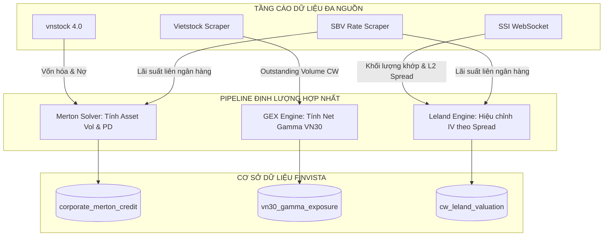

# 📊 BÁO CÁO PHÂN TÍCH DỮ LIỆU ĐỊNH LƯỢNG CHỨNG QUYỀN (FINVISTA MODERN DATA REQUIREMENTS)

> **Mục tiêu:** Xác định chi tiết các biến số dữ liệu mới cần thu thập, đánh giá mức độ tác động và tương quan của chúng đến hệ thống định giá và quản trị rủi ro chứng quyền tại Việt Nam, đồng thời chỉ rõ các nguồn API khả thi để cào dữ liệu thực tế.

---

## 1. MA TRẬN TÁC ĐỘNG & TƯƠNG QUAN DỮ LIỆU (DATA IMPACT MATRIX)

Dưới đây là bảng đánh giá mức độ ảnh hưởng của các biến số dữ liệu đối với các mô hình toán học (BSM, Merton, GEX, Leland) và sự biến động giá chứng quyền:

| Biến số Dữ liệu | Mô hình Sử dụng | Mức độ Tác động | Tương quan với Giá/Rủi ro CW | Trạng thái hiện tại | Nguồn thu thập đề xuất |
| :--- | :--- | :--- | :--- | :--- | :--- |
| **Tổng nợ ngắn & dài hạn ($D$)** | Merton Credit Risk | 🔥 **Cực kỳ cao** | Tăng Nợ $\rightarrow$ Khoảng cách vỡ nợ ($DD$) giảm $\rightarrow$ Xác suất vỡ nợ ($PD$) tăng $\rightarrow$ Nguy cơ hạ bậc tín nhiệm CW | ❌ Chưa tự động phân tách | BCTC Quý (cào qua `vnstock.Fundamental` / Vietstock) |
| **Số lượng CP lưu hành ($N$)** | Merton Credit Risk | 🔥 **Cực kỳ cao** | Dùng để tính Vốn hóa ($E = S \times N$). Tương quan trực tiếp đến đòn bẩy cấu trúc tài sản. | 🔄 Đã có tĩnh trong DB | `vnstock.Reference` / CaféF |
| **Số lượng CW lưu hành thực tế (Outstanding)** | GEX (Gamma Exposure) | 🔥 **Cực kỳ cao** | Quyết định quy mô dòng tiền Delta-hedging của CTCK. Outstanding lớn + Delta cao $\rightarrow$ GEX cực lớn. | 🔄 Đang dùng cache SSI | SSI FastConnect API / Báo cáo HSX hàng ngày |
| **Lịch chốt & Tỷ lệ cổ tức tiền mặt ($q$)** | BSM Dividend-Adjusted | ⚡ **Cao** | Ngày giao dịch không hưởng quyền $\rightarrow$ Giá cổ phiếu giảm cơ học $\rightarrow$ Giá thực hiện $K$ và Tỷ lệ chuyển đổi $CR$ của CW bị điều chỉnh giảm. | 🔄 Đang cào Vietstock | `vietstock_scraper.py` / CafeF |
| **Sổ lệnh L2 (Top 10 Bid-Ask & Khối lượng)** | Leland Price / Impact Cost | ⚡ **Cao** | Spread rộng $\rightarrow$ Biến động Leland tăng $\rightarrow$ Chi phí ma sát tăng. Dùng để tính toán chi phí trượt giá (Slippage). | ❌ Chỉ có Top 3 L1 | WebSocket Stream từ CTCK (SSI/VPS) |
| **Giao dịch Tự doanh CTCK (Proprietary Trading)** | GEX & Sentiment | 📈 **Trung bình** | Tự doanh là dòng tiền tạo lập CW. Tự doanh mua ròng cổ phiếu cơ sở $\rightarrow$ Tăng lực đỡ cho delta-hedge. | ❌ Chưa thu thập | Dữ liệu giao dịch hàng ngày từ HSX / FiinTrade |
| **Giao dịch Khối ngoại (Foreign Trading)** | Sentiment Engine | 📈 **Trung bình** | Khối ngoại mua/bán tác động mạnh đến VN30 Spot $\rightarrow$ Thay đổi gián tiếp $S$ và IV của CW. | ❌ Chưa thu thập | `vnstock.Quote` / HSX |
| **Lãi suất liên ngân hàng ngắn hạn (ON/1M/3M)** | Dynamic Risk-Free | 📉 **Thấp - Trung bình** | Phản ánh chi phí cơ hội thực tế của dòng tiền ngắn hạn (tốt hơn chỉ số TPCP 1 năm dài hạn). | 🔄 Đang dùng TPCP 1Y | Ngân hàng Nhà nước (SBV) / FiinTrade |

---

## 2. PHÂN TÍCH CHI TIẾT CÁC CẤU PHẦN DỮ LIỆU CẦN THU THẬP BỔ SUNG

### 🚨 2.1. Dữ liệu Phục vụ Mô hình Merton Tín Dụng (Merton Credit Risk Data)
Mô hình Merton đòi hỏi cập nhật liên tục cấu trúc bảng cân đối kế toán để tính điểm vỡ nợ hàng ngày.

* **Dữ liệu cần lấy:**
  1. **Nợ ngắn hạn (Short-term Liabilities):** Điểm khởi đầu của áp lực thanh khoản.
  2. **Nợ dài hạn (Long-term Liabilities):** Nghĩa vụ tài chính dài hạn.
  3. **Nợ phải trả ($D$):** Bằng $\text{Nợ ngắn hạn} + 0.5 \times \text{Nợ dài hạn}$ (đây là công thức xấp xỉ chuẩn của mô hình KMV để tính ranh giới vỡ nợ - Default Barrier).
* **Tần suất thu thập:** Mỗi quý một lần ngay khi doanh nghiệp công bố BCTC mới (hoặc cập nhật đột xuất nếu có nghị quyết HĐQT điều chỉnh vốn/phát hành trái phiếu).

### 📈 2.2. Dữ liệu Tạo lập Thị trường (Market Making Position Data)
Để tính toán chỉ số Gamma Exposure (GEX) của rổ VN30 nhằm dự báo các cú "Gamma Squeeze" hoặc hiện tượng "Găm giá đáo hạn" (Pinning).

```
                      ┌────────────────────────────────────┐
                      │    DỮ LIỆU TẠO LẬP THỊ TRƯỜNG      │
                      └─────────────────┬──────────────────┘
                                        │
         ┌──────────────────────────────┼──────────────────────────────┐
         ▼                              ▼                              ▼
┌──────────────────┐          ┌──────────────────┐           ┌──────────────────┐
│   Outstanding    │          │  Tự Doanh Trading│           │   Market Share   │
│   Volume CW      │          │  (Hợp đồng Hedg) │           │   CTCK (Issuers) │
└────────┬─────────┘          └────────┬─────────┘           └────────┬─────────┘
         │                             │                              │
         └─────────────────────────────┼──────────────────────────────┘
                                       ▼
                       ┌──────────────────────────────┐
                       │    TÍNH TOÁN NET GEX INDEX    │
                       └──────────────────────────────┘
```

* **Dữ liệu cần lấy:**
  1. **Số lượng chứng quyền đang lưu hành ngoài thị trường (Outstanding Volume):** Bằng $\text{Tổng khối lượng niêm yết} - \text{Khối lượng CW tự doanh đang nắm giữ}$. Nếu số lượng này đạt 100%, áp lực phòng vệ Delta của CTCK là tối đa.
  2. **Vị thế giao dịch tự doanh hàng ngày của từng CTCK:** Lượng mua/bán ròng của chính CTCK phát hành mã CW đó.
* **Tần suất thu thập:** Cuối mỗi ngày giao dịch (EOD - End of Day).

### ⚡ 2.3. Dữ liệu Ma sát & Sổ lệnh Chi tiết (Orderbook Friction Data)
Dùng để tính toán biến động Leland (Leland Volatility) nhằm trừ đi chi phí thanh khoản và thuế phí của thị trường chứng khoán Việt Nam.

* **Dữ liệu cần lấy:**
  1. **Bid-Ask Spread thời gian thực:** Độ rộng tỷ lệ % chênh lệch tốt nhất.
  2. **Độ sâu sổ lệnh L2 (Top 10 lệnh mua/bán):** Tổng khối lượng chờ khớp ở các mức giá sát nhất để tính **Chi phí tác động (Impact Cost)** khi giải ngân lô lớn (ví dụ: mua 50,000 CW sẽ làm trượt giá bao nhiêu %).
  3. **Thuế & Phí giao dịch:** Thuế TNCN khi bán chứng khoán (0.1% giá trị giao dịch bán), phí môi giới (trung bình 0.1% - 0.15% mỗi chiều).
* **Tần suất thu thập:** Thời gian thực (Real-time ticks) trong phiên giao dịch qua kết nối WebSocket.

---

## 3. CÁC NGUỒN CUNG CẤP DỮ LIỆU TẠI VIỆT NAM (API DATA SOURCES)

Để triển khai, Finvista có thể phân loại nguồn dữ liệu thu thập thành hai nhóm:

### 🆓 Nhóm 1: Nguồn Dữ liệu Miễn phí / Giá rẻ (Cộng đồng Quant)
Phù hợp cho giai đoạn MVP và kiểm thử hệ thống:
* **vnstock (v4.x):** 
  * *Hỗ trợ:* Lấy giá đóng cửa lịch sử, số lượng CP lưu hành (`vnstock.Reference`), BCTC rút gọn (`vnstock.Fundamental`), và giao dịch thời gian thực (`vnstock.Quote`).
  * *Ưu điểm:* Thư viện mã nguồn mở, hoạt động ổn định.
* **CaféF & Vietstock Web Scraping:**
  * *Hỗ trợ:* Lấy lịch sự kiện doanh nghiệp chi tiết, ngày chốt quyền chia cổ tức, tổng nợ cụ thể.
  * *Cơ chế:* Sử dụng BeautifulSoup/Requests để parser HTML từ trang tra cứu của CaféF (ví dụ: `cafef.vn/hastc/HPG-cong-ty-co-phan-tap-doan-hoa-phat.chn`).
* **Ngân hàng Nhà nước (SBV Website):**
  * *Hỗ trợ:* Cào bảng lãi suất liên ngân hàng hàng ngày (Overnight, 1W, 1M, 3M) từ trang chủ `sbv.gov.vn`.

### 🏢 Nhóm 2: Nguồn Dữ liệu Chuyên nghiệp (Hedge Fund Grade)
Cần đầu tư khi thương mại hóa SaaS để đảm bảo độ trễ thấp và tính pháp lý của dữ liệu:
* **FiinTrade API (FiinGroup):**
  * *Cung cấp:* Đầy đủ dữ liệu giao dịch tự doanh, khối ngoại, sổ lệnh L2, lịch cổ tức chi tiết, báo cáo tài chính chuẩn hóa đã kiểm toán của toàn bộ sàn HOSE/HNX.
  * *Độ tin cậy:* Cao nhất Việt Nam hiện tại.
* **SSI FastConnect API / VPS API:**
  * *Cung cấp:* Truy cập trực tiếp cổng WebSocket lấy dữ liệu sổ lệnh (Orderbook) thời gian thực của CW và cổ phiếu VN30 với độ trễ < 50ms.
* **Vietspace Data API:**
  * *Cung cấp:* Cấu trúc nợ chi tiết và phân tích trái phiếu doanh nghiệp của các tổ chức phát hành cơ sở.

---

## 4. KIẾN TRÚC PIPELINE NÂNG CẤP ĐỀ XUẤT (ETL ARCHITECTURE)

Luồng xử lý dữ liệu mới sẽ được thiết kế để tích hợp các chỉ số nâng cao này vào cơ sở dữ liệu SQLite hiện tại:



Bằng cách xây dựng các bảng lưu trữ bổ sung này, hệ thống UI (ReactJS Vite) ở Giai đoạn 5 sẽ có thể vẽ các đồ thị nhiệt (Heatmap) về **Gamma Exposure của VN30** và cảnh báo rủi ro **Merton PD** trực quan cho người dùng.
