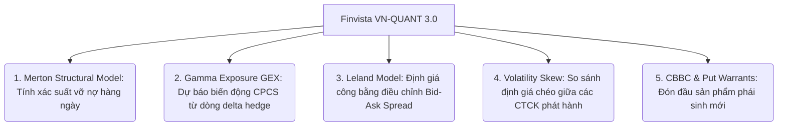
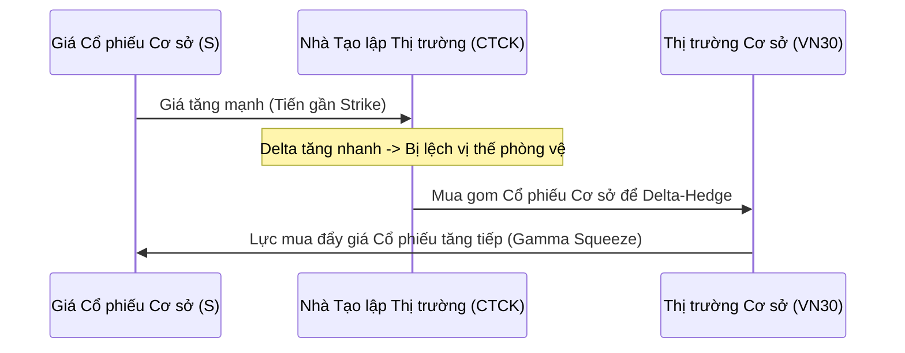

# 🚀 NGHIÊN CỨU PHÁT TRIỂN & HIỆN ĐẠI HÓA HỆ THỐNG ĐỊNH GIÁ CHỨNG QUYỀN (FINVISTA MODERN QUANT RESEARCH)

> **Mục tiêu:** Nghiên cứu và đề xuất các phương pháp định lượng hiện đại từ các thị trường chứng quyền phát triển (Hồng Kông, Đài Loan, Hàn Quốc) và lý thuyết quản trị rủi ro tiên tiến (theo John C. Hull & FRTB) để tích hợp vào hệ thống **Finvista (VN-QUANT 3.0)**, đưa nền tảng đạt chuẩn định lượng cấp định chế tài chính (Hedge Fund Grade).

---

## 📋 MỤC LỤC
1. [Tổng Quan Khoảng Trống Nghiên Cứu](#1-tổng-quan-khoảng-trống-nghiên-cứu)
2. [Mô Hình Rủi Ro Tín Dụng Cấu Trúc Merton (Merton 1974 structural model)](#2-mô-hình-rủi-ro-tín-dụng-cấu-trúc-merton-merton-1974-structural-model)
3. [Áp Lực Phòng Vệ Nhà Tạo Lập & Chỉ Số Gamma Exposure (GEX)](#3-áp-lực-phòng-vệ-nhà-tạo-lập--chỉ-số-gamma-exposure-gex)
4. [Tối Ưu Hóa Định Giá Theo Leland (Liquidity-Adjusted BSM)](#4-tối-ưu-hóa-định-giá-theo-leland-liquidity-adjusted-bsm)
5. [Mô Hình Hóa Volatility Smile/Skew Theo Tổ Chức Phát Hành](#5-mô-hình-hóa-volatility-smileskew-theo-tổ-chức-phát-hành)
6. [Sẵn Sàng Cho Quyền Chọn Bán (Put Warrants) & Hợp Đồng Callable (CBBC)](#6-sẵn-sàng-cho-quyền-chọn-bán-put-warrants--hợp-đồng-callable-cbbc)
7. [Lộ Trình Tích Hợp Đề Xuất](#7-lộ-trình-tích-hợp-đề-xuất)

---

## 1. TỔNG QUAN KHOẢNG TRỐNG NGHIÊN CỨU

Hệ thống **Finvista VN-QUANT 3.0** hiện tại đã rất mạnh mẽ với:
* Mô hình định giá BSM điều chỉnh cổ tức ($q$) & Merton Jump-Diffusion (MLE).
* Quản trị rủi ro danh mục qua Greeks ($\Delta, \Gamma, \Theta, \nu$) và phân bổ vốn bằng Half-Kelly.
* Bộ lọc cứng (Hard Gates) kết hợp cảnh báo kiệt quệ tài chính (XGBoost + Altman Z''-Score).

Tuy nhiên, đối chiếu với các nền tảng phân tích chứng quyền hiện đại trên thế giới (như HKEX hay các hệ thống của Bloomberg/Reuters), thị trường chứng quyền Việt Nam có những đặc thù rất lớn về **sự độc quyền định giá của tổ chức phát hành (Issuers)** và **thanh khoản mỏng**. Để tối ưu hóa hiệu suất thực chiến, Finvista có thể nâng cấp thêm 5 trụ cột định lượng sau:



---

## 2. MÔ HÌNH RỦI RO TÍN DỤNG CẤU TRÚC MERTON (MERTON 1974 STRUCTURAL MODEL)

### ⚠️ Hạn chế hiện tại của hệ thống:
Bảng chấm điểm tín dụng của Finvista đang sử dụng dữ liệu từ báo cáo tài chính (BCTC) định kỳ hàng quý. Do đó, các chỉ số như Altman Z''-Score, Springate, hay mô hình XGBoost luôn bị **trễ từ 30 đến 45 ngày** kể từ khi quý tài chính kết thúc. Nếu doanh nghiệp cơ sở đột ngột gặp sự cố dòng tiền lớn trong quý (ví dụ: bị thanh tra, đóng băng tài sản), hệ thống sẽ không phản ứng kịp.

### 💡 Giải pháp hiện đại (Merton Structural Model / Moody's KMV):
Mô hình cấu trúc của Merton (1974) coi **Vốn chủ sở hữu của doanh nghiệp ($E$)** là một quyền chọn mua kiểu châu Âu trên **Tổng tài sản thực tế ($V$)** của doanh nghiệp, với giá thực hiện chính là **Mệnh giá Nợ phải trả ($D$)** đến hạn tại thời điểm $T$:

$$E = V \cdot N(d_1) - D \cdot e^{-rT} \cdot N(d_2)$$

Trong đó:
$$d_1 = \frac{\ln(V/D) + (r + 0.5 \sigma_V^2)T}{\sigma_V \sqrt{T}}$$
$$d_2 = d_1 - \sigma_V \sqrt{T}$$

Để giải ra Giá trị tài sản thực tế ($V$) và Biến động tài sản ($\sigma_V$) từ thị trường cổ phiếu, ta thiết lập hệ phương trình phi tuyến tính (kết hợp với biến động vốn chủ sở hữu $\sigma_E$):

$$\sigma_E \cdot E = N(d_1) \cdot \sigma_V \cdot V$$

Bằng cách chạy thuật toán tối ưu hóa đa biến (ví dụ: Newton-Raphson 2 chiều hoặc Powell solver) hàng ngày cho 1,447 mã cổ phiếu cơ sở, ta tính được:
1. **True Asset Value ($V$):** Giá trị thực của tài sản doanh nghiệp đã điều chỉnh theo định giá thị trường.
2. **Asset Volatility ($\sigma_V$):** Biến động thực của tài sản cốt lõi.
3. **Khoảng cách đến vỡ nợ (Distance to Default - $DD$):** 
   $$DD = d_2 = \frac{\ln(V/D) + (r - 0.5 \sigma_V^2)T}{\sigma_V \sqrt{T}}$$
   *Ý nghĩa:* Giá trị tài sản phải giảm bao nhiêu độ lệch chuẩn trước khi doanh nghiệp cạn kiệt khả năng trả nợ.
4. **Xác suất vỡ nợ rủi ro trung tính (Probability of Default - $PD$):**
   $$PD = N(-DD)$$

> [!TIP]
> **Ưu việt vượt trội:** $PD$ của Merton thay đổi theo **giá cổ phiếu đóng cửa hàng ngày** ($S = E / \text{Số lượng CP}$). Nếu giá cổ phiếu cơ sở liên tục giảm mạnh kèm thanh khoản cao, khoảng cách đến vỡ nợ ($DD$) sẽ co lại lập tức và đẩy $PD$ lên cao, đưa ra cảnh báo sớm **ngay trong ngày** mà không cần chờ BCTC quý sau.

---

## 3. ÁP LỰC PHÒNG VỆ NHA TẠO LẬP & CHỈ SỐ GAMMA EXPOSURE (GEX)

### ⚠️ Bối cảnh thị trường Việt Nam:
Tại sàn HOSE, các công ty chứng quyền (như SSI, HSC, Vietcap, KIS...) phát hành Call Warrants bắt buộc phải thực hiện hoạt động tạo lập thị trường (Market Making) và phòng vệ rủi ro (Delta Hedging) bằng cách mua/bán cổ phiếu cơ sở trên thị trường cơ sở VN30.

### 💡 Chỉ số Gamma Exposure (GEX):
GEX đo lường sự thay đổi của tổng số lượng cổ phiếu cơ sở mà các nhà tạo lập thị trường (Market Makers - MM) cần phải mua hoặc bán để duy trì trạng thái phòng thủ Delta-Neutral khi giá cổ phiếu cơ sở thay đổi 1%.

$$\text{GEX}_{\text{warrant}} = \Gamma_{CW} \times \text{Outstanding Volume} \times \text{Conversion Ratio} \times S \times 1\%$$

$$\text{GEX}_{\text{total\_underlying}} = \sum_{i \in \text{Warrants on Asset}} \text{GEX}_i$$



### ⚡ Ứng dụng thực chiến của GEX:
1. **Dự báo vùng kháng cự/hỗ trợ động:** Khi $\text{GEX}_{\text{total}}$ cực lớn ở một vùng giá (thường xung quanh các Strike Price của các đợt phát hành warrant quy mô lớn), giá cổ phiếu cơ sở sẽ có xu hướng bị **găm chặt (Pinning Effect)** tại vùng đó khi đến gần ngày đáo hạn.
2. **Gamma Squeeze (Đòn bẩy ngược):** Nếu $\text{GEX}_{\text{total}}$ âm hoặc dương rất lớn, một chuyển động nhỏ của giá cổ phiếu cơ sở sẽ ép các CTCK phải điên cuồng mua đuổi hoặc bán tháo cổ phiếu cơ sở để cân bằng trạng thái, tạo ra các sóng tăng/giảm cực mạnh trên thị trường cơ sở (đặc biệt là nhóm VN30).

---

## 4. TỐI ƯU HÓA ĐỊNH GIÁ THEO LELAND (LIQUIDITY-ADJUSTED BSM)

### ⚠️ Hạn chế của BSM cổ điển:
Mô hình BSM giả định thị trường không có chi phí giao dịch và thanh khoản vô hạn. Thực tế tại Việt Nam, chênh lệch Mua - Bán (Bid-Ask Spread) của chứng quyền rất rộng (nhiều mã lên tới 10% - 15%), và phí giao dịch/thuế cũng đáng kể.

### 💡 Mô hình Leland (1985):
Leland sửa đổi mô hình Black-Scholes bằng cách điều chỉnh biến động (volatility) để phản ánh chi phí giao dịch khi thực hiện delta-hedging định kỳ. Biến động hiệu chỉnh Leland ($\sigma_{\text{Leland}}$) được định nghĩa:

$$\sigma_{\text{Leland}}^2 = \sigma^2 \left( 1 + A \cdot \Phi \right)$$

* Đối với người mua phòng thủ (Long Option):
  $$\sigma_{\text{Leland}}^2 = \sigma^2 \left( 1 - \sqrt{\frac{2}{\pi}} \frac{k}{\sigma \sqrt{\Delta t}} \right)$$
* Đối với người bán tạo lập (Short Option / Issuer):
  $$\sigma_{\text{Leland}}^2 = \sigma^2 \left( 1 + \sqrt{\frac{2}{\pi}} \frac{k}{\sigma \sqrt{\Delta t}} \right)$$

Trong đó:
* $k$: Tỷ lệ chi phí giao dịch một chiều (bao gồm thuế, phí và $0.5 \times \text{Spread Pct}$).
* $\Delta t$: Tần suất tái cân bằng danh mục phòng vệ (ví dụ: hàng ngày $\Delta t = 1/252$).

> [!NOTE]
> **Ý nghĩa thực tiễn:** Mô hình Leland cho chúng ta biết **Giá trị hợp lý đã trừ thanh khoản (Liquidity-Adjusted Fair Value)**. Nếu giá trị Leland thấp hơn giá thị trường quá nhiều, nhà đầu tư đang trả một cái giá quá đắt cho thanh khoản kém của mã chứng quyền đó.

---

## 5. MÔ HÌNH HÓA VOLATILITY SMILE/SKEW THEO TỔ CHỨC PHÁT HÀNH

Do thị trường Việt Nam không có thị trường quyền chọn niêm yết (Listed Options), biến động hàm ý ($IV$) của chứng quyền hoàn toàn do tổ chức phát hành quyết định qua việc kê lệnh chào mua/chào bán. Điều này dẫn đến sự phân mảnh định giá cực lớn:

### 📊 Bảng so sánh chênh lệch IV giữa các nhà phát hành (Ví dụ thực tế):

| Cổ phiếu cơ sở | Mã CW tiêu biểu | Tổ chức phát hành | Biến động hàm ý ($IV$) | Biến động lịch sử ($HV_{40}$) | Mức chênh lệch (Markup) | Đánh giá |
|:---|:---|:---|:---|:---|:---|:---|
| **FPT** | CFPT2401 | SSI | $42.5\%$ | $28.0\%$ | $+14.5\%$ | Hợp lý, an toàn |
| **FPT** | CFPT2402 | KIS | $58.0\%$ | $28.0\%$ | $+30.0\%$ | Đắt đỏ (Premium quá cao) |
| **HPG** | CHPG2403 | HSC | $38.2\%$ | $25.5\%$ | $+12.7\%$ | Rất rẻ (Cơ hội mua) |
| **HPG** | CHPG2404 | VNDS | $49.0\%$ | $25.5\%$ | $+23.5\%$ | Trung bình |

### 💡 Đề xuất thuật toán Volatility Surface Fitting:
Finvista có thể xây dựng một thuật toán vẽ đường cong biến động (Volatility Skew) cho mỗi mã cổ phiếu cơ sở theo công thức spline bậc hai hoặc mô hình tham số **SVI (Stochastic Volatility Inspired)**:

$$\sigma_{implied}^2(k) = a + b \left( \rho (k - m) + \sqrt{(k - m)^2 + \sigma^2} \right)$$

Trong đó $k = \ln(K/S)$ là trạng thái tiền tệ (moneyness log).
* **Ứng dụng:** Phát hiện các mã chứng quyền nằm lệch hẳn ra ngoài đường cong $IV$ chung của thị trường để tìm kiếm các cơ hội kinh doanh chênh lệch biến động (Volatility Arbitrage) giữa các nhà phát hành khác nhau trên cùng một cổ phiếu cơ sở.

---

## 6. SẴN SÀNG CHO QUYỀN CHỌN BÁN (PUT WARRANTS) & HỢP ĐỒNG CALLABLE (CBBC)

Để nền tảng Finvista đi trước thị trường và sẵn sàng đón đầu các sản phẩm phái sinh thế hệ mới khi Ủy ban Chứng khoán Nhà nước (SSC) cấp phép:

### A. Chứng quyền bán (Put Warrants):
* **Tính toán Greeks:** Delta của Put Warrant sẽ mang giá trị âm ($[-1.0, 0.0]$).
  $$\Delta_{\text{Put}} = \frac{N(d_1) - 1}{\text{Conversion Ratio}}$$
* **Ứng dụng:** Giúp nhà đầu tư cá nhân có công cụ phòng vệ danh mục cổ phiếu cơ sở khi thị trường bước vào chu kỳ Bearish (hiện tại NĐT Việt Nam chỉ có thể phòng vệ bằng HĐTL VN30F1M vốn đòi hỏi ký quỹ lớn và không phòng vệ được riêng lẻ từng cổ phiếu).

### B. Hợp đồng Callable Bull/Bear Contract (CBBC - Quyền chọn rào cản):
CBBC là sản phẩm cực kỳ ăn khách tại Hồng Kông nhờ phí cực rẻ và đòn bẩy siêu cao ($10x - 30x$), có tính năng tự động đáo hạn sớm (Knock-out) nếu giá cổ phiếu cơ sở chạm vào **Mức thu hồi (Call Price)**.

```
       Giá Cổ Phiếu
            ▲
            │       ▲ (Giá cổ phiếu tăng)
            │      ╱ ╲
   Strike   ├─────╱───╲───────────────────────── (Mức giá thực hiện)
            │    ╱     ╲
   Call/KO  ├───╱───────● (Chạm mức Call Price: Bị đoạt quyền, Thu hồi ngay lập tức!)
            │  ╱
            │ ╱
            └────────────────────────► Thời gian
```

* **Công thức định giá (Barrier Options Analytical Formula):**
  Giá trị của CBBC Bull (Down-and-Out Call Option) được tính theo mô hình Reiner & Rubinstein (1991) với rào cản $H$ (Call Price):

  $$C_{\text{CBBC}} = S \cdot e^{-qT} N(x_1) - K \cdot e^{-rT} N(x_1 - \sigma \sqrt{T}) - (S \cdot e^{-qT} (H/S)^{2\lambda} N(y_1) - K \cdot e^{-rT} (H/S)^{2\lambda - 2} N(y_1 - \sigma \sqrt{T}))$$

  Trong đó:
  $$\lambda = \frac{r - q + 0.5 \sigma^2}{\sigma^2}$$
  $$x_1 = \frac{\ln(S/H)}{\sigma \sqrt{T}} + \lambda \sigma \sqrt{T}$$
  $$y_1 = \frac{\ln(H/S)}{\sigma \sqrt{T}} + \lambda \sigma \sqrt{T}$$

---

## 7. LỘ TRÌNH TÍCH HỢP ĐỀ XUẤT

Để hiện thực hóa các nghiên cứu trên mà không làm quá tải hệ thống, Finvista nên triển khai theo lộ trình phân kỳ:

### 📍 Giai đoạn A: Tích hợp Merton Cấu Trúc & Xếp hạng CTCK (Ngay lập tức)
1. Bổ sung bảng `corporate_merton_credit` lưu trữ nợ ngắn hạn/dài hạn cào tự động và chạy solver Merton hàng ngày để tính toán khoảng cách vỡ nợ ($DD$) và $PD$ thời gian thực.
2. Thống kê lịch sử chênh lệch IV của từng CTCK để dán nhãn độ đắt đỏ của nhà phát hành (CTCK Ranking).

### 📍 Giai đoạn B: Triển khai GEX & Leland Model (Quý tiếp theo)
1. Tận dụng cache SSI outstanding volume hiện tại để tính toán GEX cho rổ VN30. Trực quan hóa GEX Heatmap trên giao diện để hỗ trợ cả nhà đầu tư cổ phiếu VN30.
2. Thêm cột định giá Leland bên cạnh định giá BSM chuẩn để hiển thị biên rủi ro thanh khoản thực tế.

---
> **Bản quyền nghiên cứu:** *Đội ngũ Định lượng Finvista Intelligence, Deutsches Haus, Quận 1, TP. HCM.*
