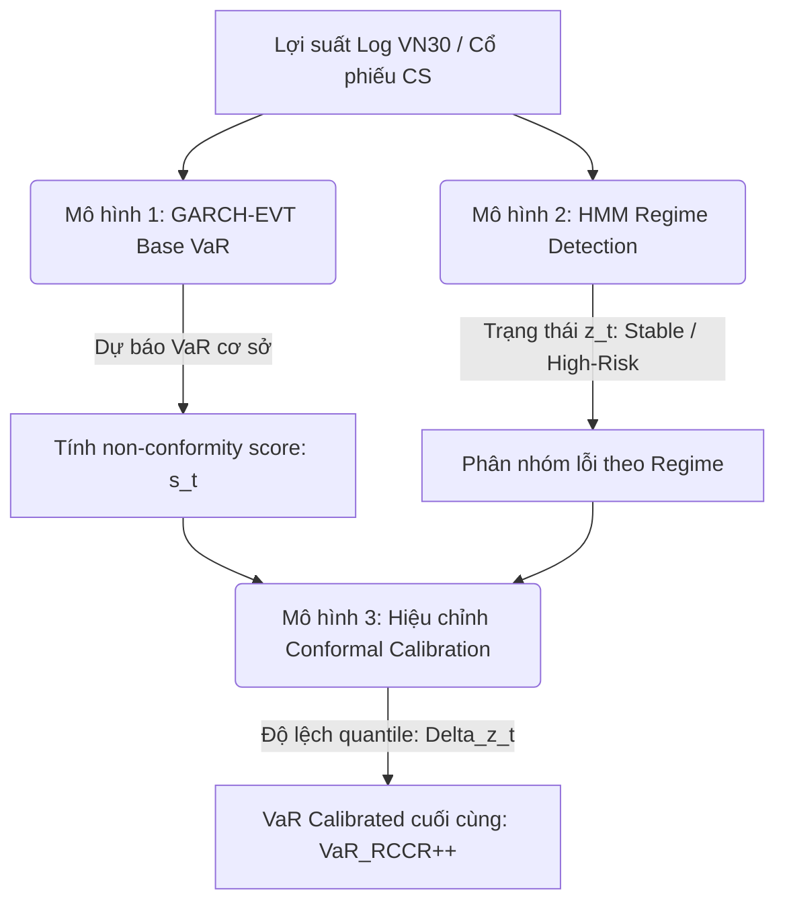

# 📈 RCCR++: KHUNG RỦI RO THÍCH NGHI THEO TRẠNG THÁI THỊ TRƯỜNG & MÔ HÌNH DỰ BÁO TĂNG TRƯỞNG BAYESIAN

> **Mã đề tài nghiên cứu:** `DDT_1_409_NTH_7`  
> **Hội thi:** Chung khảo Hội thi Khoa học Sinh viên Toàn quốc - Olympic Kinh tế lượng và Ứng dụng lần thứ XI - Năm 2026.  
> **Đơn vị:** Đại học Duy Tân - Đại học Ngoại thương.  
> **Cố vấn khoa học:** PGS.TS. Nguyễn Gia Như.

---

## Part 1: Khung Quản trị Rủi ro Đuôi Thích nghi (RCCR++ Conformal Risk Framework)

Mô hình **RCCR++ (Regime-Conditioned Conformal Risk Framework)** được thiết kế để chuyển đổi mô hình đo lường rủi ro VaR (Value at Risk) từ tĩnh sang cơ chế thích nghi động theo trạng thái ẩn của thị trường.

### 📐 Kiến trúc Mô hình RCCR++

---

### 1. Phân hệ 1: Mô hình GARCH-EVT Base VaR
Mô hình cơ sở xử lý hai thuộc tính của chuỗi thời gian tài chính: **cụm biến động (volatility clustering)** và **đuôi béo (heavy/tail loss)**.

#### A. GARCH(1,1) - Xử lý cụm biến động:
Phương sai có điều kiện $\sigma_t^2$ được ước lượng qua:

$$\sigma_t^2 = \omega + \alpha \epsilon_{t-1}^2 + \beta \sigma_{t-1}^2$$

Trong đó:
* $\omega > 0, \alpha \ge 0, \beta \ge 0$.
* Lợi suất chuẩn hóa: $z_t = \frac{r_t - \mu_t}{\sigma_t}$.

#### B. Extreme Value Theory (EVT - POT) - Xử lý đuôi béo:
Áp dụng phương pháp vượt ngưỡng **Peak Over Threshold (POT)** trên các phần dư chuẩn hóa $z_t$. Với một ngưỡng cao $u$, phần vượt ngưỡng $(L_t - u \mid L_t > u)$ tuân theo phân phối **Generalized Pareto Distribution (GPD)**:

$$G_{\xi, \sigma_u}(y) = 1 - \left(1 + \xi \frac{y}{\sigma_u}\right)^{-1/\xi}$$

Từ đó, giá trị VaR cơ sở ở mức tin cậy $\alpha$ được tính bằng:

$$\widehat{\text{VaR}}_{t,\alpha}^{\text{base}} = \mu_t + \sigma_t \left[ u + \frac{\sigma_u}{\xi} \left( \left( \frac{T}{N_u} (1 - \alpha) \right)^{-\xi} - 1 \right) \right]$$

---

### 2. Phân hệ 2: Nhận diện Trạng thái Ẩn (HMM Regime Detection)
Sử dụng mô hình Markov ẩn (Hidden Markov Model - HMM) để phân loại thị trường thành 2 trạng thái ẩn $z_t$:

$$z_t \in \{\text{Stable (Bình thường)}, \text{High-Risk (Rủi ro cao)}\}$$

HMM xác định xác suất chuyển trạng thái $P(z_t = j \mid z_{t-1} = i)$ và ma trận phát xạ của lợi suất để gán nhãn trạng thái thị trường mỗi phiên.

---

### 3. Phân hệ 3: Hiệu chỉnh Conformal Calibration
Bước đột phá của RCCR++ là sử dụng lý thuyết Conformal Prediction để hiệu chỉnh sai số VaR theo từng trạng thái thị trường nhằm đảm bảo độ bao phủ chính xác của rủi ro.

1. **Tính điểm không phù hợp (Non-conformity score):** Đo lường mức độ vượt ngưỡng thực tế so với VaR cơ sở:
   $$s_t = L_t - \widehat{\text{VaR}}_{t,\alpha}^{\text{base}}$$
2. **Hiệu chỉnh theo từng trạng thái $k$ (Regime-specific calibration):**
   Tính toán mức điều chỉnh $\Delta_k$ bằng phân vị của sai số $s_i$ thuộc trạng thái $k$:
   $$\Delta_k = Q_{1-\alpha}\left(\{s_i \mid z_i = k\}\right)$$
3. **VaR được hiệu chỉnh:**
   $$\widehat{\text{VaR}}_{t,\alpha}^{\text{RCCR++}} = \widehat{\text{VaR}}_{t,\alpha}^{\text{base}} + \Delta_{z_t}$$

---

### 📈 Hiệu quả Thực tế của RCCR++ (Từ hình ảnh 3)
Qua kiểm định trên các thị trường Đông Nam Á (VN30, SET50, STI, LQ45, PSEi), mô hình RCCR++ vượt qua các bài test thống kê khắt khe như **Kupiec**, **Christoffersen**, và **Dynamic Quantile (DQ)**.

* **Hiệu quả kinh tế (RCCR++ Policy vs Buy & Hold):**
  * **Lợi nhuận năm (Annual Return):** **17.78%** vs 9.20%
  * **Max Drawdown:** **-18.57%** vs -42.90% (Giảm hơn 2.3 lần sụt giảm tài sản).
  * **Chỉ số Sharpe:** **1.10** vs 0.43

---

## Part 2: Mô hình Tăng trưởng Kinh tế Bayesian (Bayesian Panel Regression)

Một phần độc lập trong nghiên cứu (Hình 4 & 5) tập trung vào việc ước lượng tác động của chất lượng thể chế (Institutional Quality - INS) và năng suất nhân tố tổng hợp (TFPG) lên tăng trưởng kinh tế ở các nhóm nước có thu nhập trung bình thấp và trung bình cao.

### 📐 Phương pháp Nghiên cứu 2 Pha:
1. **Pha 1: Nhận diện Bẫy thu nhập trung bình (MIT Identification):**
   * Sử dụng phương pháp số năm (Number of years method).
   * Kiểm tra điều kiện tăng trưởng bền vững qua: Growth Report Method, Growth Acceleration Method, và Catch-up Growth Method.
   * Xây dựng chỉ số Chất lượng thể chế (INS) bằng phương pháp phân tích thành phần chính (PCA) từ các biến thành phần.
2. **Pha 2: Ước lượng Phi tuyến tính (Empirical Estimation):**
   * Chạy mô hình hồi quy bảng Bayesian (Bayesian Panel Regression).
   * Ước lượng phân phối hậu nghiệm bằng thuật toán mô phỏng chuỗi Markov Monte Carlo (MCMC) với bộ lấy mẫu Gibbs (Gibbs Sampler).

### 📝 Công thức Mô hình hồi quy:

$$\ln(\text{GDP}_{i,t}) = \alpha_i + \beta_1 \text{TFPG}_{i,t} + \beta_2 \text{INS}_{i,t} + \beta_3 (\text{INS}_{i,t} \times \text{TFPG}_{i,t}) + \beta_4 \text{GINI}_{i,t} + \beta_5 \text{TRD}_{i,t} + \beta_6 \text{FDI}_{i,t} + \beta_7 \text{URB}_{i,t} + \beta_8 \text{INF}_{i,t} + \beta_9 \text{ER}_{i,t} + \beta_{10}\text{DR}_{i,t} + \beta_{11}\ln(\text{FA}_{i,t}) + \beta_{12}\text{LABO}_{i,t} + \beta_{13}\text{TELE}_{i,t} + u_{i,t}$$

Trong đó:
* $\ln(\text{GDP}_{i,t})$: Logarit tự nhiên của GDP thực tế trên đầu người.
* $\text{TFPG}_{i,t}$: Tốc độ tăng năng suất nhân tố tổng hợp.
* $\text{INS}_{i,t}$: Chỉ số chất lượng thể chế xây dựng qua PCA.
* $\text{INS} \times \text{TFPG}$: Biến tương tác để kiểm tra xem thể chế tốt có giúp thúc đẩy năng suất hay không.
* Phương pháp Bayesian giúp giải quyết hiện tượng đa cộng tuyến (multicollinearity) giữa các biến thể chế/vĩ mô và hoạt động tốt trên tập dữ liệu mẫu nhỏ.

---

## 🛠️ LỘ TRÌNH TRIỂN KHAI CHO FINVISTA (ỨNG DỤNG BƯỚC TIẾP THEO)

Để ứng dụng khung quản trị rủi ro đuôi RCCR++ vào phân hệ Chứng quyền của Finvista:

### 1. Xây dựng HMM Regime Detection cho VNINDEX
Tạo file `src/quant/indicators/hmm_regime.py` sử dụng thư viện `hmmlearn` hoặc thuật toán EM Markov tối giản để gán nhãn trạng thái ẩn hàng ngày.

### 2. Thiết lập Lõi Ước lượng VaR (GARCH-EVT)
* Chạy mô hình GARCH(1,1) từ thư viện `arch` để tính toán biến động $\sigma_t$ hàng ngày.
* Lọc phần dư $z_t$, chọn ngưỡng $u$ ở phân vị $95\%$, fit phân phối Pareto (GPD) để tính toán VaR cơ sở.

### 3. Hiệu chỉnh Conformal Calibration
* Lưu trữ lịch sử sai số VaR hàng ngày ($s_t$).
* Tính toán phân vị hiệu chỉnh $\Delta_k$ cho từng chế độ của HMM.
* Điều chỉnh khoảng cách VaR động để thiết lập **Ngưỡng Cắt Lỗ Cực Hạn (Tail Risk Stop Loss)** cho bot Paper Trading.
